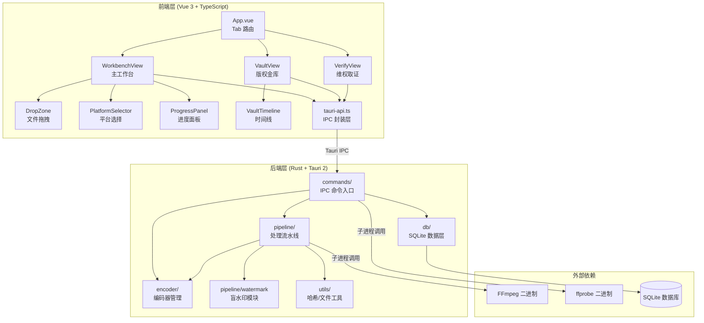
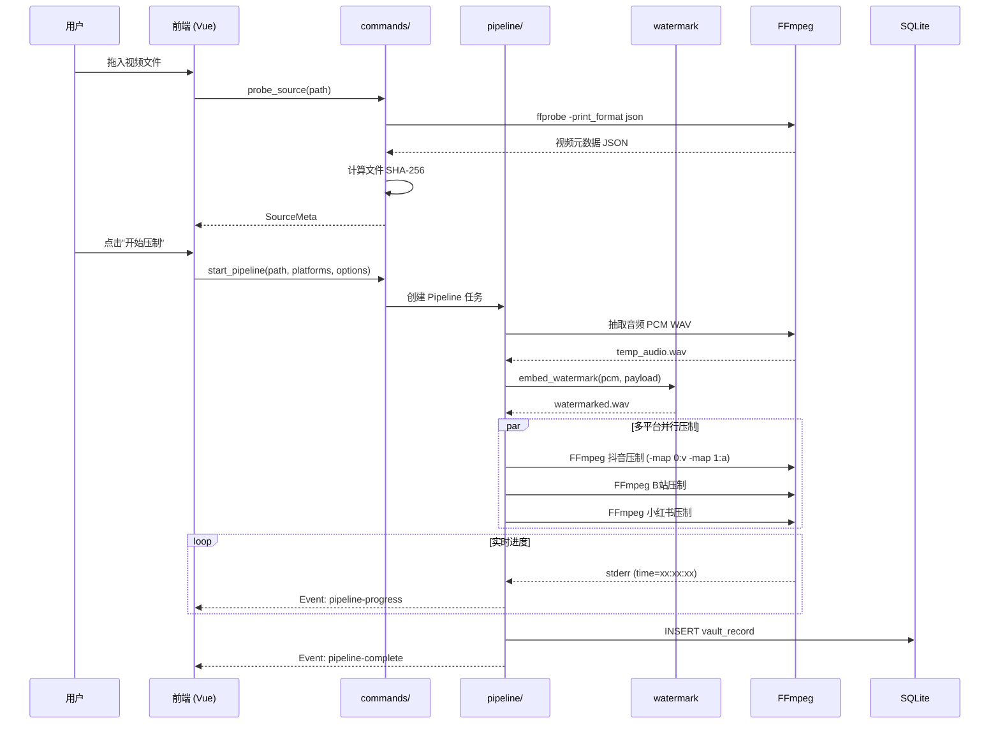
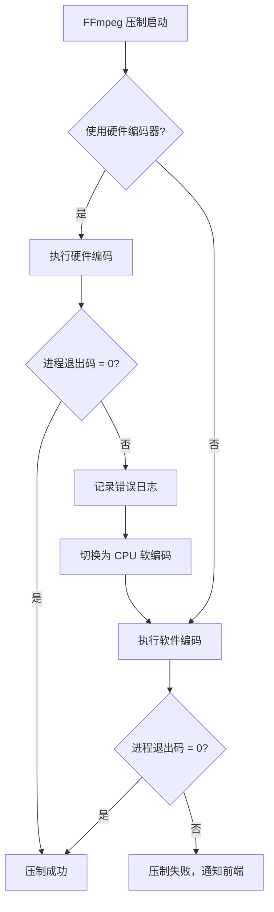

# 技术设计文档：隐盾 (HiddenShield) MVP V1.0

## 概述

本设计文档描述隐盾 MVP V1.0 的技术实现方案，目标是将当前项目中所有 stub/占位实现替换为真实功能。项目基于 Tauri 2 + Rust + Vue 3 + FFmpeg 技术栈，核心处理链路为：源文件探测（视频/图片/音频）→ 盲水印注入 → 多平台并行压制（视频）/ 水印输出（图片/音频）→ 本地版权金库存储。

参考文档：
- `docs/隐盾（HiddenShield）版权保护SaaS平台.md` — 产品需求文档
- `docs/FFmpeg多平台压制参数方案.md` — FFmpeg 压制参数与硬件加速方案
- `docs/技术架构方案.md` — 技术架构与数据流设计
- `.kiro/specs/hidden-shield-mvp/requirements.md` — 需求规格

### 设计目标

1. 将所有后端 stub 替换为真实 FFmpeg/ffprobe 调用
2. 实现音频频域盲水印嵌入与提取（realfft）
3. 实现图片 LSB 隐写水印嵌入与提取
4. 建立 SQLite 版权金库的真实 CRUD
5. 前端 DropZone 对接 Tauri 原生拖拽/文件对话框获取真实磁盘路径
6. 前端进度面板完全由后端真实事件驱动，移除模拟进度
7. FFmpeg 动态下载机制（GPL 合规）
8. 磁盘空间预检与系统休眠抑制
9. 维权取证置信度阈值与法律免责声明

### 关键设计决策

| 决策 | 选择 | 理由 |
|------|------|------|
| FFmpeg 集成方式 | AppData 动态下载 + PATH 回退 | 规避 GPL 传染性：不打包进安装包，用户主动获取 |
| 水印算法库 | realfft 3.x | 专为实数信号优化，比 rustfft 更适合音频处理 |
| 图片水印 | LSB 隐写（image crate） | 轻量级，不依赖 FFmpeg，纯 Rust 实现 |
| 数据库 | rusqlite (bundled) | 零配置嵌入式 SQLite，bundled 特性自带编译 |
| 硬件编码探测 | FFmpeg 编码器初始化测试 | 通过实际执行 `ffmpeg -c:v <encoder> -f null -` 验证可用性 |
| 前端文件获取 | Tauri drag-drop + dialog API | 原生 API 可获取完整磁盘路径，替代浏览器 File API |
| 磁盘空间检查 | 压制前预估 + 拦截 | 避免 FFmpeg 因 No space left on device 崩溃 |
| 休眠抑制 | 平台原生 API | Windows: SetThreadExecutionState, macOS: IOPMAssertionCreateWithName |
| 取证置信度 | 阈值 0.95 + 免责声明 | 防止误判导致的法律连带责任 |

## 架构

### 系统分层架构



### 核心数据流




## 组件与接口

### 后端模块划分

#### 1. `commands/` — IPC 命令入口

所有前端可调用的 Tauri 命令集中在此模块，每个命令负责参数校验和调度，不包含业务逻辑。

| 命令 | 文件 | 输入 | 输出 | 说明 |
|------|------|------|------|------|
| `probe_source` | probe.rs | `path: String` | `Result<SourceMeta, String>` | 调用 ffprobe 获取真实元数据 |
| `start_pipeline` | transcode.rs | `input_path, platforms, options` | `Result<PipelineStartResult, String>` | 启动异步压制流水线 |
| `cancel_pipeline` | transcode.rs | `pipeline_id: String` | `Result<(), String>` | 终止 FFmpeg 子进程 |
| `get_hw_info` | transcode.rs | 无 | `Result<HardwareInfo, String>` | 返回硬件编码器探测结果 |
| `list_vault_records` | vault.rs | 无 | `Result<Vec<VaultRecord>, String>` | 查询版权金库 |
| `verify_suspect` | verify.rs | `path: String` | `Result<VerificationResult, String>` | 水印提取与比对 |

#### 2. `pipeline/` — 处理流水线

新增模块，负责完整的压制链路编排：

| 文件 | 职责 |
|------|------|
| `mod.rs` | 模块导出 |
| `progress.rs` | 进度帧定义与 FFmpeg stderr 解析 |
| `ffmpeg.rs` (新增) | FFmpeg/ffprobe 子进程管理、AppData 检测 + PATH 回退、动态下载、二进制路径缓存 |
| `watermark.rs` (新增) | 音频盲水印嵌入与提取（realfft） |
| `image_watermark.rs` (新增) | 图片 LSB 隐写水印嵌入与提取 |
| `scheduler.rs` (新增) | 流水线调度：文件类型分发 → 视频/图片/音频各自处理链路 |
| `system_guard.rs` (新增) | 磁盘空间预检、系统休眠抑制（平台原生 API） |

#### 3. `encoder/` — 编码器管理

| 文件 | 当前状态 | 改造内容 |
|------|---------|---------|
| `hw_detect.rs` | 硬编码返回值 | 真实执行 FFmpeg 编码器初始化测试 |
| `presets.rs` | 仅返回标签字符串 | 生成完整 FFmpeg 参数数组（分辨率、编码器、CRF、码率、滤镜链） |
| `tonemap.rs` | 仅按文件名推断 HDR | 根据 ffprobe 色彩空间数据生成 tone-mapping 滤镜链 |

#### 4. `db/` — 数据层

| 文件 | 当前状态 | 改造内容 |
|------|---------|---------|
| `schema.rs` | 已有建表 SQL | 不变 |
| `queries.rs` | 返回硬编码假数据 | 真实 rusqlite CRUD：init_db、insert_record、list_records、find_by_watermark_uid |
| `mod.rs` | 仅导出 | 新增 `DbPool` 类型（`Arc<Mutex<Connection>>`），在 AppState 中管理 |

#### 5. `utils/` — 工具模块

| 文件 | 当前状态 | 改造内容 |
|------|---------|---------|
| `hash.rs` | 仅对字符串做 SHA-256 | 新增 `sha256_of_file(path)` 流式读取文件计算哈希 |
| `fs.rs` | 仅有 `safe_output_dir` | 新增临时文件管理、输出文件命名工具 |

### 前端组件改造

| 组件 | 当前状态 | 改造内容 |
|------|---------|---------|
| `DropZone.vue` | 使用浏览器 File API，只获取 `file.name` | 改用 Tauri `@tauri-apps/plugin-dialog` 的 `open()` 和 Tauri 拖拽事件获取完整磁盘路径 |
| `WorkbenchView.vue` | `simulateProgress()` 模拟进度 | 移除模拟逻辑，完全依赖后端 `pipeline-progress` 事件 |
| `tauri-api.ts` | 已有完整 IPC 封装 | 保持接口不变，mock 分支保留用于浏览器开发模式 |

### 关键接口定义

#### FFmpeg 进程管理接口 (`pipeline/ffmpeg.rs`)

```rust
/// FFmpeg/ffprobe 二进制路径缓存
pub struct FfmpegPaths {
    pub ffmpeg: PathBuf,
    pub ffprobe: PathBuf,
}

/// 检测 FFmpeg 可用性：先查 AppData，再查系统 PATH（应用启动时调用一次）
pub async fn detect_ffmpeg(app_data_dir: &Path) -> Result<FfmpegPaths, String>;

/// 从 CDN/GitHub 下载 FFmpeg 到 AppData 目录，校验 SHA-256
pub async fn download_ffmpeg(app_data_dir: &Path, on_progress: impl Fn(u64, u64)) -> Result<FfmpegPaths, String>;

/// 调用 ffprobe 获取视频元数据
pub async fn ffprobe_source(ffprobe: &Path, input: &str) -> Result<FfprobeOutput, String>;

/// 启动 FFmpeg 子进程并返回句柄
pub async fn spawn_ffmpeg(ffmpeg: &Path, args: &[String]) -> Result<FfmpegChild, String>;

/// 从 FFmpeg stderr 解析进度（time= 字段）
pub fn parse_progress_line(line: &str, total_duration: f64) -> Option<f64>;
```

#### 系统防护接口 (`pipeline/system_guard.rs`)

```rust
/// 检查磁盘可用空间是否满足压制需求
pub fn check_disk_space(output_dir: &Path, source_size_bytes: u64, platform_count: usize) -> Result<(), PipelineError>;

/// 阻止系统休眠（返回 guard，drop 时自动恢复）
pub fn inhibit_sleep(reason: &str) -> Result<SleepInhibitor, PipelineError>;

/// RAII guard：drop 时自动释放休眠抑制
pub struct SleepInhibitor { /* platform-specific handle */ }
impl Drop for SleepInhibitor { /* 释放休眠抑制 */ }
```

#### 图片水印接口 (`pipeline/image_watermark.rs`)

```rust
/// 在图片像素中使用 LSB 隐写术嵌入水印
pub fn embed_image_watermark(image_path: &Path, payload: &WatermarkPayload, output_path: &Path) -> Result<(), WatermarkError>;

/// 从图片像素中提取 LSB 隐写水印
pub fn extract_image_watermark(image_path: &Path) -> Result<WatermarkPayload, WatermarkError>;
```

#### 水印模块接口 (`pipeline/watermark.rs`)

```rust
/// 水印数据载荷（固定 32 字节）
pub struct WatermarkPayload {
    pub magic: [u8; 4],        // 0x48443548
    pub timestamp: u64,         // Unix epoch 秒
    pub machine_fingerprint: [u8; 16], // SHA-256 前 16 字节
    pub crc32: u32,
}

/// 将水印嵌入 PCM 音频
pub fn embed_watermark(samples: &mut [f32], payload: &WatermarkPayload) -> Result<(), WatermarkError>;

/// 从 PCM 音频提取水印
pub fn extract_watermark(samples: &[f32]) -> Result<WatermarkPayload, WatermarkError>;

/// 序列化载荷为 256 bit
pub fn encode_payload(payload: &WatermarkPayload) -> [u8; 32];

/// 反序列化 256 bit 为载荷
pub fn decode_payload(bits: &[u8; 32]) -> Result<WatermarkPayload, WatermarkError>;
```

#### 压制参数引擎接口 (`encoder/presets.rs`)

```rust
/// 完整的 FFmpeg 压制配置
pub struct TranscodeConfig {
    pub video_filter: String,
    pub video_codec: String,
    pub video_params: Vec<String>,
    pub audio_params: Vec<String>,
    pub container_params: Vec<String>,
    pub output_suffix: String,
}

/// 根据源视频元数据 + 目标平台 + 硬件编码器 + 用户选项生成完整参数
pub fn build_transcode_config(
    platform: Platform,
    source: &SourceMeta,
    hw_encoder: &DetectedHardware,
    options: &TranscodeOptions,
    tonemap_filter: Option<&str>,
) -> TranscodeConfig;
```


## 数据模型

### Rust 端核心数据结构

#### SourceMeta（源视频元数据）

```rust
pub struct SourceMeta {
    pub file_name: String,
    pub path: String,
    pub width: u32,
    pub height: u32,
    pub fps: f64,
    pub duration_secs: f64,
    pub file_size_mb: f64,
    pub is_hdr: bool,
    pub color_profile: String,  // "BT.2020 / PQ" | "BT.709 / SDR"
    pub sha256: String,         // 文件完整二进制的 SHA-256
}
```

改造要点：所有字段由 ffprobe JSON 输出解析填充，`sha256` 由流式文件读取计算。

#### DetectedHardware（硬件探测结果）

```rust
pub struct DetectedHardware {
    pub preferred_encoder: String,      // 最优编码器名称
    pub available_encoders: Vec<String>, // 所有可用编码器列表
    pub hw_type: HwEncoderType,         // 枚举：Nvenc | VideoToolbox | Qsv | Amf | Software
}

pub enum HwEncoderType {
    Nvenc,
    VideoToolbox,
    Qsv,
    Amf,
    Software,
}
```

改造要点：通过实际执行 FFmpeg 编码器初始化测试填充，而非硬编码。

#### WatermarkPayload（水印载荷）

```rust
/// 固定 256 bit (32 字节) 水印数据
pub struct WatermarkPayload {
    pub magic: [u8; 4],              // 魔数 0x48443548 ("HD5H")
    pub timestamp: u64,               // Unix epoch 秒（8 字节）
    pub machine_fingerprint: [u8; 16], // 机器指纹 SHA-256 前 16 字节
    pub crc32: u32,                   // 前 28 字节的 CRC32 校验
}
```

水印 UID 格式：`HS-{fingerprint[0..2]}-{fingerprint[2..4]}-{fingerprint[4..6]}`（十六进制大写）

#### VaultRecord（版权金库记录）

```rust
pub struct VaultRecord {
    pub id: u32,
    pub original_hash: String,     // 源文件 SHA-256
    pub file_name: String,
    pub created_at: String,        // ISO 8601
    pub duration_secs: f64,
    pub resolution: String,        // "1920x1080"
    pub watermark_uid: String,     // "HS-XXXX-XXXX-XXXX"
    pub thumbnail_path: Option<String>,
    pub output_douyin: Option<String>,
    pub output_bilibili: Option<String>,
    pub output_xhs: Option<String>,
    pub is_hdr_source: bool,
    pub hw_encoder_used: Option<String>,
    pub process_time_ms: Option<u64>,
}
```

改造要点：`platforms: Vec<String>` 字段拆分为三个独立的输出路径字段，与 SQLite schema 对齐。前端 `VaultRecord` 接口需同步更新。

#### VerificationResult（取证结果）

```rust
pub struct VerificationResult {
    pub matched: bool,
    pub watermark_uid: Option<String>,
    pub confidence: f64,           // 0.0 - 1.0, 阈值 >= 0.95 才返回 matched=true
    pub matched_record: Option<VaultRecord>,
    pub summary: String,
    pub disclaimer: String,        // 法律免责声明（固定文本）
}
```

置信度阈值策略：
- `>= 0.95`：返回 matched=true，确认匹配
- `0.5 ~ 0.95`：返回 matched=false，提示"疑似水印特征但置信度不足"
- `< 0.5`：返回 matched=false，提示"未检测到有效水印"

### SQLite 表结构

沿用 `db/schema.rs` 中已定义的 `vault_records` 表，新增索引：

```sql
CREATE TABLE IF NOT EXISTS vault_records (
    id              INTEGER PRIMARY KEY AUTOINCREMENT,
    original_hash   TEXT NOT NULL,
    file_name       TEXT NOT NULL,
    file_type       TEXT NOT NULL DEFAULT 'video',  -- 'video' | 'image' | 'audio'
    created_at      TEXT NOT NULL,
    duration_secs   REAL,
    resolution      TEXT,
    watermark_uid   TEXT NOT NULL,
    thumbnail_path  TEXT,
    output_douyin   TEXT,
    output_bilibili TEXT,
    output_xhs      TEXT,
    is_hdr_source   INTEGER DEFAULT 0,
    hw_encoder_used TEXT,
    process_time_ms INTEGER
);

CREATE INDEX IF NOT EXISTS idx_vault_hash ON vault_records(original_hash);
CREATE INDEX IF NOT EXISTS idx_vault_created ON vault_records(created_at);
CREATE INDEX IF NOT EXISTS idx_vault_watermark ON vault_records(watermark_uid);
```

### AppState 扩展

```rust
pub struct AppState {
    pub active_pipelines: Mutex<HashSet<String>>,
    pub db: Mutex<Connection>,              // 新增：SQLite 连接
    pub ffmpeg_paths: OnceLock<FfmpegPaths>, // 新增：FFmpeg 路径缓存
    pub hw_info: OnceLock<DetectedHardware>, // 新增：硬件探测缓存
}
```

使用 `OnceLock` 确保 FFmpeg 路径和硬件探测仅执行一次。

### 前端 TypeScript 接口

`tauri-api.ts` 中的接口保持现有定义不变，仅需调整 `VaultRecord` 以匹配后端拆分后的输出路径字段：

```typescript
export interface VaultRecord {
    id: number;
    fileName: string;
    createdAt: string;
    watermarkUid: string;
    originalHash: string;
    resolution: string;
    durationSecs: number;
    isHdrSource: boolean;
    outputDouyin: string | null;
    outputBilibili: string | null;
    outputXhs: string | null;
    hwEncoderUsed: string | null;
    processTimeMs: number | null;
}
```


## 正确性属性 (Correctness Properties)

*属性（Property）是在系统所有合法执行中都应成立的特征或行为——本质上是对系统行为的形式化陈述。属性是人类可读规格与机器可验证正确性保证之间的桥梁。*

### Property 1: HDR 色彩空间判断正确性

*对任意* color_transfer 和 color_primaries 字符串组合，当且仅当 color_transfer 为 "smpte2084" 或 "arib-std-b67"，或 color_primaries 为 "bt2020" 时，HDR 判断函数应返回 true；否则返回 false。

**Validates: Requirements 2.2**

### Property 2: 平台压制参数不变量

*对任意* 合法的 SourceMeta（分辨率 > 0、帧率 > 0、时长 > 0）和任意目标平台，`build_transcode_config` 生成的参数应满足：
- 抖音：目标分辨率包含 "1080" 和 "1920"，编码器为 H.264 系列，CRF 18，最大码率 12000k，帧率 30fps
- B站：目标分辨率包含 "1920" 和 "1080"，编码器为 HEVC 系列，CRF 20，最大码率 16000k，帧率为 30 或 60（源 >= 50fps 时为 60）
- 小红书：目标分辨率包含 "1080" 和 "1440"，编码器为 H.264 系列，CRF 17，最大码率 15000k，帧率 30fps
- 所有平台：音频参数包含 "aac"、"192k"、"44100"，容器参数包含 "faststart"

**Validates: Requirements 5.1, 5.2, 5.3, 5.6**

### Property 3: Letterbox 滤镜生成

*对任意* 源视频分辨率（宽 > 0、高 > 0）和任意目标平台，当用户选择 letterbox 策略时，生成的 video_filter 应包含 "scale" 和 "pad" 关键字，且 pad 的目标尺寸与平台规格一致。

**Validates: Requirements 5.4**

### Property 4: 硬件编码器模式切换

*对任意* 硬件编码器类型（非 Software）和 fast_gpu 编码模式，`build_transcode_config` 生成的 video_codec 应为对应的硬件编码器名称（而非 libx264/libx265）；当编码模式为 high_quality_cpu 时，video_codec 应为软件编码器。

**Validates: Requirements 5.5**

### Property 5: Tonemap 滤镜链条件生成

*对任意* 源视频色彩信息，当 is_hdr 为 true 时，生成的滤镜链应包含 "zscale"、"tonemap=hable"、"format=yuv420p" 关键字；当 is_hdr 为 false 时，生成的滤镜链不应包含 "tonemap" 关键字。

**Validates: Requirements 6.1, 6.2, 6.3**

### Property 6: 水印载荷序列化 Round-trip

*对任意* 合法的 WatermarkPayload（magic = 0x48443548，timestamp 为合法 Unix 时间戳，machine_fingerprint 为任意 16 字节），`encode_payload` 然后 `decode_payload` 应得到与原始载荷相同的值，且 CRC32 校验通过。

**Validates: Requirements 7.5, 10.3**

### Property 7: 水印嵌入/提取 Round-trip

*对任意* 长度 >= 4096 采样点且包含非静音帧的 PCM 音频信号和任意合法 WatermarkPayload，先执行 `embed_watermark` 再执行 `extract_watermark`，提取出的载荷应与嵌入的载荷一致（魔数匹配、CRC32 校验通过、时间戳和指纹相同）。

**Validates: Requirements 7.2, 7.3, 10.2**

### Property 8: FFmpeg 进度解析

*对任意* 格式为 `time=HH:MM:SS.ms` 的 FFmpeg stderr 行和正的总时长值，`parse_progress_line` 应返回 0.0 到 1.0 之间的进度值；对不包含 `time=` 的行应返回 None。

**Validates: Requirements 8.3**

### Property 9: 输出文件命名格式

*对任意* 非空源文件名（不含扩展名）和任意目标平台，生成的输出文件名应匹配 `{源文件名}_{平台中文名}优化版.mp4` 格式，且不包含路径分隔符。

**Validates: Requirements 8.5**

### Property 10: 版权金库存取 Round-trip 与排序

*对任意* 多条合法 VaultRecord（不同的 created_at 时间戳），依次插入数据库后调用 `list_records`，返回的记录应包含所有插入的记录（字段值一致），且按 created_at 严格倒序排列。

**Validates: Requirements 9.2, 9.3**


## 错误处理

### 错误分类与处理策略

| 错误类型 | 触发场景 | 处理策略 | 用户提示 |
|---------|---------|---------|---------|
| FFmpeg 不可用 | AppData 和系统 PATH 中均找不到 ffmpeg/ffprobe | 触发动态下载流程 | "正在为您下载必要的开源组件..." |
| FFmpeg 下载失败 | 网络不可用或 SHA-256 校验失败 | 提示手动安装 | "下载失败，请手动安装 FFmpeg 或检查网络连接" |
| ffprobe 解析失败 | 文件损坏或非音视频格式 | 返回 Err，前端显示错误 | "无法解析该文件，请确认是有效的媒体文件" |
| 文件读取失败 | 路径不存在或权限不足 | 返回 Err | "文件读取失败，请检查文件路径和权限" |
| 磁盘空间不足 | 可用空间小于预估需求 | 阻止压制启动 | "磁盘空间不足，预计需要 {X}GB，当前可用 {Y}GB" |
| FFmpeg 压制失败 | 编码器不兼容或参数错误 | 自动降级为 CPU 软编码重试一次 | "硬件编码失败，已自动切换为 CPU 编码重试" |
| FFmpeg 重试仍失败 | 严重错误（文件损坏等） | 记录错误日志，通知前端 | "压制失败：{错误详情}" |
| 系统休眠中断 | 压制期间系统进入休眠 | 通过 SleepInhibitor 预防 | （预防性措施，不应触发） |
| 水印嵌入失败 | 音频过短或无音频流 | 跳过水印步骤，继续压制 | "该文件无音频流，已跳过版权保护" |
| 水印提取失败 | 魔数不匹配或 CRC 校验失败 | 返回 matched=false | "未检测到有效水印，可能原因：深度篡改/非本机加密" |
| 取证置信度不足 | 置信度 < 0.95 | 返回 matched=false + 免责声明 | "检测到疑似水印特征但置信度不足，无法确认匹配" |
| SQLite 操作失败 | 数据库文件损坏或磁盘满 | 记录日志，不阻塞压制流程 | "版权记录保存失败，压制文件不受影响" |
| 任务取消 | 用户点击取消 | kill 所有 FFmpeg 子进程，清理临时文件，释放休眠抑制 | "任务已取消" |

### Rust 错误类型设计

```rust
#[derive(Debug, thiserror::Error)]
pub enum PipelineError {
    #[error("FFmpeg not found in AppData or PATH")]
    FfmpegNotFound,

    #[error("FFmpeg download failed: {0}")]
    FfmpegDownloadFailed(String),

    #[error("ffprobe failed: {0}")]
    ProbeFailed(String),

    #[error("File not found: {0}")]
    FileNotFound(String),

    #[error("Insufficient disk space: need {needed_mb}MB, available {available_mb}MB")]
    InsufficientDiskSpace { needed_mb: u64, available_mb: u64 },

    #[error("FFmpeg process failed: {0}")]
    FfmpegFailed(String),

    #[error("Watermark embedding failed: {0}")]
    WatermarkEmbedFailed(String),

    #[error("Watermark extraction failed: {0}")]
    WatermarkExtractFailed(String),

    #[error("Database error: {0}")]
    DatabaseError(String),

    #[error("Sleep inhibition failed: {0}")]
    SleepInhibitFailed(String),

    #[error("Pipeline cancelled")]
    Cancelled,
}
```

### 降级重试流程



## 测试策略

### 双轨测试方法

本项目采用单元测试 + 属性测试的双轨策略：

- **单元测试**：验证特定示例、边界条件和错误路径
- **属性测试**：验证跨所有输入的通用属性（使用 `proptest` 库）
- **集成测试**：验证依赖外部进程（FFmpeg）的端到端流程

### 属性测试配置

- 测试库：`proptest` (Rust 生态最成熟的 PBT 库)
- 每个属性测试最少 100 次迭代
- 每个属性测试必须引用设计文档中的属性编号
- 标签格式：`// Feature: hidden-shield-mvp, Property {N}: {property_text}`

### 测试矩阵

| 属性编号 | 测试类型 | 被测模块 | 关键生成器 |
|---------|---------|---------|-----------|
| Property 1 | 属性测试 | `encoder/tonemap.rs` | 随机 color_transfer/color_primaries 字符串 |
| Property 2 | 属性测试 | `encoder/presets.rs` | 随机 SourceMeta（分辨率、帧率、时长） |
| Property 3 | 属性测试 | `encoder/presets.rs` | 随机源视频分辨率 + 平台枚举 |
| Property 4 | 属性测试 | `encoder/presets.rs` | HwEncoderType 枚举 × EncodingMode 枚举 |
| Property 5 | 属性测试 | `encoder/tonemap.rs` | 随机 is_hdr 布尔值 + 缩放滤镜字符串 |
| Property 6 | 属性测试 | `pipeline/watermark.rs` | 随机 timestamp + machine_fingerprint |
| Property 7 | 属性测试 | `pipeline/watermark.rs` | 随机 PCM 音频信号（正弦波 + 噪声） |
| Property 8 | 属性测试 | `pipeline/progress.rs` | 随机 time=HH:MM:SS.ms 字符串 + 总时长 |
| Property 9 | 属性测试 | `utils/fs.rs` | 随机文件名字符串 + 平台枚举 |
| Property 10 | 属性测试 | `db/queries.rs` | 随机 VaultRecord 列表（不同时间戳） |

### 单元测试覆盖

| 需求 | 测试类型 | 测试内容 |
|------|---------|---------|
| 1.1-1.4 | Smoke/Example | FFmpeg PATH 检测、缓存行为 |
| 2.5 | Example | ffprobe 失败时返回 Err |
| 4.4 | Example | 所有硬件编码器不可用时回退到软件编码 |
| 7.4 | Edge Case | 静音帧跳过（由 Property 7 的生成器覆盖） |
| 8.6 | Example | FFmpeg 失败后降级重试 |
| 10.5-10.6 | Example | 水印匹配成功/失败的返回结构 |

### 集成测试

集成测试需要真实的 FFmpeg 二进制和测试视频文件，在 CI 环境中通过条件编译控制：

```rust
#[cfg(test)]
mod integration_tests {
    // 仅在设置了 FFMPEG_PATH 环境变量时运行
    #[test]
    #[ignore = "requires FFmpeg binary"]
    fn test_full_pipeline() { /* ... */ }
}
```

### Cargo.toml 测试依赖

```toml
[dev-dependencies]
proptest = "1.4"
tempfile = "3"
```

