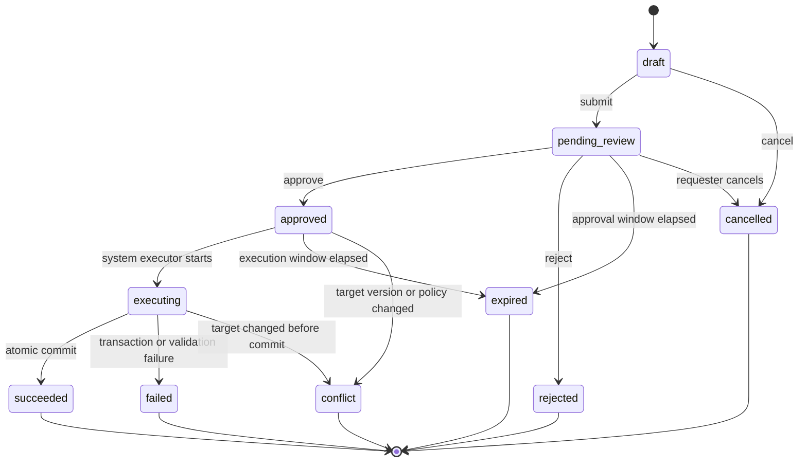

# AI 生成内容标识授权写入双人审批与审计状态机合同

版本：`v1`

冻结日期：`2026-07-27`

实现状态：`identity_schema_fixture_and_state_machine_contract_test_frozen_no_write_implementation`

## 1. 目的与当前 Gate

本合同冻结 AI Transparency license 与 Profile entitlement 的创建、续期、暂停和撤销流程。

本阶段只冻结合同，不实现数据库迁移、写入接口、审批 UI、工作流引擎、通知、production credential 或 SDK。

在以下 Gate 全部通过前，禁止发放 production license、production credential 或 SDK：

```text
双人审批写入合同与状态机实现
-> confirm 原子事务实现与回归测试
-> 三地法规 Profile 外部法务审查
-> 生产 issuer / key custody Gate
-> 真实平台试点与互操作验收
```

## 2. 双人审批定义

V1 的“双人审批”采用 maker-checker：

```text
申请人 requester
+ 独立审批人 approver
= 至少两名不同自然人参与
```

硬约束：

- `requesterActorId != approverActorId`。
- 服务账号、自动化任务或系统 executor 不能充当 requester 或 approver。
- approver 必须在审批时具有有效的目标环境和操作权限。
- requester 不能审批、执行人工 override 或关闭自己创建的冲突。
- approval 不能预签、批量复用或跨 request 使用。
- 审批人离职、权限撤销或角色失效后，尚未执行的 approval 立即失效。
- production 操作必须引用不可变的合同、法务或运营依据；sandbox 也不得绕过 maker-checker。

## 3. 支持的写入操作

### 3.1 License

```text
create_license
renew_license
suspend_license
revoke_license
```

### 3.2 Profile entitlement

```text
grant_profile_entitlement
renew_profile_entitlement
suspend_profile_entitlement
revoke_profile_entitlement
```

V1 不支持：

- 修改已批准请求的目标对象或 desired state。
- 同一请求同时修改多个 license。
- 同一请求同时修改多个 Profile entitlement。
- 直接编辑 active 记录绕过 request。
- 删除历史 license、Profile、request、approval、execution 或 audit event。
- 自动恢复 suspended / revoked 状态。

## 4. 角色与权限

```text
ai_transparency_requester
ai_transparency_commercial_approver
ai_transparency_compliance_approver
ai_transparency_security_approver
ai_transparency_readonly_auditor
system_executor
```

审批角色：

| 操作 | production 必需审批角色 | sandbox 必需审批角色 |
| --- | --- | --- |
| create / renew license | `ai_transparency_commercial_approver` | `ai_transparency_commercial_approver` |
| suspend license | `ai_transparency_commercial_approver` | `ai_transparency_commercial_approver` |
| revoke license | `ai_transparency_security_approver` | `ai_transparency_commercial_approver` |
| grant / renew regulatory Profile | `ai_transparency_compliance_approver` | `ai_transparency_compliance_approver` |
| suspend regulatory Profile | `ai_transparency_compliance_approver` | `ai_transparency_compliance_approver` |
| revoke regulatory Profile | `ai_transparency_security_approver` | `ai_transparency_compliance_approver` |
| grant / renew technical Profile | `ai_transparency_security_approver` | `ai_transparency_compliance_approver` |
| suspend / revoke technical Profile | `ai_transparency_security_approver` | `ai_transparency_compliance_approver` |

角色只决定能否审批，不替代外部法务、合同或安全 Gate。

## 5. Change Request 合同

逻辑对象：`ai_transparency_change_requests`

```json
{
  "changeRequestId": "atcr_example",
  "operation": "renew_license",
  "targetType": "license",
  "targetId": "atl_example",
  "tenantId": "tenant_example",
  "workspaceId": "workspace_example",
  "environment": "production",
  "expectedTargetVersion": 3,
  "desiredState": {
    "expiresAt": "2027-07-27T00:00:00Z"
  },
  "requestReason": "contract renewal",
  "contractReference": "contract_ref_example",
  "legalReviewReference": null,
  "securityReviewReference": null,
  "idempotencyKey": "opaque-idempotency-key",
  "requesterActorId": "actor_requester",
  "requesterRole": "ai_transparency_requester",
  "status": "pending_review",
  "expiresAt": "2026-07-29T00:00:00Z",
  "createdAt": "2026-07-27T00:00:00Z",
  "updatedAt": "2026-07-27T00:00:00Z"
}
```

不变量：

- `(requesterActorId, idempotencyKey)` 唯一。
- `expectedTargetVersion` 用于乐观并发；执行时版本不一致必须进入 `conflict`。
- production license create / renew 必须有 `contractReference`。
- production regulatory Profile grant / renew 必须有 `legalReviewReference`。
- production technical Profile grant / renew 必须有 `securityReviewReference`。
- `desiredState` 只允许当前 operation 的白名单字段。
- 请求提交后，target、operation、environment、desired state 和依据引用不可修改。
- 请求默认最多保留 `48h` 待审批；过期后不能审批或执行。

## 6. Approval 合同

逻辑对象：`ai_transparency_change_approvals`

```json
{
  "approvalId": "atca_example",
  "changeRequestId": "atcr_example",
  "decision": "approved",
  "approverActorId": "actor_approver",
  "approverRole": "ai_transparency_commercial_approver",
  "decisionReason": "contract and tenant scope verified",
  "policyVersion": "ai-transparency-four-eyes-v1",
  "requestDigest": "64-character-lowercase-hex",
  "decidedAt": "2026-07-27T00:05:00Z"
}
```

不变量：

- 每个 change request 只能有一个有效最终 decision。
- `requestDigest` 必须覆盖不可变 request 字段，防止审批后篡改。
- `approved` 必须满足 requester / approver 分离、角色、环境和依据要求。
- `rejected` 必须包含非空 `decisionReason`。
- approval 成功后不能修改；纠错必须创建新 request。
- approval 不直接修改 license 或 Profile。

## 7. Execution 合同

逻辑对象：`ai_transparency_change_executions`

执行主体固定为 `system_executor`。

执行前必须重新验证：

```text
request status = approved
-> approval digest matches request
-> requester and approver remain distinct and authorized
-> request not expired
-> target version matches expectedTargetVersion
-> target transition is legal
-> required references still valid
-> no conflicting in-flight request
```

执行成功必须在一个数据库事务中：

```text
lock target
-> revalidate current state/version
-> create or update license/Profile
-> increment target version
-> mark execution succeeded
-> mark request succeeded
-> append audit events
-> commit
```

任一步失败：

- 不得留下部分生效的 license / Profile。
- 不得创建 SDK credential。
- 不得创建 marking session、Manifest 或 ledger。
- request 进入 `failed` 或 `conflict`，不得自动重试写入。

## 8. Change Request 状态机



允许状态：

```text
draft
pending_review
approved
executing
succeeded
rejected
expired
cancelled
failed
conflict
```

终态不可恢复；任何重试都必须创建新 request，并通过 `supersedesChangeRequestId` 指向旧请求。

## 9. License 状态转换

```text
create_license: none -> active | suspended
renew_license: active | suspended -> same status with later expiresAt
suspend_license: active -> suspended
revoke_license: active | suspended | expired -> revoked
```

禁止：

```text
revoked -> active
expired -> active
suspended -> active
```

恢复、重新开通或过期后续约必须创建新的 license，不得复活旧记录。

## 10. Profile Entitlement 状态转换

```text
grant_profile_entitlement: none -> active | suspended
renew_profile_entitlement: active | suspended -> same status with later expiresAt
suspend_profile_entitlement: active -> suspended
revoke_profile_entitlement: active | suspended | expired -> revoked
```

禁止复活 revoked / expired entitlement。重新授权必须创建新的 entitlement version；现有 `(licenseId, profileId)` 逻辑唯一键需要在实现前升级为版本化模型，不能直接覆盖历史记录。

## 11. 审计事件状态机

逻辑对象：`ai_transparency_change_audit_events`

事件类型：

```text
change_request_drafted
change_request_submitted
change_request_cancelled
approval_granted
approval_rejected
approval_expired
execution_started
execution_succeeded
execution_failed
execution_conflict
target_state_changed
```

每个事件必须包含：

```text
auditEventId
changeRequestId
eventType
fromState?
toState
actorType
actorId
actorRole
targetType
targetId?
targetVersionBefore?
targetVersionAfter?
reasonCode
requestDigest
details
occurredAt
```

审计不变量：

- append-only，禁止 update / delete。
- `(changeRequestId, eventType, toState, targetVersionAfter)` 必须具备幂等保护。
- 每次 request 状态转换必须有且只有一个对应审计事件。
- target 成功变更必须同时记录 `execution_succeeded` 和 `target_state_changed`。
- 审计写入失败时整个状态转换或目标写入必须回滚。
- `details` 禁止包含 API key、credential、密钥、签名、媒体字节、媒体摘要、用户本地路径或完整 HTTP header。
- 审计事件不产生任何标识计量或验证计量。

## 12. 冲突、失败与撤销语义

稳定 `reasonCode`：

```text
request_invalid
request_expired
request_cancelled
request_digest_mismatch
requester_approver_not_separated
approver_role_denied
required_reference_missing
required_reference_invalid
target_not_found
target_already_exists
target_version_conflict
target_state_conflict
conflicting_request_exists
approval_rejected
execution_failed
audit_write_failed
```

`suspend`：

- 阻止新 marking session 和新 credential 绑定。
- 不删除历史 Manifest、Evidence、ledger 或审计。
- 不改变已发布公共事实的历史状态。

`revoke`：

- 永久阻止该 license / entitlement 的未来使用。
- 不复活、不物理删除、不覆盖历史记录。
- 不自动撤销历史 Manifest；Manifest 撤销必须走独立内容事实流程。

## 13. 未来内部接口

以下接口仅冻结，不实现：

```text
POST /internal/ai-transparency/change-requests
POST /internal/ai-transparency/change-requests/{changeRequestId}/submit
POST /internal/ai-transparency/change-requests/{changeRequestId}/approve
POST /internal/ai-transparency/change-requests/{changeRequestId}/reject
POST /internal/ai-transparency/change-requests/{changeRequestId}/cancel
POST /internal/ai-transparency/change-requests/{changeRequestId}/execute
GET  /internal/ai-transparency/change-requests/{changeRequestId}
GET  /internal/ai-transparency/change-requests/{changeRequestId}/audit-events
```

所有接口必须使用未来的细粒度内部身份与角色校验；现有单一 admin token 不足以承载 maker-checker 写入。

## 14. 实施前置条件

开始数据库或写接口实现前必须先完成：

1. 冻结 actor / role / tenant / workspace 的内部身份来源。已完成。
2. 冻结 Profile entitlement 的不可变版本模型。已完成，尚未迁移。
3. 冻结 request digest canonicalization。已由 fixture digest 字段冻结，具体 canonicalization 算法待实现前评审。
4. 冻结 operation 对应的 `desiredState` JSON Schema。已在 V1 fixture 中冻结 renewal 最小字段；其余 operation 待独立 fixture。
5. 新增审批、执行、审计成功与拒绝路径 fixture。已完成。
6. 建立状态机 contract test 和并发冲突测试。状态机与 version conflict fixture test 已完成；真实并发数据库测试待迁移后完成。
7. 评审生产 RBAC、法务引用、合同引用和 security review 引用的真实性来源。未完成。

## 15. 下一 Gate

已冻结的身份与版本化 Schema 合同：

```text
docs/AI生成内容标识审批身份与版本化Entitlement_Schema合同.md
```

状态机 fixture / contract test：

```text
docs/contracts/ai-transparency-approval/
npm run ai-transparency:approval-contract
```

0003 前置 Gate 已冻结，见：

```text
docs/AI生成内容标识0003迁移前置Gate合同.md
```

下一任务可创建：

```text
0003_ai_transparency_approval_state_machine
以及 PostgreSQL 真实双连接并发测试实现；SQLite 只保留本地迁移/单元测试
```

在 migration 与真实并发测试通过前，继续禁止所有 production 发放。

数据库迁移设计评审见：

```text
docs/AI生成内容标识审批状态机数据库迁移设计评审.md
```

评审结论为 `conditional_design_pass`，不代表允许立即创建 `0003`。

上述工作完成并通过审查前，继续禁止：

```text
license / Profile 写接口
production license 发放
production SDK credential 发放
SDK 销售或分发
公共 Resolver / Detector
marking / confirm 生产调用
```
