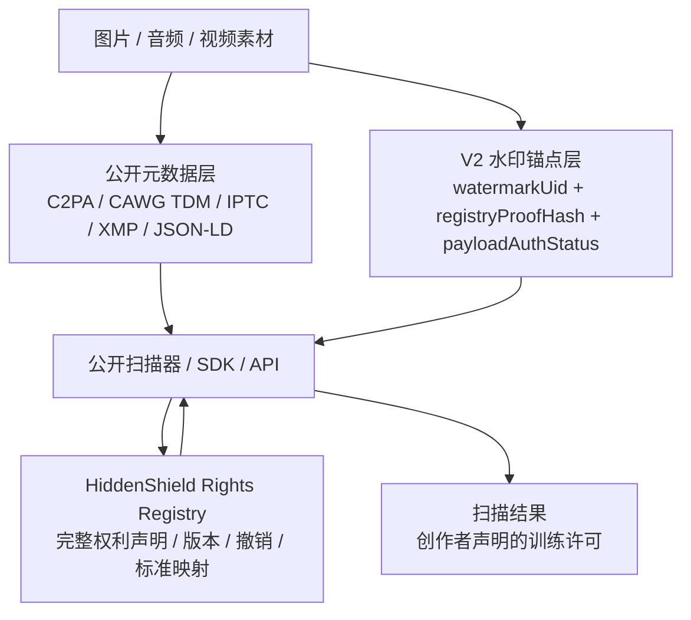

# HiddenShield 公开权利信号与训练许可扫描协议设计

更新时间：2026-07-02

本文档定义 HiddenShield 后续“公开权利信号”和“训练许可扫描”的产品与技术协议方向。核心决策是：**直接把 V3 作为目标协议**，不保留面向新写入的 V2 兼容承诺，不再扩展 `PAYLOAD_BYTES = 119`，并以长期架构视角做瘦身设计：在最小可用锚点前提下追求性能与鲁棒性的最佳性价比，把完整授权声明迁移到后端 registry 与公开元数据层。

本文档既是协议设计约束，也是当前实现状态的事实源。当前已支持公开查询 API、公开元数据 sidecar 导出、PNG / JPEG 图片公开元数据嵌入副本、图片 C2PA signed manifest 最小写入、WAV / MP4 音视频公开元数据传播层 + 官方 C2PA 容器级 signed manifest 运行态 QA、外部分发 TypeScript SDK 包和受 API key / quota / 可信代理指纹限流保护的 Enterprise 只读批量扫描 API。仍未完成的是生产级官方 C2PA 信任锚证书链 / TSA 配置、iOS 运行态 QA、外部 npm 发布、大规模质量 / 性能 release 样本池和首批客户签字；这些外部收口项已接入 `public-rights:completion-gate`，强制模式必须提供真实 JSON 证据，不能只靠文档勾选。

生产发布门禁另见 `docs/生产C2PA证书链_TSA_SDK发布_Enterprise客户开通Runbook.md`。任何“生产 C2PA 已上线”“SDK 已外部发布”“Enterprise 客户已开通”的对外表述，都必须先通过该 runbook 和 `public-rights:production-readiness-contract`；所有公开查询和 Enterprise API 输出仍必须固定 `legalConclusion=false`。

## 1. 背景

当前“作品声明与授权策略”已经能记录：

- 作品来源声明：人工创作、AI 辅助、AI 生成。
- 创作方式声明：文生图、图片转换、文生视频、视频转换、音频生成、多模态生成。
- 人工编辑声明：无编辑、轻度、中度、重度。
- 内容真实性：虚构 / 合成、基于真实、创作者声明真实。
- 训练许可：禁止模型训练、需单独授权、允许非商业训练、允许商业训练。

当前这些数据属于创作者声明，保存在版权库、云版权库、报告和同步 payload 中。它们不是系统从图片、音频或视频本体自动检测出来的事实，也不能被包装成 AI 生成检测、真实性鉴定或法律授权判断。

新的产品目标是让第三方扫描素材时能读取“创作者声明的机器可读权利信号”，尤其是训练许可。该能力要服务素材平台、企业训练数据治理、版权合规审计和创作者授权管理。

## 2. 核心决策

### 2.1 直接升级 V3，V2 只做迁移桥接

`watermark-core` 当前 V2 payload 已固定为 119 bytes，并已经影响图片、音频和视频视觉 staged 能力的容量设计。

迁移原则：

- 新写入目标直接按 V3 设计，不为 V2 新兼容做反向约束。
- V2 只允许作为旧记录读取、迁移桥接、重签参考和 QA 对照，不再作为未来协议承诺。
- 迁移期重点是缩短技术债，而不是维持旧字段在新写入中的存活。

这里的“影响容量设计”指算法为了稳定承载 119 bytes payload，需要重新计算写入位数、冗余、同步定位、最低素材条件和提取策略；不等同于当前已经证明图片、音频或视频产生了明显肉眼 / 听觉可感知失真。盲水印写入必然会改变保护副本的媒体数据，但是否“明显可感知”需要用单独的感知质量门禁证明，例如图片 PSNR / SSIM / 差异热力图、音频 SNR / LUFS / 峰值差异 / 主观试听或 ABX、视频 PSNR / SSIM / VMAF 等。

当前项目已有图片 / 音频鲁棒性与提取稳定性基线，主要证明写入后和常见二次处理后能否读回水印；它不是完整的感知质量基线。后续如果公开宣传“不可见”“无感”“不影响观感 / 听感”，必须先补独立质量门禁。

当前 V2 已包含：

| 能力 | V2 当前字段 | 说明 |
| --- | --- | --- |
| 版权编号 | `watermark_id` | 16 bytes，展示为 `watermarkUid` |
| 父编号 | `parent_watermark_id` | 版本链上一版编号 |
| 版本次数 | `revision` | 作品链版本，不是权利声明版本 |
| 写入时间 | `issued_at` | 写入时间戳 |
| 原作品摘要前缀 | `original_hash_prefix` | 16 bytes |
| 声明 bit | `ai_flags` | 包含 AI 生成、训练许可、生成方式、编辑程度、真实性声明 |
| 编号签发模式 | `issue_mode` | 后端预留、离线生成、后端确认、后端重签 |
| 媒体类型 | `media_type` | 图片、音频、视频音轨、视频画面 |
| 登记证明摘要 | `registry_proof_hash` | 16 bytes |
| 创作者绑定摘要 | `creator_binding_hash` | 16 bytes |
| payload 认证 | `auth_tag` | 16 bytes HMAC 认证标签 |

当前 V2 没有单独的 `rightsManifestHash` 字段，也不应为了公开权利信号新增该字段。

原因：

- 新增 payload 字段会改变 `PAYLOAD_BYTES`，直接影响图片 sync packet、音频 recovery packet、视频视觉 ECC bitstream、跨端 fixture 和 release 门禁。
- 训练许可和授权条款需要撤销、替代、补充、版本化和外部标准映射，不适合长期固化在不可变水印 payload 中。
- V2 已经足够作为权利查询锚点：读取 `watermarkUid` 后即可查询 registry，读取 `registryProofHash` 后可校验登记收据链路。

### 2.3 V3 正式迁移草案

下表给出 V3 的正式迁移分层与执行顺序。这里的“可迁 / 必迁出”不表示删除字段，而是指这些字段最终应迁入版权库或云版权库，必要时由 registry 继续作为事实源；媒体内只保留真正需要参与写入 / 验证的最小集。迁移目标不是把媒体压到理论最短，而是在最小可用锚点前提下拿到性能与鲁棒性的最佳性价比。

建议采用三段式迁移：

- S0：先冻结 `watermark_id`、`auth_tag`、`payloadProtocolVersion`，把它们定义为 V3 唯一媒体锚点。
- S1：先迁版本链和登记证据，让 registry / 版权库承接可回溯信息。
- S2：再迁声明语义和审计语义，让公开元数据层与 registry 承接完整授权表达。

| 当前字段 | V3 归类 | 迁移顺序 | 前置依赖 | 媒体内保留 | 最终落点 | 验收标准 |
| --- | --- | --- | --- | --- | --- | --- |
| `watermark_id` / `watermarkUid` | 必留 | S0 | 无 | 是 | 媒体内 + 版权库 + 云版权库 + registry | 旧 V2 / 新 V3 都能稳定读回同一 UID，跨端互验不变。 |
| `auth_tag` | 必留 | S0 | 水印锚点协议冻结 | 是 | 媒体内 + 版权库 + 云版权库 + registry | 写入 / 验证仍可校验签名与认证状态。 |
| `payloadProtocolVersion` | 必留 | S0 | V3 解析规则冻结 | 是 | 媒体内 + 版权库 + 云版权库 | 扫描器可据此判定 V3 解析路径与迁移语义。 |
| `parent_watermark_id` | 可迁 | S1 | registry / 版权库可保存版本链 | 否 / 迁移期可保留 | 版权库 + 云版权库 + registry | 版本链可在媒体外完整回放，媒体不再作为长期真源。 |
| `revision` | 可迁 | S1 | 版本链模型已落库 | 否 / 迁移期可保留 | 版权库 + 云版权库 + registry | 版本号查询、展示、修复与仲裁都可离开媒体完成。 |
| `media_type` | 可迁 | S1 | 记录级媒体类型枚举一致 | 否 / 迁移期可保留 | 版权库 + 云版权库 + registry | 记录、报告和同步可从库侧获得一致媒体类型。 |
| `registry_proof_hash` | 可迁 | S1 | registry 收据模型已落库 | 否 / 迁移期可保留 | 版权库 + 云版权库 + registry | 证明链可由 registry / 版权库独立复核。 |
| `payloadBytesLength` | 可迁 | S1 | contract / CI 已能读取协议长度 | 否 | 版权库 + 云版权库 + CI/contract 记录 | 门禁、回归和报表可用库侧长度字段替代媒体依赖。 |
| `issued_at` | 必迁出 | S2 | 版权库 / registry 时间戳字段就绪 | 否 | 版权库 + 云版权库 + registry | 写入时间可在库侧和 registry 中完整查询。 |
| `original_hash_prefix` | 必迁出 | S2 | 原作品摘要已落库 | 否 | 版权库 + 云版权库 + registry | 原作品摘要链路可独立于媒体重建。 |
| `ai_flags` / 声明 bit | 必迁出 | S2 | `rights_manifests` / 公开元数据模型就绪 | 否 | 版权库 + 云版权库 + 公开元数据层 | 声明语义不再依赖媒体 bit，公开表达与 registry 一致。 |
| `issue_mode` | 必迁出 | S2 | 签发 / 确认 / 重签状态已落库 | 否 | 版权库 + 云版权库 + registry | 签发状态、补登记与重签都能在库侧追踪。 |
| `creator_binding_hash` | 必迁出 | S2 | 创作者绑定与审计模型就绪 | 否 | 版权库 + 云版权库 + registry | 创作者绑定与审计不再依赖媒体保存。 |

审计结论：

- 如果目标是“最小媒体 payload”，V3 最应该保留的是 `watermark_id`、`auth_tag` 和 `payloadProtocolVersion`。
- 如果目标是“保留版本链与可回溯性”，`parent_watermark_id` 和 `revision` 应当迁到版权库 / 云版权库 / registry，而不是继续塞在媒体 payload 里。
- 如果目标是“公开训练许可扫描”，`ai_flags` 不应承载完整授权语义，而应由 `rights_manifests` 负责主语义，媒体侧只保留最小可验证锚点。
- 如果目标是“未来 V3 瘦身”，最合理路径是把媒体内 V3 收敛成锚点，把解释权交给版权库和云版权库。

### 2.4 V3 瘦身方向

V3 的长期目标不是继续增加字段，而是反向收敛 payload 职责，并在最小集、性能和鲁棒性之间找到最佳性价比。V3 不是 V2 的兼容延长线，而是新协议起点。

建议的 V3 方向：

- 媒体内只保留最小可验证锚点：`watermark_id` + `auth_tag` + `payloadProtocolVersion`。
- 版本链、签发模式、登记状态、原作品摘要、创作者绑定、训练许可主语义全部迁到 registry。
- 公共传播字段只保留在 C2PA / CAWG / IPTC / XMP / JSON-LD。
- 扫描器默认读取顺序改为：公开元数据 -> registry -> 锚点水印，而不是依赖媒体内塞满字段。

V3 的收益：

- 媒体写入字节更少，理论上有利于性能和鲁棒性，但最终目标是“足够小且足够稳”，不是单纯追求最短 payload。
- 授权语义可版本化、可撤销、可替代，商业化表达更灵活。
- API 和商业策略的变化不再直接撕扯媒体 payload。

V3 的代价：

- 需要 registry 可用性更高。
- 版本链解释、离线兜底和冲突仲裁要更依赖后端。
- 迁移期内仍要保留 V2 读取、重签和报告回放桥接，不能一次性删掉旧记录的解释能力。

### 2.5 迁移桥接层：旧记录解释，不是新协议承诺

旧记录桥接的职责：

- 解释旧记录中的 HiddenShield 水印锚点。
- 提供旧记录的 `watermarkUid`、版本链和登记证明摘要。
- 支撑旧记录的跨端读取、验证、版本链和登记仲裁。

旧记录桥接不负责：

- 保存完整法律条款。
- 保存自定义授权文本。
- 保存训练用途细分规则。
- 保存声明撤销记录。
- 保存完整 C2PA / IPTC / XMP 元数据。
- 直接输出“法律上可以训练”的结论。

### 2.6 V3 media codec 实现前置清单

V3 media payload codec 不应在没有影响面清单和跨端 fixture 的情况下直接修改 `PAYLOAD_BYTES`。正式实现前必须先完成以下准备：

V3 跨端 fixture、迁移桥接、同步 payload、报告字段、V2 / V3 显示差异和回滚门禁已冻结到独立执行合同：`docs/V3跨端fixture与迁移桥接报告字段冻结合同.md`。后续实现必须先满足该合同，不得只依据本节概要直接修改正式写入路径。

影响文件：

- `watermark-core/src/payload.rs`：新增 V3 最小锚点编码 / 解码结构，不能直接把 V2 `WatermarkPayload` 字段删掉。
- `watermark-core/src/image.rs`：图片 sync packet、payload bit 数、提取阈值和旧 V2 读取路径需要双路解析。
- `watermark-core/src/audio.rs`：音频 payload bits、recovery packet、checksum 和纠错路径需要双路解析。
- `watermark-core/src/video_visual.rs`：视频视觉 staged ECC bitstream 依赖 `PAYLOAD_BYTES`，V3 改动必须另走 staged fixture，不得顺手宣传为 L3 可用。
- `src-tauri/src/pipeline/scheduler.rs`、`mobile_app/rust/src/api.rs`：双端写入参数、完成后验证和读回字段要能区分 V2 迁移桥与 V3 最小锚点。
- `feedback-backend/src/lib.rs`、`feedback-backend/src/schema.rs`、`feedback-backend/src/storage.rs`：后端已接受 V3 registry 描述，但媒体 codec 切换后仍要保证 `rights_manifests` 是权利事实源。
- `src/lib/tauri-api.ts`、`src/views/VaultView.vue`、`mobile_app/lib/**`：详情页、验证页、同步 payload 和报告文案不能把 V3 锚点误写成完整授权。

Fixture 与互验：

- 新增 V3 图片 fixture：desktop 写入 -> mobile 读取、mobile 写入 -> desktop 读取。
- 新增 V3 音频 fixture：desktop 写入 -> mobile 读取、mobile 写入 -> desktop 读取。
- 保留 V2 fixture：旧保护副本仍能读出 `watermarkUid`、`payloadProtocolVersion=2`、`payloadBytesLength=119` 和认证状态。
- 新增 registry 对照 fixture：同一 `watermarkUid` 的完整训练许可只从 `rights_manifests` 与公开元数据获取，V3 media payload 不含声明 bit。

回滚策略：

- 默认图片 / 音频正式路径已切到 V3/39；V2 只允许通过显式 `force_v2_rollback`、`embed_v2`、`extract_v2` 作为迁移 / 回滚工具链使用。
- V3 默认读取只接受 V3/39 最小锚点；历史 V2 读取必须走显式迁移桥，不作为默认验证成功路径。
- 一旦 V3 写入回归失败，显式回滚到 V2 写入不应影响 registry / rights manifest 查询，因为权利事实源已在媒体外。
- 不允许为了赶进度把 `ai_flags`、`registry_proof_hash` 或声明语义重新塞回 V3 media payload。

## 3. 三层架构



### 3.1 公开元数据层

公开元数据层优先使用已有行业标准，不新造只属于 HiddenShield 的权利语言。

目标映射：

- C2PA / Content Credentials：用于内容来源、声明、签名和 manifest。
- CAWG Training and Data Mining assertion：用于训练和数据挖掘相关声明。
- IPTC / PLUS Data Mining：用于图片元数据中的数据挖掘和训练保留信号。
- XMP / JSON-LD：用于补充机器可读字段和网页 / API 场景兼容。

公开元数据层的优点：

- 第三方素材库、搜索引擎、企业爬虫最容易读取。
- 不需要解水印就能做基础训练许可筛选。
- 可直接承载完整字段、URL、声明版本和标准命名空间。

公开元数据层的风险：

- 可能被平台压缩、转码、截图、导出工具剥离。
- 不能单独作为最终可信锚点。
- 与 registry 不一致时必须标记冲突，不静默相信本地元数据。

### 3.2 迁移桥接层（仅旧记录）

迁移桥接层由 `watermark-core` 及上层服务共同维护，只负责读取旧记录、辅助重签和输出迁移期解释，不作为新写入协议的长期承诺。

桥接层可读取：

- `watermarkUid`
- `revision`
- `parentWatermarkUid`
- `training_permission` 粗粒度 bit
- `mediaType`
- `watermarkIdIssueMode`
- `registryProofHash`
- `payloadProtocolVersion`
- `payloadBytesLength`
- `payloadAuthStatus`

使用规则：

- `payloadAuthStatus=verified` 只表示旧记录锚点认证通过，不表示训练许可法律有效。
- `training_permission` 只能作为旧记录快照或离线兜底。
- 当 registry 可访问时，训练许可最终展示以 registry 的 active rights manifest 为准。
- 当 registry 不可访问时，扫描器可以显示旧记录快照，但必须标注“来自迁移桥接层，未查询最新 registry”。

### 3.3 Rights Registry 层

完整权利声明放入后端 registry。Registry 是公开扫描能力的事实源。

建议新增逻辑模型：`rights_manifests`。

`rights_manifests` 建议拆成三组字段：

- 标识与版本：说明“这条声明是谁、属于哪个水印、处于哪个版本”。
- 权利与限制：说明“允许什么、禁止什么、是否需要单独授权”。
- 生命周期与审计：说明“何时生效、是否被替代、是否被撤销、由谁签署”。

其中字段还应再分成两档：

- 对外必返：`rightsManifestId`、`watermarkUid`、`manifestVersion`、`status`、`trainingPolicy`、`manifestSha256`、`signature`。
- 仅内部分析：`customTermsUrl`、`customTermsHash`、`standardMappings`、`signedBy`、`supersededBy`、`revokedAt`、`createdAt`、`updatedAt`、`effectiveAt`。

这样做的目的很简单，公开扫描器先拿到能解释的最小结果，不被一堆内部审计字段拖慢。

字段建议：

| 字段 | 含义 |
| --- | --- |
| `rightsManifestId` | 权利声明记录 ID |
| `watermarkUid` | 绑定的版权编号 |
| `manifestVersion` | 权利声明版本，不等同于 V2 `revision` |
| `status` | `active`、`superseded`、`revoked`、`disputed` |
| `workSourceDeclaration` | 作品来源声明 |
| `creationMethodDeclaration` | 创作方式声明 |
| `humanEditLevelDeclaration` | 人工编辑声明 |
| `authenticityClaimDeclaration` | 内容真实性声明 |
| `trainingPolicy` | 训练许可主枚举 |
| `tdmReservation` | 是否声明保留文本与数据挖掘权利 |
| `searchIndexingPolicy` | 搜索索引许可 |
| `embeddingPolicy` | embedding / 向量检索许可 |
| `commercialTrainingPolicy` | 商业训练许可 |
| `customTermsUrl` | 自定义条款 URL |
| `customTermsHash` | 自定义条款摘要 |
| `standardMappings` | C2PA / CAWG / IPTC / XMP 映射结果 |
| `manifestSha256` | 本 manifest 规范化 JSON 的 SHA-256 |
| `signedBy` | 签名主体，账号 / 工作区 / 创作者档案 |
| `signature` | 服务端或创作者签名 |
| `effectiveAt` | 生效时间 |
| `supersededBy` | 后续声明 ID |
| `revokedAt` | 撤销时间 |
| `createdAt` | 创建时间 |
| `updatedAt` | 更新时间 |

最小实现建议：

- 先只支持 `active`、`superseded`、`revoked`、`disputed` 四种状态。
- 先只保留一个 active manifest 作为对外生效版本。
- 先把 `trainingPolicy` 作为主枚举，其余字段作为补充约束，不让媒体 payload 反向承载它们。
- `manifestSha256` 和 `signature` 必须一同返回，避免只拿到未签名的声明快照。

Registry 与当前 `watermark_id_registry` 的关系：

- `watermark_id_registry` 继续负责编号签发、确认、补登记、重签和冲突仲裁。
- `rights_manifests` 负责同一 `watermarkUid` 下的公开权利声明版本。
- `registryProofHash` 不改名、不改 payload 语义；它可以继续证明编号登记收据，也可以由后端登记收据间接包含 active manifest 摘要。

### 3.4 长期 V3 层

V3 不是新的授权语义来源，而是把媒体内 payload 收敛为“可验证锚点”，让完整权利语义集中到 registry 和公开元数据层。

V3 层职责：

- 只保留最小校验与锚定能力。
- 不承载完整声明、版本化条款和登记过程细节。
- 允许同一媒体格式下不同业务线复用同一基础锚点。

V3 不应承担：

- 完整训练许可主枚举。
- 完整声明 bit 组合。
- 完整签发 / 登记 / 版本链展示。
- 面向法律或商业策略的可读语义。

## 4. 训练许可枚举

当前 V2 只有 2 bit 训练许可，枚举是：

- `Prohibited`
- `NonCommercial`
- `Commercial`
- `PublicDomain`

公开 Rights Manifest 应使用更清晰的高层枚举，不要求反写 V2：

| Manifest 枚举 | 用户含义 | V2 粗粒度映射 |
| --- | --- | --- |
| `not_declared` | 未声明训练许可 | 不写回 V2 |
| `no_ai_training` | 禁止 AI / ML 训练 | `Prohibited` |
| `separate_license_required` | 需单独授权 | `Prohibited` |
| `non_commercial_research_allowed` | 允许非商业研究训练 | `NonCommercial` |
| `commercial_training_allowed` | 允许商业训练 | `Commercial` |
| `public_domain_or_unrestricted` | 公共领域或不限制 | `PublicDomain` |
| `custom_terms` | 自定义条款，以 URL / hash 为准 | 依条款选择最保守 V2 映射 |

重要规则：

- V2 粗粒度许可不能覆盖 registry 的 active manifest。
- `separate_license_required` 在 V2 中映射为 `Prohibited`，避免被离线扫描误判为可训练。
- `custom_terms` 必须有 `customTermsUrl` 和 `customTermsHash`，否则扫描器输出为“需人工确认”。

## 5. 扫描流程

### 5.1 标准流程

1. 读取公开元数据：C2PA / CAWG TDM / IPTC / XMP / JSON-LD。
2. 使用 `watermark-core` 提取当前记录锚点或迁移桥接结果。
3. 如果提取成功，校验 `payloadAuthStatus`。
4. 通过 `watermarkUid` 查询公开 registry。
5. 校验 registry 返回的 active rights manifest。
6. 对比公开元数据与 registry manifest。
7. 输出分层结果。

### 5.2 输出结果模型

建议扫描器输出：

```json
{
  "watermark": {
    "detected": true,
    "watermarkUid": "HS-...",
    "payloadProtocolVersion": 2,
    "payloadBytesLength": 119,
    "payloadAuthStatus": "verified",
    "registryProofHash": "..."
  },
  "registry": {
    "status": "found",
    "rightsManifestStatus": "active",
    "rightsManifestVersion": 3,
    "rightsManifestId": "rmf_...",
    "source": "hidden_shield_public_registry"
  },
  "publicMetadata": {
    "c2pa": "present",
    "iptc": "missing",
    "xmp": "present",
    "consistency": "matches_registry"
  },
  "trainingPermission": {
    "policy": "separate_license_required",
    "label": "需单独授权",
    "source": "creator_declaration_registry",
    "effectiveSource": "registry",
    "legalConclusion": false
  },
  "warnings": []
}
```

建议扫描器结果再附带一个 `policyResolution` 对象，专门解释“为什么得到这个结论”：

```json
{
  "policyResolution": {
    "decision": "registry_wins",
    "conflicts": [
      "public_metadata_training_policy_differs_from_registry"
    ],
    "notes": [
      "registry 是事实源",
      "公开元数据只做传播层"
    ]
  }
}
```

### 5.3 结果状态

| 状态 | 含义 | 用户可见表达 |
| --- | --- | --- |
| `registry_active` | 读到 V2，registry 有 active manifest | 已读取创作者声明的训练许可 |
| `metadata_only` | 只有公开元数据，无 HiddenShield 水印 | 仅发现公开元数据声明，未发现 HiddenShield 水印 |
| `watermark_only` | 有 V2，无 registry 或离线 | 仅发现写入时水印声明，未查询最新登记 |
| `registry_revoked` | manifest 已撤销 | 该授权声明已撤销 |
| `registry_superseded` | manifest 已被新版替代 | 该授权声明已有新版 |
| `metadata_registry_conflict` | 公开元数据与 registry 不一致 | 元数据与登记声明不一致，建议以 registry 和人工核验为准 |
| `payload_invalid` | 水印 payload 认证失败 | 发现疑似水印但无法验证 |
| `no_signal` | 未发现元数据或水印 | 未发现可机器读取的 HiddenShield 权利信号 |

## 6. 公开 API 草案

### 6.1 查询权利声明

```http
GET /v1/public/rights/{watermarkUid}
```

返回：

- watermark 识别信息。
- active rights manifest。
- 历史版本摘要。
- 撤销 / 替代状态。
- 标准映射。
- 签名和规范化 hash。

建议响应骨架：

```json
{
  "watermarkUid": "HS-...",
  "registry": {
    "status": "found",
    "registryProofHash": "...",
    "payloadAuthStatus": "verified"
  },
  "rightsManifest": {
    "rightsManifestId": "rmf_...",
    "manifestVersion": 3,
    "status": "active",
    "trainingPolicy": "commercial_training_allowed",
    "signature": "...",
    "manifestSha256": "..."
  },
  "history": [
    {
      "rightsManifestId": "rmf_...",
      "status": "superseded",
      "manifestVersion": 2
    }
  ],
  "publicMetadata": {
    "c2pa": "present",
    "iptc": "missing",
    "xmp": "present"
  }
}
```

隐私约束：

- 不返回原始媒体。
- 不返回保护副本文件。
- 不返回本地路径。
- 不返回 creator seed 明文。
- 不返回私人联系方式，除非创作者选择公开授权联系入口。

### 6.2 批量查询

```http
POST /v1/public/rights/batch
```

输入：

```json
{
  "watermarkUids": ["HS-...", "HS-..."]
}
```

边界：

- Free / Creator 用户端不应默认暴露企业级批量 API。
- 企业级批量扫描属于未来 Studio / Enterprise 或 `api_access` 能力。
- 当前文档不新增套餐权益，不改变现有商业化 Roadmap。

批量返回建议沿用单条结果结构，并增加每条记录的 `status`、`errorCode` 和 `resolvedAt`，避免批量接口再发明第二套口径。

## 7. 写入流程影响

在默认 V3/39 媒体锚点不扩容的前提下，写入流程只增加外层动作：

1. 用户在处理页填写作品声明与授权策略。
2. 客户端按当前默认路径生成 V3/39 最小锚点 payload，写入保护副本；V2/119 只允许显式迁移 / 回滚工具链使用。
3. 后端 `reserve / confirm` 继续登记 `watermarkUid`、原作品摘要、保护副本摘要、payload protocol / length 和 registry 状态。
4. 后端创建 `rights_manifests` active 版本。
5. 客户端或后端导出公开元数据 manifest，用 C2PA / CAWG / IPTC / XMP / JSON-LD 表达完整声明。
6. 版权库、报告、同步继续保存声明字段，但不得把它们包装为检测结论。

不允许：

- 为 `rightsManifestHash` 修改媒体 payload。
- 用 `ai_flags.reserved` 暗塞复杂授权状态。
- 把 `registryProofHash` 改造成另一种语义导致历史 payload 解释漂移。
- 平台层绕过 `watermark-core` 自行编码或解析媒体 payload。

## 8. 一致性与冲突规则

权威顺序：

1. `payloadAuthStatus=verified` 的 V3/39 只证明水印锚点可信；V2/119 仅作为显式迁移 / 回滚证据。
2. 最新 active registry manifest 是 HiddenShield 权利声明事实源。
3. C2PA / IPTC / XMP 是公开传播层。
4. 本地版权库是用户设备上的记录副本。

冲突处理：

- 公开元数据比 registry 新：显示冲突，不自动覆盖 registry。
- registry 比公开元数据新：显示 registry 最新声明，同时提示媒体文件内元数据可能过期。
- V2 粗粒度训练许可与 registry 不一致：以 registry 为准，并显示“水印内许可为写入时快照”。
- registry 不可访问：显示 V2 粗粒度许可和公开元数据，但标注未联网确认。

## 9. 产品文案边界

推荐表达：

- “读取创作者声明的训练许可。”
- “该素材声明为禁止 AI 训练。”
- “该素材声明需单独授权后使用。”
- “该结果来自 HiddenShield registry，表示创作者声明，不等同法律意见。”
- “公开元数据与登记声明不一致，请人工核验。”

禁止表达：

- “系统已判定该素材可合法训练。”
- “扫描结果等同平台授权。”
- “未发现禁止声明，所以可以训练。”
- “HiddenShield 自动检测作品真实来源。”
- “HiddenShield 自动确认作品是否 AI 生成。”

## 10. 分阶段落地建议

### Phase R-0：协议冻结

- 冻结本文档。
- 在当前能力边界中注明公开权利扫描仍是规划能力。
- 明确 V3 是目标协议，新写入不再为 V2 兼容服务。

### Phase R-1：Registry 数据模型

- 新增 `rights_manifests` 表设计。
- 建立 `watermarkUid -> active rights manifest` 查询。
- 增加 manifest 版本、撤销、替代和签名。

### Phase R-2：公开元数据导出

- 将作品声明与授权策略映射到 C2PA / CAWG TDM / IPTC / XMP / JSON-LD。
- 先支持图片，再扩展音频和视频容器。
- 图片 PNG / JPEG 副本：从 registry 拉取公开元数据，写入 PNG `iTXt` XMP 或 JPEG `APP1` XMP segment，并把 IPTC / PLUS 与 C2PA / CAWG 映射作为 JSON-LD 放入同一 XMP packet；同时使用官方 `c2pa` Rust SDK 写入 signed manifest，QA 环境可使用 ephemeral development certificate，生产环境必须配置 `HIDDENSHIELD_C2PA_SIGN_CERT_PEM`、`HIDDENSHIELD_C2PA_PRIVATE_KEY_PEM`、`HIDDENSHIELD_C2PA_SIGNING_ALG` 和可选 TSA。ephemeral signer 只证明 manifest 可被 C2PA Reader 读取，不代表公开信任锚或证书链合规。
- 音频 / 视频容器级公开元数据：WAV 先写入 RIFF 自定义 `hsPM` chunk，MP4 / M4A / MOV 先写入 `uuid` box 承载同一 registry metadata JSON packet，再通过官方 `c2pa` Rust SDK 写入 `audio/wav`、`video/mp4`、`audio/mp4`、`video/quicktime` signed manifest。`rights:metadata-embed-av-runtime-qa` 已确认 WAV / MP4 可读到 C2PA active manifest、`watermarkUid`、`manifestHash`、`signedManifestHash` 和 `legalConclusion=false`；未配置生产证书时仍标记为 ephemeral development certificate，不代表生产信任锚。
- Android 需要原生“图片嵌入元数据副本”能力，但必须受保护副本文件字节可用性约束：移动端版权库历史记录当前只保存保护副本名称和摘要，不长期保存文件字节或本地路径，因此旧详情页必须继续保留 JSON-only 边界文案。正式入口采用“重新选择 PNG / JPEG 保护副本并导出嵌入副本”，仍复用同一 registry metadata 与 SDK 语义。
- 元数据剥离不影响 V2 水印锚点。

### Phase R-3：扫描器

- 建立本地 scanner：读公开元数据、读 V2、查 registry。
- 输出分层 JSON 和用户可见摘要。
- 离线时降级为水印内快照 + 公开元数据。

### Phase R-4：企业批量 API

- 批量扫描与公开 API 纳入 Studio / Enterprise 或 `api_access` 权益。
- 增加限流、审计、批量报告和合规导出。
- 不上传原始媒体，除非用户明确选择云端扫描服务并完成隐私授权。

### Phase R-5：V3 瘦身设计

- 设计 `watermark_id + auth_tag` 为最小媒体锚点组合。
- 明确哪些字段在 V3 中彻底迁出媒体 payload。
- 评估哪些字段只在高价值格式或高价值流程中短期保留。
- 为 V3 准备 fixture、兼容读取和回写迁移策略。
- 迁移期只做桥接，不做“继续兼容 V2 新写入”的新承诺。

## 11. 协议冻结草案

本文档在进入后端 schema / API 设计前，建议冻结以下最小契约：

### 11.1 `rights_manifests` 最小契约

- `rightsManifestId`
- `watermarkUid`
- `manifestVersion`
- `status`
- `trainingPolicy`
- `customTermsUrl`
- `customTermsHash`
- `standardMappings`
- `manifestSha256`
- `signature`
- `effectiveAt`
- `supersededBy`
- `revokedAt`
- `createdAt`
- `updatedAt`

### 11.2 扫描结果最小契约

- `watermark`
- `registry`
- `publicMetadata`
- `trainingPermission`
- `policyResolution`
- `warnings`

### 11.3 文案冻结原则

- 只说“读取创作者声明的训练许可”。
- 只说“来自 registry 的声明”。
- 不说“自动判定可训练”。
- 不说“法律上可以使用”。
- 不说“企业批量 API 已开放”。

### 11.4 评审结论待定项

- `rights_manifests` 是否需要单独的 `jurisdictionScope` 字段。
- `customTermsHash` 是否必须绑定规范化文本快照。
- 批量接口是否要返回记录级 `resolvedAt` 还是只返回批次级时间。
- 扫描器是否需要 `confidence`，还是只保留 `status + warnings`。

### 11.5 `rights_manifests` 后端 schema 草案

建议把 `rights_manifests` 作为独立表，不和 `watermark_id_registry` 混表。原因很简单，编号登记和权利声明是两条生命周期，混在一起以后会很难做撤销、替代和历史回放。

建议字段：

- `id`，主键，内部 UUID。
- `rights_manifest_id`，公开 ID，前缀可用 `rmf_`。
- `watermark_uid`，外键，关联 `watermark_id_registry.watermark_uid`。
- `manifest_version`，同一 `watermark_uid` 下递增。
- `status`，`active` / `superseded` / `revoked` / `disputed`。
- `training_policy`，主训练许可枚举。
- `work_source_declaration`。
- `creation_method_declaration`。
- `human_edit_level_declaration`。
- `authenticity_claim_declaration`。
- `tdm_reservation`。
- `search_indexing_policy`。
- `embedding_policy`。
- `commercial_training_policy`。
- `custom_terms_url`。
- `custom_terms_hash`。
- `standard_mappings_json`。
- `manifest_sha256`。
- `signed_by`.
- `signature`.
- `effective_at`。
- `superseded_by_rights_manifest_id`。
- `revoked_at`。
- `created_at`。
- `updated_at`。

建议约束：

- `rights_manifest_id` 唯一。
- `(watermark_uid, manifest_version)` 唯一。
- 每个 `watermark_uid` 同一时刻只能有一个 `active` 版本。
- `status=active` 时必须存在 `signature` 和 `manifest_sha256`。
- `custom_terms_hash` 存在时应同时存在 `custom_terms_url`。

建议索引：

- `watermark_uid` 普通索引。
- `watermark_uid + status` 复合索引。
- `watermark_uid + manifest_version desc` 复合索引。
- `status + updated_at` 复合索引，方便后台巡检和过期扫描。

查询约定：

- 公开查询只取 `watermark_uid` 的最新 `active` 版本。
- 冲突查询可取最近 3 条历史版本，用于展示替代与撤销链。
- 批量查询不返回表内审计字段，除非显式进入内部模式。

### 11.6 迁移与回填草案

旧记录回填建议按下面顺序做，先保住事实源，再补权利声明：

1. 先从 `watermark_id_registry` 回填 `watermark_uid`、`registry_proof_hash`、`issue_mode`、`payload_auth_status`、`issued_at`、`revision` 和 `parent_watermark_uid`。
2. 再从版权库和云版权库回填 `work_source_declaration`、`creation_method_declaration`、`human_edit_level_declaration`、`authenticity_claim_declaration` 和 `training_permission_declaration`。
3. 如果存在公开元数据或外部条款，再生成 `rights_manifests` 初始版本，并写入 `manifest_sha256`、`signature` 和 `standard_mappings_json`。
4. 对历史冲突记录，不直接覆盖旧声明，先标记 `disputed`，再由人工或更高版本声明替代。
5. 公开查询只认回填后的 `active` 版本，旧版仅作为历史链展示。

回填原则：

- 不反向修改 V2 payload。
- 不把历史登记状态硬抹成 active。
- 不把缺字段的旧记录伪装成完整声明。
- 回填失败要保留空档，不要静默合并。

建议把回填任务单独做成后台 job，批次粒度按 `watermark_uid` 跑，避免一把梭把 registry 压住。

批次运行建议：

- 单批只处理固定数量的 `watermark_uid`，优先按待迁移队列顺序，不按媒体大小排序。
- 单个 `watermark_uid` 回填失败时，整条记录进入重试队列，不影响同批其他记录。
- `disputed` 记录默认不自动重试，必须先有人审或更高版本声明接管。
- 回填 job 必须幂等，同一 `watermark_uid` 重跑只能更新缺失字段，不能重复生成多条 active 记录。
- 批次完成后输出三类结果，成功、需要人工处理、失败待重试。

### 11.7 API 草图

建议后端先冻结三条最小路径：

#### 11.7.1 公开查询

```http
GET /v1/public/rights/{watermarkUid}
```

返回：

- `watermarkUid`
- `registry`
- `rightsManifest`
- `history`
- `publicMetadata`

行为：

- 只读。
- 默认只返回最新 `active` 版本。
- 发现冲突时返回 `policyResolution`。
- 不返回原始媒体和本地路径。

#### 11.7.2 批量查询

```http
POST /v1/public/rights/batch
```

输入：

- `watermarkUids`

返回：

- `results`
- `warnings`

行为：

- 逐条返回单条查询结构。
- 只允许公开查询，不返回内部审计字段。
- 企业级批量能力后续再决定是否接入权限门禁。

#### 11.7.3 迁移回填 job

建议不直接暴露成用户 API，先作为后台管理接口或内部命令。

可选命名：

```http
POST /internal/rights-manifests/backfill
```

输入：

- `batchSize`
- `cursor`
- `dryRun`

返回：

- `processed`
- `succeeded`
- `needsReview`
- `retryable`
- `nextCursor`

行为：

- 幂等。
- 只更新缺失字段。
- `dryRun=true` 时只做校验，不写库。
- 失败项进入重试或人工处理队列。

### 11.8 扫描 SDK 草图

建议公开扫描 SDK 只做三件事：

- 封装公开查询。
- 合并批量查询结果。
- 统一错误码和用户文案映射。

建议方法：

- `scanOne(watermarkUid)`
- `scanBatch(watermarkUids)`
- `resolvePolicy(scanResult)`
- `formatUserMessage(scanResult)`

建议 SDK 输出保持和 API 同构，不再发明第二套结构。

```json
{
  "status": "ok",
  "scan": {
    "watermarkUid": "HS-...",
    "registryStatus": "found",
    "rightsManifestStatus": "active",
    "trainingPolicy": "commercial_training_allowed"
  },
  "error": null,
  "warnings": []
}
```

建议错误码：

- `not_found`
- `registry_unavailable`
- `payload_invalid`
- `manifest_conflict`
- `backfill_pending`
- `backfill_disputed`
- `internal_error`

映射原则：

- 错误码只表示系统状态，不表示法律结论。
- `backfill_pending` 和 `backfill_disputed` 要显式提示“未完成回填 / 需要人工处理”。
- `registry_unavailable` 要降级为公开元数据 + 水印快照，不要假装扫描完成。
- `payload_invalid` 只表示锚点认证失败，不代表文件没有权利声明。

#### 11.8.1 外部分发边界与限流策略

公开扫描 SDK 已抽出外部分发包草案 `packages/public-rights-sdk`，并冻结以下边界：

- 匿名公开查询仍只允许读取公开 registry 快照，不需要登录，不返回创作者私密信息、账号信息、工作区信息、本地路径、原始媒体或保护副本。
- 匿名 `POST /v1/public/rights/batch` 当前最大批量固定为 `PUBLIC_RIGHTS_ANONYMOUS_BATCH_MAX_ITEMS = 100`；这是反滥用的技术保护上限，不是商业套餐额度。
- 稳定错误码集合固定为：`not_found`、`registry_unavailable`、`payload_invalid`、`manifest_conflict`、`backfill_pending`、`backfill_disputed`、`rate_limited`、`watermark_uid_invalid`、`internal_error`。
- SDK 可以把 HTTP / 后端错误映射成稳定错误码，但不得新增法律结论、不得把 `commercial_training_allowed` 自动解释成“可直接训练”。
- SDK 输出中的 `legalConclusion` 必须保持 `false`；如需展示商业使用建议，只能使用“需人工核验 / 以 registry 与合同为准”的文案。
- 外部分发包首版只开放只读查询；不开放回填、撤销、替代、重签、manifest 写入或媒体内嵌 C2PA/IPTC。当前包已提供 `createPublicRightsScanner`、`scanOne`、`scanBatch`、`resolvePolicy`、`formatUserMessage`，但尚未发布到外部 npm registry。

生产上线前必须补齐的限流与额度门禁：

- 匿名 IP / 指纹限流：由 API 网关或可信反向代理执行，后端只接受可信来源传入的真实客户端标识；本地开发后端不伪造“已完成生产限流”。
- API key / Enterprise 调用方限流：Enterprise 批量查询已进入第一条只读客户路由 `POST /v1/enterprise/public-rights/batch`，使用 API key、`public_rights:batch_read` scope、DB rate-limit、quota balance、quota ledger 和 API audit；生产模式可配置 `HIDDENSHIELD_TRUSTED_PROXY_SHARED_SECRET` 与 `HIDDENSHIELD_ENTERPRISE_REQUIRE_TRUSTED_PROXY=true`，只有可信反向代理携带共享密钥时才接受 `x-hiddenshield-client-fingerprint` / `x-forwarded-for` / `x-real-ip`，后端只保存 hash-only `clientFingerprintHash` 并按 API key + 指纹分桶限流。
- 批量查询额度：匿名批量仍按 100 条硬上限；Studio / Enterprise 后续可设计更高额度，但必须写入商业化 Roadmap 和权益模型后再开放。
- 观测指标：记录请求量、错误码分布、`backfill_pending` / `backfill_disputed` 比例和限流命中率，但不得采集原始媒体或本地文件路径。

### 11.9 实现分工草案

建议后端、SDK、前端（桌面端 + 移动端）这样拆：

- 后端 A，`rights_manifests` 表迁移、约束、索引、回填 job。
- 后端 B，公开查询 API 和批量查询 API。
- SDK，`scanOne`、`scanBatch`、`resolvePolicy`、`formatUserMessage`。
- 桌面端前端，公开结果展示、冲突提示、人工处理入口。
- 移动端前端，公开结果展示、冲突提示、人工处理入口。
- 文档与产品，文案冻结和边界校验。

责任边界：

- 迁移 job 不负责用户展示。
- 公开查询不负责回填。
- SDK 不负责数据库写入。
- 桌面端和移动端前端都不负责判断法律结论。

### 11.10 实现顺序草案

建议按以下顺序推进，先把事实源打平，再开放读取：

1. 后端 A 完成 `rights_manifests` 表迁移、约束、索引和回填 job 骨架。
2. 后端 A 先跑历史回填，产出 `active` / `disputed` / `retryable` 的稳定分层。
3. 后端 B 在迁移数据稳定后开放公开查询 API 和批量查询 API。
4. SDK 接入公开查询，统一错误码、冲突和文案映射。
5. 桌面端前端接入公开查询结果和冲突提示。
6. 移动端前端接入公开查询结果和冲突提示。
7. 文档与产品在双端结果稳定后冻结正式文案。

这个顺序的核心是，先把后端事实源和回填稳定住，再让桌面端和移动端去消费结果，别反过来。

### 11.11 当前实现状态（2026-07-02）

本轮已经完成第一阶段实现，但仍严格遵守“不修改 V2 payload”的架构约束：

- 后端已新增 `rights_manifests` 独立表、唯一约束和索引。
- 后端已开放匿名只读公开查询：`GET /v1/public/rights/{watermarkUid}`。
- 后端已开放匿名只读批量查询：`POST /v1/public/rights/batch`，并将匿名批量最大 100 条固化为 `PUBLIC_RIGHTS_ANONYMOUS_BATCH_MAX_ITEMS`。
- 后端已开放公开元数据 sidecar 导出：`GET /v1/public/rights/{watermarkUid}/metadata`，输出 C2PA / CAWG Training and Data Mining、IPTC / PLUS Data Mining、XMP 和 JSON-LD 映射包；该导出是公开元数据事实源契约。
- 后端 `GET /metadata` 已新增 `signedManifestStore`：这是 HiddenShield registry HMAC-SHA256 签名的 C2PA-compatible manifest-store JSON 原型，包含 `manifestStoreHash`、`signatureAlgorithm`、`signature`、`signedBy`、`verificationStatus` 和 `legalConclusion=false`。该字段不是公开 CA 信任锚证书链签名。
- 桌面端已新增 PNG / JPEG 图片公开元数据嵌入副本导出：版权库详情页先读取 registry metadata，再通过本地 Tauri 命令把 XMP packet 写入 PNG `iTXt` 或 JPEG `APP1`，其中包含 XMP、IPTC / PLUS JSON-LD 和 C2PA / CAWG assertion 映射；随后用官方 `c2pa` Rust SDK 写入 signed manifest。未配置生产证书时使用 ephemeral development certificate，结果字段会标记 `ephemeral_development_certificate_not_publicly_trusted`；导出只生成复制件，不覆盖原保护副本，不改 V2 / V3 payload。
- 桌面端公开元数据嵌入图片副本运行态 QA 已补齐并升级：`tmp-ui-qa/public-metadata-embedded-image/1782767752192/public-metadata-embedded-image-qa-1782767752192.md` 通过真实后端 `reserve -> confirm -> sync -> metadata` 链路生成 PNG / JPEG 保护副本，并用字节级检查确认 PNG `iTXt`、JPEG `APP1`、C2PA active manifest、`watermarkUid`、`manifestHash`、`signedManifestHash` 和 `legalConclusion=false` 均存在。
- 桌面端已新增 WAV / MP4 / M4A / MOV 公开元数据传播层 + 官方 C2PA 容器级 signed manifest 嵌入：WAV 写入 RIFF `hsPM` chunk，MP4 系容器写入 `uuid` box，随后调用官方 `c2pa` Rust SDK 写入 signed manifest；`rights:metadata-embed-av-runtime-qa` 已用 ffmpeg 真实 WAV / MP4 样本确认 C2PA active manifest、容器传播层、namespace、`watermarkUid`、`manifestHash`、`signedManifestHash`、`legalConclusion=false`。未配置生产证书 / TSA 时只能作为运行态签名能力证据，不能宣称生产 C2PA trust chain 已上线。
- Android 已完成 PNG / JPEG 公开元数据嵌入器实现准备：`mobile_app/lib/features/public_rights/public_metadata_embedder.dart` 复用同一 registry metadata 语义，写入 PNG `iTXt` 或 JPEG `APP1`，并固定 `legalConclusion=false`、`watermarkUid`、`manifestHash` 字节检查；该工具是公开元数据传播层，不改移动端 Rust bridge 默认 PNG 写入路径，不改 `watermark-core` V2 payload。
- Android 运行态字节检查 QA 已新增：`rights:metadata-embed-android-runtime-qa` 在原生 Flutter / Rust bridge 运行态生成带训练许可声明的 PNG 保护副本、云同步到 registry、拉取 `GET /metadata`，再用 Dart 嵌入器导出 PNG / JPEG 副本并检查 `iTXt` / `APP1` 中存在 `watermarkUid`、`manifestHash`、`legalConclusion=false`。JPEG 当前验证的是同一 Dart 嵌入器的容器写入能力，不改变移动端正式图片写入默认输出 PNG。
- 移动端版权库图片详情页已接入“导出嵌入元数据图片副本”正式入口：用户需重新选择 PNG / JPEG 保护副本文件，客户端拉取 registry metadata，校验 `watermarkUid` 一致后调用 Dart 嵌入器生成传播层副本并通过系统分享面板导出；若用户没有可访问保护副本文件，仍只能导出公开元数据 JSON。
- Android 端到端点击 QA 已补齐：`rights:metadata-embed-android-click-qa` 在 Android 模拟器 `emulator-5554` 上打开图片版权库详情 QA 页面，点击“导出嵌入元数据图片副本”，分别选择真实 PNG / JPEG 保护副本并触发系统分享链路；证据 `tmp-ui-qa/android-public-metadata-embed-click/1782739643606/android-public-metadata-embed-click-qa-1782739643606.md` 确认分享前产物字节均包含 `watermarkUid`、`manifestHash`、`legalConclusion=false`。该 QA 不替代 iOS Simulator 或真机 QA。
- V3 最小锚点默认 codec 已落到 `watermark-core` 默认路径：新增 `WatermarkPayloadV3MinimalAnchor`、`PAYLOAD_V3_MINIMAL_ANCHOR_BYTES = 39`、`encode_payload_v3_minimal_anchor`、`decode_payload_v3_minimal_anchor`、`WatermarkDecodedPayload`、`decode_watermark_payload_readonly`，并将默认 `WatermarkService::embed/extract` 切到图片 / 音频 V3/39。该层只包含 `watermark_id + payloadProtocolVersion + auth_tag`，并保持 `PAYLOAD_BYTES = 119` 不变；V2/119 仅保留为显式 `force_v2_rollback`、`embed_v2`、`extract_v2` 迁移 / 回滚工具链。
- 图片 V3 sync packet 已采用 V3 专用容量布局，不再为 V2 dense payload 预留承载空间；音频 recovery packet 默认写读 V3/39。桌面 scheduler、桌面默认验证页、Android 原生 bridge 默认 `write/read` 均消费 V3/39；验证结果显示 `watermarkUid`、`payloadProtocolVersion=3`、`payloadBytesLength=39`、`payloadAuthStatus=verified`、`watermarkIdIssueMode=registry_resolved`、`mediaPayloadRole=v3_minimal_anchor`。
- `rights:v3-feature-gate-rollback-contract` 已更新为默认 V3 后的回滚门禁：默认 `WatermarkService` 写读 V3/39，显式 `force_v2_rollback` / `embed_v2` / `extract_v2` 仍能产出和读取 V2/119；内部 QA 专用 `internal_qa` 入口仍可生成受控 V3/39 样本。
- `rights:v3-internal-qa-write-runtime-qa` 已新增桌面端 + Android 原生端运行态证据：证据 `tmp-ui-qa/v3-internal-qa-write-runtime/1782761746650/v3-internal-qa-write-runtime-qa-1782761746650.md` 确认 desktop 与 android_native 的 `internal_qa` 和 `default_write` 均为 `v3_minimal_anchor` / V3/39；Android QA 仍不替代 iOS QA。
- 后端已新增内部回填入口：`POST /internal/rights-manifests/backfill`，该入口复用管理员 Bearer token，不作为公开 API。
- 云同步收到 `vaultRecord` / `evidenceRecord` 后，会从版权库声明字段生成或替换 active rights manifest。
- 历史 registry-only 记录可通过 backfill 生成 `not_declared` active manifest；冲突 / 重签待处理记录进入人工复核口径。
- 后端登记 API 已接受 `V2 / 119 bytes` 与 `V3 / 33..64 bytes` 两类 protocol 描述；当前默认图片 / 音频媒体注入 / 提取 codec 已切到 V3/39，后端 registry 仍只把完整权利语义保存在版权库 / 云版权库 / rights manifest，不从 V3 媒体锚点推导授权结论。
- 桌面端版权库详情和验证页已接入公开权利查询，展示训练许可、扫描状态、锚点协议、manifest 状态和“非法律结论”边界。
- 移动端版权库详情和验证页已接入同一公开权利查询，保持桌面端一致文案。
- 桌面端版权库详情页已接入“导出公开元数据 JSON”，直接下载 `GET /v1/public/rights/{watermarkUid}/metadata` 返回的公开元数据 sidecar。
- 桌面端已新增公开扫描 SDK 第一版：`scanOne`、`scanBatch`、`resolvePolicy`、`formatUserMessage`，封装 `GET /v1/public/rights/{watermarkUid}` 与 `POST /v1/public/rights/batch`，统一错误码、回填状态和用户文案映射；版权库详情页和验证页已改为通过 SDK 解释公开权利结果。
- 外部分发 TypeScript SDK 包已抽出到 `packages/public-rights-sdk`，导出 `@hiddenshield/public-rights-sdk` 包结构、types、README、匿名公开查询和 Enterprise batch 查询入口；当前已通过 `rights:sdk-package-contract`，但尚未发布到外部 npm registry。
- 移动端已新增 Dart 同构公开扫描 SDK 第一版：`PublicRightsScanner.scanOne`、`resolvePublicRightsPolicy`、`formatPublicRightsUserMessage`，版权库详情页和验证页已改为通过 SDK 解释公开权利结果；SDK 固定 `legalConclusion=false` 与 `canTreatAsTrainingAllowed=false`，避免把训练许可展示包装成法律授权结论。
- 移动端版权库详情页已接入“导出公开元数据 JSON”，通过系统分享面板导出同一 sidecar JSON；分享参数已包含文件名覆盖和 iOS / iPad 所需的弹窗定位来源。移动端图片记录详情页同时接入“导出嵌入元数据图片副本”，但该入口要求用户重新选择 PNG / JPEG 保护副本文件；历史记录没有文件字节或路径时，仍按 JSON 分享边界文案处理。
- 真实后端运行态 QA 已补齐桌面端和 Android 原生端证据：`tmp-ui-qa/public-rights-runtime/1782707328008/public-rights-runtime-qa-1782707328008.md`，覆盖桌面端图片 / 音频、移动端图片 / 音频各一条训练许可声明记录，公开 rights registry 查询均为 `registry_active`，本地声明与公开训练许可一致，且 `legalConclusion=false`。
- iOS 同场景运行态 QA 已暂时挂起：当前 Windows 环境的 `flutter devices` 仅发现 Android 模拟器、Windows、Chrome 和 Edge，缺少 macOS / Xcode / iOS Simulator 或真机；挂起记录见 `tmp-ui-qa/public-rights-runtime/ios-public-rights-metadata-qa-20260629-124447.md`。
- iOS 专属公开权利 / V3 运行态入口已补出：`rights:ios-public-rights-v3-runtime-qa` 会运行 `mobile_app/tool/ios_public_rights_v3_runtime_qa.dart`，覆盖 iOS 原生 Flutter 运行态下的公开权利 JSON、公开元数据 JSON、PNG 图片嵌入副本字节检查和默认 V3/39 写读。该入口仍需要 macOS + Xcode + iOS Simulator 或真机，Windows / Android 结果不能替代。
- 公开权利最终收口门禁已补出：`public-rights:completion-gate` 默认输出 BLOCKED 报告；设置 `HIDDENSHIELD_PUBLIC_RIGHTS_REQUIRE_COMPLETE=1` 后，必须提供生产 C2PA/TSA、iOS QA、外部 npm 发布、release 样本池、客户签字 5 份真实 JSON artifact 才允许通过。

仍未完成或不在本轮范围：

- 未改变 `PAYLOAD_BYTES = 119`，V2 payload 常量仍保留；但它已退出默认算法，只能作为显式 rollback / 迁移工具链使用。
- 视频视觉 L3 默认写入不在本次 V3 图片 / 音频默认 codec 迁移范围内。
- iOS 默认 V3 图片 / 音频同场景仍因缺少 macOS + Xcode + iOS Simulator 或真机环境挂起，三端 release gate 仍未完成；当前已经有 `rights:ios-public-rights-v3-runtime-qa` 专属入口等待真实 iOS 环境复跑。
- V3 默认媒体内不再含 V2 的父 UID、revision、原作品摘要、声明 bit、训练许可和 registry proof hash；这些字段不是删除，而是迁入版权库 / 云版权库 / registry。默认验证页只能依据 UID 锚点匹配本地版权库 / registry，不能再从媒体内给出 V2 原始哈希前缀匹配结论。
- V3 跨端 fixture 与迁移桥接报告字段已冻结为执行合同：`docs/V3跨端fixture与迁移桥接报告字段冻结合同.md`，并已新增 `rights:v3-migration-contract` 固定 fixture ID、同步字段、报告字段、禁止事项和回滚门禁；`rights:v3-readonly-fixture-qa`、`rights:v3-readonly-candidate-runtime-qa`、`rights:v3-report-sync-migration-qa` 和 `rights:v3-internal-qa-write-runtime-qa` 已覆盖受控 V3 minimal anchor、正式承载位只读识别、报告 / 同步回填字段、桌面端 + Android 原生端默认 V3/39 写读。V2/119 只保留为显式 `force_v2_rollback` / `embed_v2` / `extract_v2` 迁移与回滚工具链。
- 图片 PNG / JPEG 已实现官方 `c2pa` SDK signed manifest 最小写入和 C2PA Reader active manifest QA；生产级公开信任锚仍要求配置正式证书链 / 私钥 / TSA，并补证书轮换与信任链运行态门禁。
- Android 已具备 PNG / JPEG XMP 嵌入器、运行态 QA 门禁、版权库图片详情入口和端到端点击 QA；该入口不是无文件一键导出，仍要求用户重新选择 PNG / JPEG 保护副本文件，因为历史版权库记录不持久化保护副本文件字节或本地路径。
- 音频 / 视频已实现 WAV `hsPM` 与 MP4 / M4A / MOV `uuid` 的公开元数据实际嵌入，并已通过官方 `c2pa` SDK 写入 WAV / MP4 signed manifest 的运行态 QA；生产公开信任仍受正式证书链 / TSA 注入门禁阻断。
- 公开扫描 SDK 已完成桌面 TypeScript 第一版、移动端 Dart 同构第一版和外部分发 TypeScript 包草案；外部分发包尚未发布。真实发布完成后必须提供 `public_rights_sdk_npm_publish_v1` JSON artifact 交给 `public-rights:completion-gate`。
- 外部分发边界与限流策略已冻结：稳定错误码、匿名批量 100 条上限、生产网关限流、API key / Enterprise 额度和观测指标边界已经写入协议；外部分发 SDK 包草案已完成但未发布。
- Enterprise API key / quota ledger 已推进到真实只读客户路由：`POST /v1/enterprise/public-rights/batch` 已开放，并执行 API key lookup、`public_rights:batch_read` scope、可信代理指纹限流、quota balance 查询、quota ledger committed debit、`used_units` 回写、API audit 和 `last_used_at` 更新；`enterprise:public-rights-runtime-qa` 覆盖缺 key 401、成功扣减、hash-only client fingerprint、quota 不足拒绝和 `legalConclusion=false`。仍未开放外部客户 key 管理 / quota 管理路由；SDK 发布、C2PA 证书链 / TSA 和客户合同开通步骤已冻结到 `docs/生产C2PA证书链_TSA_SDK发布_Enterprise客户开通Runbook.md`，并由 `public-rights:production-readiness-contract` 机器检查。
- 未完成 iOS 原生端运行态 QA，当前按环境条件暂时挂起，不能用 Android 或 Web 结果替代；专属门禁已存在但尚未在真实 iOS 设备上通过。
- 未开放 Studio / Enterprise 企业批量训练许可商业 API，也未新增 `api_access` 权益。
- 未把训练许可展示成法律授权结论。

## 11. 验收标准

协议设计完成的验收标准：

- 文档明确不修改 `Watermark Payload Protocol V2`。
- 文档明确 V2 是锚点层，不是完整授权层。
- 文档明确完整权利声明进入 registry 与公开元数据层。
- 文档明确扫描结果是创作者声明，不是法律授权结论。
- 文档明确 V2 中训练许可 bit 只作为写入时快照或离线兜底。
- 文档明确 C2PA / CAWG / IPTC / XMP / JSON-LD 是公开表达层。
- 文档明确企业批量 API 是未来商业能力，不改变当前套餐权益。
- 文档明确 `rights_manifests`、扫描结果和文案边界的最小冻结契约。

## 12. 当前结论

HiddenShield 应把 V3 设为长期目标协议，把媒体内 payload 收敛为最小锚点，把完整权利与授权语义留在 registry 和公开元数据层。V2 只作为迁移桥接和旧记录解释层，不再承担新写入兼容承诺。公开训练许可能力应通过 `watermarkUid` 连接后端 rights registry，再通过 C2PA / CAWG / IPTC / XMP / JSON-LD 对外传播。

V3 跨端 fixture 与迁移桥接报告字段已冻结为独立合同，并已新增 `rights:v3-migration-contract` 作为机器检查；`watermark-core` 默认图片 / 音频写入和读取已切到 V3/39 minimal anchor，桌面 scheduler、桌面默认验证页和 Android 原生 bridge 默认 `write/read` 已消费 V3。`rights:v3-feature-gate-rollback-contract` 验证显式 rollback 仍可产出 V2/119；`rights:v3-internal-qa-write-runtime-qa` 验证桌面端 + Android 原生端 internal_qa 与 default_write 均为 V3/39。当前仍不能把协议写成“三端全部完成”，因为 iOS 默认 V3 运行态 QA、生产级 C2PA 证书链 / TSA、外部分发 SDK 发布和完整 V3 感知质量 / 性能 release 样本池仍未完成。

剩余任务清单见 [docs/公开权利信号与训练许可扫描剩余任务清单.md](docs/公开权利信号与训练许可扫描剩余任务清单.md)。

内部 dry-run 运行态样例和失败矩阵 QA 已补齐，API key 明文签发 / key custody 内部入口、轮换命令、过期轮换撤销巡检、可信反向代理 hash-only 指纹限流和真实 Enterprise 只读批量扫描路由也已落地。下一步应补正式 C2PA 证书链配置 QA、外部 SDK npm 发布验收、真实客户 SLA / 合同签字，并在具备 macOS + iOS Simulator 或真机条件后恢复 iOS 公开元数据和 V3 默认写读运行态 QA。
