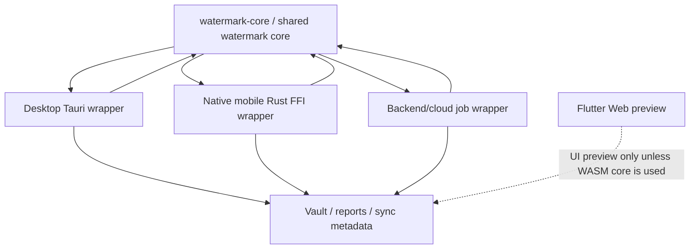

# HiddenShield 共享水印核心与跨端互验推进计划

## 2026-07-21 桌面发布候选范围冻结

- `docs/桌面媒体正式支持范围.md` 定义桌面端后续图片 / 音频工作的唯一产品范围：静态 PNG / JPEG / WebP 不超过 `100 MP / 512 MiB`；WAV / MP3 / FLAC / OGG / M4A 为 `8–48 kHz`、mono / stereo、`30 秒–20 分钟`、不超过 `512 MiB`。
- 桌面取证副本容器统一为 PNG（图片）和 WAV（音频）；音频不回写有损容器，FLAC 仅作为后续兼容选项，且必须经过独立写后回读与质量 Gate。
- 图片最小可处理规格由 `watermark-core` 的分块容量计算决定；不得以 `1920×1080` 等测试参考尺寸代替容量规则。
- 所有条目在容量、接近上限、真实文件、写后回读和只读 Gate 全部通过前均属于发布候选，不得提前作为当前能力对外承诺。
- 移动端冻结；后续共享核心工作只要求桌面 wrapper 和桌面 release Gate，不增加移动端义务。

## 2026-07-21 常见音频规格产品边界

状态：`对外口径已确定；高采样率与多声道扩展未承诺`

- 当前发布只推进桌面端；移动端实现和历史 fixture 冻结，不新增移动端能力承诺或 release Gate。
- HiddenShield 桌面端当前支持常见的 `8–48 kHz` 音频采样率和 `mono / stereo` 声道，并在保护过程中保持原始采样率与声道不变。
- 该口径不等于任意素材均可保护：单文件最短时长、内容质量、容器解析和写后回读门槛仍然有效。
- `4–8` 声道及 `48 kHz` 以上采样率属于后续兼容性扩展范围；低于 `8 kHz` 的低采样率也不进入当前用户承诺。
- 扩展只能修改 `watermark-core` 的采样率无关容量 / 频带策略，并必须新增原规格保持、桌面 ↔ 移动双向互读和扰动后的 release Gate；不得由端侧转换格式、重采样或降声道实现“兼容”。
- 已有证据：30 秒 48 kHz 五种容器 × mono / stereo 基线 `10 / 10` 通过；广泛控制矩阵的常见 `8–48 kHz` 代表性组合通过，所有生成输出均保持源规格。
- `watermark-core` 现以 `validate_audio_protection_input` 统一执行最短 `30` 秒、`8–48 kHz`、`1–2` 声道边界；桌面端在写入前使用 `audio-support-v1` fixture、失败分类和中文提示。

下一共享核心任务：

- 以 `audio-support-v1` 的允许和拒绝边界样本完成桌面安装版运行时验证，并补 PNG / JPEG / WebP 的常见尺寸矩阵写后回读与只读验证，先定位核心容量边界再决定最小规格；高采样率、多声道与低采样率容量策略单独立项。

## 2026-07-21 音频采样率与性能复核（发布阻断）

状态：`48 kHz 保规格写读已修复；扰动与跨端 Gate 待补`

- 复核证明桌面端与 CLI 均调用 `watermark-core`；先前 140 秒图片、30–110 秒音频耗时来自 debug 构建，不代表桌面 Release 性能。修正为 release 后，同一 1920×1080 JPEG 写入约 `9.7 s`，30 秒 mono WAV 写入 / 读取约 `0.63 s / 1.13 s`。
- 桌面正式 `sine_31s` 夹具的 FLAC / MP3 / OGG / M4A 在 `44.1 kHz` mono 下 `4 / 4` 写后回读通过，证明容器解析链路可用。
- 根因是默认 V3 WAV 写入在实际采样率以外硬编码 `44.1 kHz` 频带，而读取按 WAV 实际采样率取频带；该核心缺陷已修复，不通过桌面降采样规避。
- 修复后，同类 31 秒 48 kHz 控制音频 WAV / MP3 `6 / 6` 通过；30 秒 48 kHz 的 WAV / MP3 / FLAC / OGG / M4A、mono / stereo `10 / 10` 通过，输出保持原采样率和声道。
- 当前不能把 48 kHz 失败归因于 MP3 容器或粉噪内容；修复后的粉噪基线已通过，但仍需在扰动、感知质量和跨端路径分别评估。
- `watermark:matrix` 已固定使用 release，后续完整扰动不得再用 debug 构建。
- `watermark:cross-end-release` 已改为向每个 Cargo 子 Gate 传递 `--release` 并输出分组耗时；首次运行在本机清理 `target` 与 Cargo 缓存后会重建 Tauri / C2PA 依赖，不得把该构建耗时记为图片或音频写读性能。
- `robustness_bench` 已改为保持每个源文件的采样率和声道，并在所有扰动输出提取前执行 WAV 规格断言；本轮 `240 / 240` 输出均保持 48 kHz 和原声道。
- 五种容器 × mono/stereo 的矩阵总计 `106 / 240` 可读。基线、WAV 重编码、音量 80%、音量 120% 和 MP3 192k 往返为 `50 / 50`；`134` 个失败集中于 5–15 秒短裁剪和裁剪位置。
- 短片段失败不允许通过改变采样率或声道规避；若未来承诺片段级取证，必须在 `watermark-core` 内新增明确的片段恢复策略和独立 Gate。

## 2026-07-21 广泛采样率 / 声道边界审计

- 广泛控制矩阵覆盖 4–192 kHz 的标准采样率和 1–8 声道代表组合，34 组中 22 组通过。
- 当前 8–48 kHz、48 kHz 的 1–8 声道组合通过；4 kHz 受 31 秒 V3 packet 容量限制，88.2 kHz 以上受当前 FFT 频对容量限制。
- 该结果证明核心已能按实际规格保留输出，但不证明“任意 kHz / 任意声道”。不能通过桌面或移动端重采样、降声道来掩盖失败。

下一任务：在 `watermark-core` 内设计采样率无关的容量策略，明确最低采样率、最高采样率、最低时长和最大声道数，并以保规格回归作为发布 Gate。

下一任务：保持桌面与移动端的原始采样率/声道，补 48 kHz 桌面/移动双向读取；随后决定产品是否需要承诺低于 30 秒的片段恢复，未立项前保持该能力边界。

## 2026-07-21 图片 / 音频自检矩阵审计

状态：`写读基本通过；质量与真实文件矩阵未完成`

- 图片 8 类合成内容全部完成 V3 写入、提取和质量 Gate。
- 音频 6 类内容全部能够提取；噪声底录音因 SNR 低于阈值阻断发布质量 Gate。
- 跨端 release contract 通过，但外部语料矩阵没有找到输入文件，不能据此证明所有格式、大小、时长和声道。
- 本次不修改 payload、阈值或算法，不通过降低阈值绕过噪声底问题。

下一共享核心任务：

- 建立真实文件矩阵：图片 PNG / JPEG / WebP 的小、中、大分辨率；音频 WAV / MP3 / FLAC / OGG / M4A 的短、中、长时长及 mono / stereo，先记录失败分类，再决定是否调整共享核心。

## 2026-07-17 正式安装包与内部 QA 工具隔离

- 本轮没有修改 `watermark-core` API、payload、算法、阈值、fixture 内容或正式写读规则。
- Tauri 正式 Cargo 包只保留 `hidden_shield` 产品 bin；水印候选读取、V3 internal QA 写入、公开元数据嵌入、音频噪声底迁移和报告互验工具统一作为 Cargo examples 运行。
- 服务方 `offline_license_issuer` 与 `desktop_offline_release_gate` 同样不进入用户 MSI / NSIS，避免把服务方密钥操作工具或内部 Gate 暴露为桌面产品能力。
- MSI / NSIS 静默安装结果只包含产品主程序和卸载器；安装版仍通过相同桌面调用层访问 `watermark-core`。
- 自包含启动 Gate 只验证前端内嵌、WebView2 离线载荷和产品页面启动，不替代图片 / 音频跨端互验 Gate。

下一共享核心任务：在当前安装版中各执行一次真实图片和音频写入、写后回读与只读验证，确认迁移内部工具后正式 `watermark-core` 调用结果没有变化。

## 2026-07-17 写前识别调用边界

- 本轮未修改 `watermark-core` API、payload、算法、阈值、fixture 或 benchmark。
- 桌面不再在普通文件选择时调用完整 `WatermarkService::extract`；该负路径在 3840×1080 无水印 PNG 上实测约 63 秒，不适合作为选择文件的同步 UI 前置条件。
- 完整提取只在用户显式选择“这是已有作品的新版”时按需调用；正式写入仍通过共享核心的已有水印保护规则阻止误覆盖。
- 五步进度是桌面对现有后端阶段事件的产品化映射，不改变核心算法阶段或事件协议。

回滚路径：如按需识别出现版本关系回归，可恢复显式“检查上一版”按钮，但不得恢复普通文件选择时的自动深度提取。

下一核心任务：评估共享核心是否需要独立、快速、有限候选的已有水印检测 API；在完成性能门禁前不得用完整读取 API 作为实时 UI 预检。

## 2026-07-17 桌面调用边界补充

- 本轮未修改 `watermark-core` API、payload、算法、fixture、阈值或 benchmark。
- 桌面处理与验证入口只允许图片 / 音频；视频算法和历史兼容代码继续作为内部冻结资产，不通过当前产品 UI 调用。
- 验证页新增视频扩展名 fail-closed 检查，防止绕过文件选择器调用冻结的视频验证路径。
- 可信时间补充只更新版权记录的 TSA / 网络授时材料，不修改媒体 payload、水印读取结论或版权编号。
- 当前验证结果：`npm run build` 与 `cargo check --manifest-path src-tauri/Cargo.toml` 通过。

下一核心任务：重新打包桌面 Release，并对图片 / 音频写入、读取、验证和可信时间回填执行页面级人工验证；移动端继续冻结。

## 2026-07-16 当前执行基线与 RC / GA Gate

状态：`移动端与视频暂停；新权益映射不改算法；桌面 RC 待重建复验`

- `watermark-core` 继续是桌面端与后端云全部正式盲水印写入、读取、验证、payload、版权编号和重写判断的唯一事实源。
- 移动端接入、移动端新 fixture 和新增桌面写 / 移动读、移动写 / 桌面读任务全部冻结；已有图片 / 音频跨端证据继续保留为回归资产。
- 当前桌面发布只承诺图片 / 音频能力，并必须补齐断网环境下的读取与验证。
- L1 视频音轨、L2 视频指纹存证和 L3 视频画面候选不再作为当前正式能力。桌面端不得展示入口、生成新记录或把任何一层写入正式报告和商业权益。
- 视频相关 core API、后端 execution wrapper、fixture、benchmark 和历史记录字段暂不删除，仅允许内部研究、回归和未来重启时复用；内部结果不得进入用户可见能力口径。
- 未来重启真正的视频盲水印时，算法仍必须落在 `watermark-core`，并重新建立独立的鲁棒性、误报 / 漏报、性能、离线 / 云执行和用户可见发布 Gate。
- 当前商业权益只影响包装层：未付费无批量，图片 / 音频年费只开放批量，正式报告按记录单独购买；`watermark-core` 不承载套餐或报告授权。
- HSLIC1 兼容产品代码 `creator_offline` 只能映射 `batch_processing=true`，必须保持 `report_export=false`。

Gate 分层：

- `RC Gate 待新映射复验`：旧安装版已完成物理断网图片 / 音频 4 / 4 写读和许可证生命周期；算法证据继续有效，但商业映射变更后必须用新包复验 HSLIC1 不授予报告。
- `GA Gate 进行中`：仍需干净 Windows、正式企业分发证书和生产密钥托管证据。全新 `HiddenShieldReleaseQA` 本地用户的页面级复跑只作为隔离账户补充证据，不替代干净系统 Gate。

本次完成：

- 将推进主线从“新增跨端能力”调整为“桌面离线验证 + 服务方注册码签发”。
- 明确视频能力从当前发布范围整体退出，不以 L1 / L2 替代真正的视频盲水印。

验证：

- 本次未修改 `watermark-core` API、payload、算法、fixture 或 benchmark。
- 桌面入口屏蔽后仍保留 core 与后端内部资产，回滚方式为恢复 UI 门禁并重新完成能力边界审批与发布 Gate。
- 2026-07-16 安装版 runtime gate 在真实 WLAN 断开期间调用同一 `watermark-core`：图片 / 音频 internal QA 与默认写入路径共 4 条均读回 V3/39、同一版权编号且 `payloadAuthStatus=verified`。
- 当前性能快照只记录功能正确性：4 / 4 通过；本轮未改变强度、阈值、payload 或感知质量指标。

风险：

- 旧脚本仍可能验证冻结前的视频与移动端合同；这些脚本不再属于当前桌面 release gate，但不能删除其历史证据。

下一核心任务：

- 在全新 `HiddenShieldReleaseQA` Windows 本地用户下对安装版 UI 执行图片 / 音频页面级 QA，并记录安装、启动、读取结果、HSREQ1 / HSLIC1 / HSRVL1 状态和注销登录后的持久化证据；算法仍不得在桌面 wrapper 中分叉。

本文档用于推进 HiddenShield 桌面端、移动端、后端和未来视频能力的同核化。它是 `docs/双端能力一致性Roadmap.md` 的 Phase I 执行文档。

执行 Phase I 前必须先阅读并遵守算法审计：

- `docs/共享水印核心算法审计.md`

审计结论是：当前桌面端和原生移动端已经调用 `watermark-core`，但 payload 构造、音频预处理、Web 预览和未来视频边界仍有高风险漂移点。Phase I 必须先固化契约和互验门禁，不得先迁移或重写核心算法。

## 1. 目标

HiddenShield 正式盲水印能力必须只有一套算法核心。

- 桌面端、原生移动端、后端云任务和未来视频能力可以有不同平台封装。
- 图片、音频、视频音轨和未来视频画面盲水印的正式写入、读取、重写判断、版权编号、媒体 payload 编码和写入后验证必须来自 `watermark-core`。
- 正式版权编号必须是记录级身份：不同作品首次写入不得复用同一 `watermarkUid`；在线默认由后端签发 / 确认唯一，离线使用 128-bit 级高熵本地编号兜底；作为新版写入时应生成新 `watermarkUid`，并通过 `parentWatermarkUid + revision` 表达版本链。
- 图片 / 音频当前正式默认写入已进入 V3/39 最小锚点；V2/119 只保留为显式迁移、回滚和历史对照工具链。新写入不再生成 V1 payload，也不得静默回退到 V2。
- 云端视频画面盲水印如果需要服务端能力，服务端也只能部署或调用 `watermark-core` 产物，不能形成第二套盲水印算法核心。
- 任一正式端写入的保护副本，必须能被支持同类媒体的另一正式端正确解析。
- 本版封版要求进一步收紧为双端互解：移动端写入 / 加密后的图片、音频保护副本必须能被桌面端读取、验证或解密出同一版权编号和 payload；桌面端写入 / 加密后的图片、音频保护副本也必须能被移动端读取、验证或解密出同一版权编号和 payload。
- 公开权利信号与训练许可扫描不再推动媒体 payload 扩容；V3/39 保持最小锚点层职责，完整授权声明应进入后端 rights registry 与 C2PA / CAWG / IPTC / XMP / JSON-LD 公开元数据层，执行文档为 `docs/公开权利信号与训练许可扫描协议设计.md`。

## 2. 硬约束

- `watermark-core` 是所有当前和未来正式盲水印算法的唯一事实源。
- 平台 UI、Flutter bridge、Tauri command、后端 API、云任务和脚本不得重新实现正式盲水印写入、读取、验证、payload 编码、版权编号生成或重写规则。
- Web 预览如果不调用同一核心，只能作为 UI 预览，不得进入正式版权库、正式报告、云同步 payload 或跨端 QA 证据。
- 双端互验失败时，不得通过文案、导出按钮或结果卡补丁绕过。
- 未来视频盲水印写入与验证必须复用 `watermark-core`。如果需要云端执行，云端必须是 `watermark-core` 的部署/调度包装层，而不是新的算法源。
- 当前正式格式矩阵只收敛到图片 PNG / JPEG / WebP、音频 WAV / MP3 / FLAC / OGG / M4A、视频 L1 / L2 当前正式可承诺的 MP4 / MOV / MKV / WebM；AVI / M4V 仅保留为北极星目标，候选格式不得混入正式互验门禁。
- 不得为了训练许可、公示授权、公开扫描 API 或企业批量检查扩展媒体 payload；后续新增权利字段应通过 registry 与公开元数据承载，V3/39 只作为可验证水印锚点，V2/119 只作为显式迁移 / 回滚工具链。
- 感知质量发布门禁只能测量 `watermark-core` 正式写入链路的输出，不能在平台层、脚本层或云端另行实现水印算法、强度参数或绕开 core 的保护副本生成逻辑；执行文档为 `docs/感知质量发布门禁设计.md`。

## 3. 当前事实

| 模块 | 当前状态 | 风险 |
| --- | --- | --- |
| `watermark-core` | 已包含图片和音频 `WatermarkService::embed/extract`、payload、版权编号、重写拒绝 | 需要提升为发布门禁，而不是只被部分测试覆盖 |
| payload 协议 | `watermark-core` 图片 / 音频默认 `WatermarkService::embed/extract` 已切到 V3/39 最小锚点；V2/119 的 `PAYLOAD_BYTES = 119` 常量保留给显式 `force_v2_rollback` / `embed_v2` / `extract_v2` 和历史迁移对照；双端版权库 / 报告 / 同步 payload 已落地 protocol 与 registry 字段；桌面端和移动端图片 / 音频写入已在线优先接入 `reserve -> confirm`，同步前自动执行 `confirm / reconcile` 并回写本地记录 | 同步仲裁 UI 和历史修复 UI 已接入；不得回退到旧 32-byte payload、短编号或默认 V2 兼容读写 |
| 版权编号规则 | core 正式构造路径已使用 128-bit CSPRNG 离线记录身份，展示为完整 `HS-XXXXXXXX-XXXXXXXX-XXXXXXXX-XXXXXXXX`；后端 `watermark-ids` reserve / confirm / reconcile / reissue API 已实现并测试；双端写入前会尽力请求后端编号，后端不可用时保持离线写入并在云同步前自动补登记；`watermark:uid-format-contract` 阻断正式 UI / mock / 自动化继续出现旧 48-bit `HS-XXXX-XXXX-XXXX` 编号 | 同 UID 不同哈希已进入 `pending_registry_reconcile`；历史重复重签入口已接入；真实后端运行态 QA 已覆盖登记三态和保护副本文件流转；旧短编号只允许作为历史本地记录或文档背景出现 |
| 桌面端 Tauri | 已通过 `watermark-core` 处理图片、音频和写入后验证 | 前后处理、输出格式和错误映射仍可能漂移 |
| 原生移动端 Rust bridge | 已依赖 `watermark-core`，有基础互验测试 | 测试范围仍集中在 mobile crate 内，没有形成仓库级合同 |
| 移动端 Web 预览 | 使用 preview marker 和 mock hash，不调用 `watermark-core` | 不能代表正式移动端能力，容易误导手测和产品判断 |
| 视频能力 | 当前主要是 L1 视频音轨水印和 L2 视频指纹存证，云端视频画面盲水印仍是未来商业能力 | 进入实现前必须先确定 `watermark-core` 视频画面算法边界和云端执行包装方式 |
| 公开权利信号 | 已新增协议设计，明确不扩展媒体 payload；扫描器应先读公开元数据，再读 V3 锚点，最后查 rights registry；桌面端已具备 PNG / JPEG 公开元数据嵌入副本导出首版，Android 已具备同构 Dart PNG / JPEG 嵌入器、字节检查 QA 和详情页点击到分享前产物的运行态 QA。该能力只写复制件的 XMP/IPTC/JSON-LD / C2PA 传播层，不参与盲水印 payload | 不得把训练许可扫描包装成法律授权判断或自动 AI 生成检测；图片嵌入副本不是媒体 payload 扩容；移动端旧版权库记录没有保护副本字节或路径时，不得承诺无文件导出嵌入副本；Android QA 不能替代 iOS QA |
| V3 最小锚点默认 codec | `watermark-core` payload 层已新增 `WatermarkPayloadV3MinimalAnchor`、`PAYLOAD_V3_MINIMAL_ANCHOR_BYTES = 39`、独立 encode / decode 单测、`WatermarkDecodedPayload` 和 `decode_watermark_payload_readonly`；默认 `WatermarkService::embed/extract` 已写读 V3/39，桌面 scheduler、桌面默认验证页和 Android 原生 bridge 默认 `write/read` 已消费 V3；图片 sync packet 采用 V3 专用容量布局，音频 recovery packet 默认承载 V3/39；显式 `extract_image_watermark_readonly_candidate_bytes`、`extract_watermark_wav_readonly_candidate_bytes` / `extract_watermark_samples_readonly_candidate` 继续作为迁移桥 / 受控 QA reader；正式报告生成器与同步回填 QA 已覆盖派生 `media_payload_role`；`rights:v3-feature-gate-rollback-contract` 验证 `off` 与 `internal_qa` 为 V3/39，只有显式 `force_v2_rollback` 回到 V2/119 | V3 默认算法已覆盖图片 / 音频桌面端和 Android 原生端，但不包含视频视觉 L3 默认切换；iOS 同场景运行态 QA 仍因缺少 macOS + Xcode + iOS Simulator 或真机环境挂起；历史 V2 记录读取只属于显式迁移 / rollback 工具链，不是默认算法 |
| 感知质量门禁 | 已新增设计文档并实现 `watermark:quality-gate:fast` / `watermark:quality-gate:release` / `watermark:quality-gate:full` / `watermark:quality-gate:contract`，覆盖 V3 图片 roundtrip PSNR / SSIM / 耗时、音频 SNR / LUFS / 峰值差异 / clipping、L1 视频音轨和 ABX 模板；稳定噪声底 A/B/C 隔离实验均不能晋级正式候选，已新增 `docs/音频噪声底跨端可读频带策略迁移设计.md` 作为下一阶段设计闸门 | `field-noise` 仍是 full gate 客观阻断项；迁移设计不代表算法已实现，不得降低阈值、绕过 ABX 或把 `Forensic` / `Balanced` 强度枚举包装成用户可选质量策略 |

## 4. 目标架构

原则：

- Core 只关心正式算法、payload、读写和验证。
- Wrapper 只关心平台输入输出、文件选择、保存分享、FFmpeg/Symphonia 转换、Tauri/Flutter/HTTP 封装。
- Cloud wrapper 只关心调度、权益、密钥托管、策略下发和自检编排；盲水印算法仍来自 `watermark-core`。
- Vault、报告和同步只接收核心产出的正式 metadata，不接收原始媒体、保护副本、本地路径或 preview marker。

## 5. 分阶段任务

### Phase I-1：核心契约固化

状态：进行中，`watermark-core` 已从旧 payload builder 升级为 V2-119；后端登记、双端数据层、双端图片 / 音频写入链路在线优先 `reserve -> confirm`、同步前自动 `confirm / reconcile`、仲裁 UI 与历史修复入口已接入

任务：

- 梳理 `watermark-core` 对外正式 API：图片写入、图片读取、音频写入、音频读取、重写检测、写入后验证。
- 固化 V2 payload 字段：`watermarkIdBytes`、`parentWatermarkIdBytes`、`revision`、`issuedAt`、`originalHashPrefix`、`declarationFlags`、`issueMode`、`mediaType`、`registryProofHash`、`creatorBindingHash`、`authTag`。
- 固化版权编号生成规则：`HS-...` 必须由共享核心或共享 payload 方法从完整 128-bit 级身份生成，不再使用短 48-bit 创作者 / 设备派生片段。
- 固化版权编号唯一性语义：每次正式保护副本写入生成新的记录级 `watermarkUid`；在线优先后端签发 / 确认唯一，离线高熵兜底；版本链由 `parentWatermarkUid + revision` 表达，不能用复用同一编号替代版本关系。
- 固化版权编号展示契约：正式 UI、mock、自动化 fixture 和错误解析只能接受完整 `HS-XXXXXXXX-XXXXXXXX-XXXXXXXX-XXXXXXXX`；旧 `HS-XXXX-XXXX-XXXX` 不得再作为当前正式编号样例或测试数据。
- 把错误类型分层：核心错误码、平台日志、用户可见文案。
- 设计共享 V2 payload builder，明确后端签发身份、离线高熵身份、父编号、原作品摘要和声明字段如何进入同一 payload 契约。

验收标准：

- [x] 文档列出哪些规则只能在 `watermark-core` 修改。
- [x] 桌面端和移动端没有新的正式算法分叉点。
- [x] 移动端图片、音频和本地批量不再各自维护重复 payload seed 派生规则。
- [x] `watermark-core` 曾提供 `PayloadBuildInput` 和 `PayloadDigestBuildInput`，统一生成旧 payload、版权编号、媒体哈希片段和 auth tag；该成果将被 V2 builder 替代。
- [x] 桌面端 identity seed 派生从历史路径直接切换到 `watermark-core` 原始 identity builder，不保留 seed 迁移层；V2 实施后该路径不再作为正式编号来源。
- [x] 桌面端正式写入不再传入预计算 `user_seed` / `device_id` / `file_hash`，改为传 creator/device 源身份和媒体 SHA-256，由 `watermark-core` 生成旧正式 payload；V2 实施后改为传后端签发或离线高熵记录身份。
- [x] 核心错误码结构化，双端平台层优先使用 `already_watermarked`、`missing_creator_identity`、`embed_failed`、`extract_failed` 等稳定 code 映射用户文案。
- [x] `watermark:uid-format-contract` 已接入 `commercial:ci`，正式 UI / mock / 自动化 fixture 不得再出现旧短版权编号或旧短编号 regex。
- [ ] 继续补齐跨端金样本 fixture，把错误码合同接入互验失败报告。
- [ ] 按 `docs/版权编号唯一性与版本链语义设计.md` 改造为 `Watermark Payload Protocol V2`：同一创作者 / 设备写入不同作品必须得到不同 `watermarkUid`，同一作品新版写入必须得到新 `watermarkUid` 并保留父编号。

### Phase I-1.1：Watermark Payload Protocol V2 与版权编号唯一性

状态：`watermark-core` V2-119 核心、双端 Rust bridge、后端签发 / 登记 API、双端落库 / 报告 / 同步字段、双端写入前在线 reserve/confirm、同步前自动 confirm/reconcile、同步仲裁 UI 和历史修复入口已实施

执行文档：

- `docs/版权编号唯一性与版本链语义设计.md`

任务：

- [x] 确认产品语义：`watermarkUid` 是正式保护副本写入后的记录级版权编号，不是创作者编号或设备编号。
- [x] 确认版本链语义：新版写入生成新 `watermarkUid`，上一版写入 `parentWatermarkUid`，`revision` 递增。
- [x] 确认研发期直接进入 `Watermark Payload Protocol V2`，新写入不保留 V1 payload 兼容，不在旧 32-byte payload 中塞字段。
- [x] `watermark-core` 新增 V2 payload 常量和结构体，固化完整二进制布局、`PAYLOAD_BYTES = 119`、字段顺序、大小端、16-byte HMAC 认证标签、16-byte creator binding hash 和展示编号生成。
- [x] `watermark-core` 正式 identity/media 构造路径移除对旧 `user_seed + device_id` 确定性短编号模型的依赖，离线写入使用 128-bit CSPRNG 记录身份；测试 / 诊断残留的 `WatermarkPayload::new` 不得作为正式写入入口。
- [x] 图片算法容量升级：主 payload bit 写入长度、sync packet 长度、checksum、最小图片尺寸、提取窗口和写入后回读已随 `PAYLOAD_BYTES` 升级。
- [x] 音频算法容量升级：recovery packet 长度、冗余、恢复包偏移、容错和写入后回读已随 `PAYLOAD_BYTES` 升级。
- [x] 视频视觉算法容量升级：DCT / sync / ECC bitstream payload 位数、策略区域预算、采样帧预算、性能预算和失败归因已随 V2-119 更新；L3 仍保持 staged / 内部测试边界。
- [x] 后端新增编号签发 / 登记 / 确认 / 重新签发 API，并通过 `watermark_id_registry.watermark_uid UNIQUE` 保证在线登记唯一；已覆盖 reserve 幂等、confirm、offline reconcile、conflict 和 reissue 测试。
- [x] `watermark-core` 支持至少 128-bit 高熵本地编号兜底，并由 V2 payload 构造路径生成展示编号。
- [x] 桌面端和移动端图片 / 音频写入在线优先请求后端编号；后端不可用时使用本地高熵编号；同步前自动执行 `confirm / reconcile` 并回写本地版权库和同步 payload。
- [x] 桌面端和移动端版权库、存证摘要、正式报告和同步 payload 保存 `watermarkIdIssueMode`、registry status / receipt、parent id、revision、payload protocol、payload bytes 和 payload auth status；当前新写入默认 `offline_generated + pending_registration`。
- [x] 云同步发送前会对 `pending_registration / reserved` 的版权记录调用后端 `confirm / reconcile`，成功后回写 registry receipt、状态、父编号和版本次数。
- [x] 同 `watermarkUid`、不同原作品哈希且无父链关系的显式仲裁 UI、`pending_registry_reconcile` 展示和历史重复编号修复入口已接入双端版权库。
- [x] 研发期旧 payload 或重复编号进入重新签发和 V2 保护副本重写修复队列；桌面端可访问保护副本时用 `watermark-core` 重写并回读验证，媒体不可访问时标记 `reissue_required`；移动端先创建重签任务并等待用户重新选择文件完成 payload 修复。

验收标准：

- `watermark-core` V2 payload 编码 / 解码 roundtrip 能完整保留 128-bit `watermarkUid`、父编号、版本次数、摘要前缀、签发模式和认证标签。
- 任意 V2 关键字段被篡改时，payload 认证失败。
- 同一创作者、同一设备连续写入 3 张不同图片，生成 3 个不同 `watermarkUid`。
- 同一创作者、同一设备连续写入 3 段不同音频，生成 3 个不同 `watermarkUid`。
- 后端在线时，写入使用后端签发编号并获得登记收据。
- 后端不可用时，写入使用高熵本地编号并进入待登记状态，联网后补登记。
- 桌面写入、移动端读取，以及移动端写入、桌面读取，都能读出同一新模型编号和 payload。
- 作为新版写入时，新编号、父编号和版本次数在版权库、存证摘要、正式报告和同步 payload 中一致。
- 图片 V2 sync packet 和音频 V2 recovery packet 都能跨端读回完整 payload。
- 视频视觉 V2 bitstream 在 staged 核心测试中通过，或记录为容量风险并同步当前真实能力边界；不得改变对用户的 L3 承诺边界。
- 研发期旧 payload 或重复编号不能只提示旧模型；可访问媒体时必须能重新签发并生成 V2 保护副本，不可访问媒体时进入待修复状态。

### Phase I-1.2：V2 算法容量施工图

状态：核心容量施工已完成；后端、双端落库字段、同步仲裁和历史修复仍待下一阶段接入

施工顺序：

1. `payload.rs` 先冻结 V2 二进制布局和 `PAYLOAD_BYTES`。
2. 图片算法跟进：主 payload anchor、sync packet、纠错和最小尺寸一起改。
3. 音频算法跟进：recovery packet、冗余和最低时长一起改。
4. 视频视觉 staged 算法跟进：DCT bitstream、ECC、策略预算和性能测试一起改。
5. 桌面端和移动端桥接同时切到 V2 builder。
6. 后端签发 API、离线兜底和同步登记仲裁接入。
7. 跨端金样本全部重建为 V2，并让 release 门禁阻断旧 payload 回流。

容量施工要求：

| 模块 | 必改项 | 验收 |
| --- | --- | --- |
| payload | V2 magic、版本、长度、128-bit 编号、父编号、revision、摘要、签发模式、认证标签 | 核心单测 roundtrip 和 tamper fail |
| image | payload bits、sync packet、checksum、冗余、最小尺寸、提取窗口 | PNG / JPEG / WebP 双端互验读出完整 V2 payload |
| audio | recovery packet、冗余倍数、最低时长、容错阈值、恢复偏移 | WAV / MP3 / FLAC / OGG / M4A 双端互验读出完整 V2 payload |
| video visual | DCT bitstream、sync / ECC 位数、策略区域、采样帧、性能预算 | staged core 测试明确通过或明确记录容量风险 |
| desktop/mobile bridge | 写入请求、读取结果、版权库字段、报告字段 | 双端 UI 和数据层不再出现旧短编号模型 |
| sync/backend | reserve / confirm / reconcile / reissue、registry 状态、同步前自动补登记、冲突仲裁 | 离线编号可补登记；同 UID 不同哈希不静默合并，双端展示待登记仲裁与重新签发修复入口 |

发布门禁：

- 禁止新正式写入调用旧 32-byte payload builder。
- 禁止新正式记录保存 `HS-XXXX-XXXX-XXXX` 级短编号作为唯一版权编号。
- 禁止 Web preview marker、旧 payload 或 mock ID 进入正式版权库、报告和云同步。
- 任一图片、音频、payload、版权编号、同步仲裁改动都必须复跑 V2 跨端互验合同。

### Phase I-2：跨端金样本 fixtures

状态：进行中，已落地首个 Rust 层双向互验合同

任务：

- [x] 建立首个可 CI 运行的图片和音频 Rust fixture，覆盖原始样本、桌面 core 写入产物、移动端原生桥写入产物。
- [x] 桌面 core 写入图片，移动端原生读取必须得到同一版权编号和 payload。
- [x] 移动端原生写入图片，桌面 core 读取必须得到同一版权编号和 payload。
- [x] 桌面 core 写入音频，移动端原生读取必须得到同一版权编号和 payload。
- [x] 移动端原生写入音频，桌面 core 读取必须得到同一版权编号和 payload。
- [x] 将 desktop->mobile 与 mobile->desktop 双向读取 / 验证 / 解密作为封版 release gate，而不是只作为算法测试证据。
- [x] 扩展图片真实输入容器矩阵：PNG / JPEG / WebP 输入均覆盖 mobile->desktop 与 desktop->mobile 双向互验。
- [x] 扩展音频真实容器矩阵：WAV / MP3 / FLAC / OGG / M4A 输入均覆盖移动端归一化后进入同一 `watermark-core` payload，并覆盖移动端写入产物可被桌面 core 提取。
- [ ] 裸 AAC / ADTS 需要补标准 fixture 或明确产品承诺收束到 M4A(AAC in MP4)，再决定是否进入 release-blocking 门禁。
- [x] 将失败报告细分为核心算法、平台转码、桥接封装、移动端归一化和 fixture 问题。

验收标准：

- [x] 首个互验测试可以在 CI 中无人工操作运行：`npm run watermark:cross-end-contract`。
- [x] 图片输入容器至少覆盖 PNG / JPEG / WebP，且双端互验均通过同一 `watermark-core` payload 与版权编号。
- [x] 音频输入容器至少覆盖 WAV / MP3 / FLAC / OGG / M4A；非 WAV 样本作为仓库 fixture 固定，CI 不依赖本机 FFmpeg。
- [x] 双端保护副本互解必须双向通过：desktop->mobile 与 mobile->desktop 均能读取 / 验证 / 解密出同一版权编号和 payload。
- [x] 失败时能定位到 `core_algorithm`、`mobile_normalize`、`desktop_transcode`、`bridge_contract` 或 `fixture_invalid`。

失败归因 code：

- `core_algorithm`：归一化后的媒体进入 `watermark-core` 后，写入 / 提取 / payload / 版权编号互验失败。
- `mobile_normalize`：移动端原生桥将 MP3 / FLAC / OGG / M4A 等输入归一化到 WAV 后，无法得到与桌面 core 一致的 payload。
- `desktop_transcode`：桌面端或未来视频 L1 使用 FFmpeg / FFprobe 抽取、转码、保留声道采样率时失败或漂移。
- `bridge_contract`：平台桥接、结构化返回、移动写入产物被桌面读取、桌面写入产物被移动读取等包装契约失败。
- `fixture_invalid`：仓库内金样本缺失、过小、魔数不匹配或不能被当前解码路径归一化。

### Phase I-2.1：稳定噪声底音频频带策略迁移设计

状态：设计闸门、旧策略读取兼容门禁、只读 candidate interface、read-only candidate 扫描和 protected-new-candidate draft manifest 已建立，写入迁移实现未开始

执行文档：

- `docs/音频噪声底跨端可读频带策略迁移设计.md`

背景：

- A/B/C 三组隔离实验均保持 V3/39 UID 可读和 `extractionConfidence=1.000000`，但都不能解除 `field-noise` 的 full gate 阻断。
- 当前 2-8 kHz extractor 可读 lane 内的 lane / 时间窗口 / 单位时间 pair budget 微调应停止。
- 任何真正迁移都可能影响双端读取，必须先完成新旧 extractor 兼容和双端互验设计。

任务：

- [x] 固化迁移设计文档，明确不改 payload、不改 UID、不降低质量阈值、不进入正式 UI / mock / release gate 默认路径。
- [x] 固化新旧 extractor 兼容顺序：新策略候选读取、legacy V3/39 fallback、既有 V2 / legacy fallback。
- [x] 固化桌面端 / 移动端双向读取矩阵：old write / new read、new write / new read、desktop->mobile、mobile->desktop。
- [x] 固化 fixture manifest 设计，要求记录 `audioStrategyVersion`、`expectedExtractorPath`、UID、V3/39、质量阈值和 rollback policy。
- [x] 固化回滚规则：写入策略 flag、读取 fallback、vault/report 记录 strategy/extractor path。
- [x] 实现 `watermark:audio-noise-floor-migration-contract`，只检查设计、fixture schema 占位、禁止平台算法漂移和阈值不降。
- [x] 新增 migration fixture manifest 和 read compat gate：`manifest.schema.json` / `manifest.example.json` 固定 `read_compat_legacy_v3`，`watermark:audio-noise-floor-migration-read-compat` 先验证旧策略样本、桌面 file-backed 旧产物和 Android 原生 Rust bridge file-backed 旧产物可由当前默认 extractor 与 legacy readonly candidate 读取。
- [x] 固化新 extractor 计划读取顺序和报告字段：`plannedExtractorReadOrder`、`plannedReportFields`、`audioStrategyVersion`、`extractorPath`、`extractorFallbackPath`、`candidateFailureCode`、`candidateFailureMessage`、`candidateFailureMatrix`、`readCompatibilityMode`。
- [x] 只读 new extractor candidate interface 已接入 read compat：`watermark-core` 导出 `extract_audio_noise_floor_migrated_band_v1_candidate_wav_bytes` 和失败码枚举，报告输出 `extractorPath=v3_recovery_2_8k_legacy`、`extractorFallbackPath=v3_noise_floor_migrated_band_v1_candidate -> v3_recovery_2_8k_legacy`、`readCompatibilityMode=legacy_v3_read_compat_candidate_interface_fallback`，并继续 fallback 命中 legacy V3。
- [x] 候选接口失败码矩阵已接入 read compat：`candidate_not_implemented_no_frequency_strategy`、`candidate_input_invalid`、`candidate_audio_too_short`、`candidate_payload_not_found`、`candidate_payload_invalid` 均有固定 expected handling、gate disposition 和当前观测数规则。
- [x] read-only candidate 扫描已接入 read compat：当前 5 个旧 V3/39 fixture 均观测 `candidate_payload_not_found` 后 fallback；`candidateScanAttempted=true`，`candidateScanProfiles` 固定三组只读频带，且 legacy fallback 仍读回同一 UID、`extractionConfidence >= 0.99`。
- [x] `protected-new-candidate/manifest.draft.json` 已固化新候选 fixture 草案和 read-compat 阻断矩阵：旧样本必须 candidate miss 后 fallback，新候选样本必须 candidate 命中；fallback-only、payload invalid、stub regression 均阻断。
- [ ] 在新候选 fixture 矩阵和双端读取准入完成前，不进入 `watermark-core` 新频带写入策略实现。
- [ ] RC1 阶段暂停音频噪声底新频带 writer 实验；`field-noise` 按 release blocker / known limitation 收口，不降低 full gate 阈值、不接正式 UI / mock / release 默认路径。

验收标准：

- 新 extractor 必须继续读取当前正式 V3/39 音频保护副本。
- 新策略候选必须保持 `extractionConfidence >= 0.99`。
- `field-noise` 只有达到 full gate SNR `>= 44 dB` 才能解除阻断。
- voice / music / quiet / transient / speech-music-mix / L1 video audio track 不得新增阻断。
- 平台层不得新增 DCT / QIM / 频带选择 / payload bitstream 等算法实现。
- iOS 真实运行态证据缺失时，不得宣布三端迁移完成。

### Phase I-3：发布门禁接入

状态：进行中，首个跨端互验合同已接入 CI

任务：

- [x] 新增 `npm run watermark:cross-end-contract`。
- [x] 新增 `npm run watermark:cross-end-fast`，用于本地快速验证 fixture、图片桥接和 WAV core 互验。
- [x] 新增 `npm run watermark:cross-end-release`，用于完整发布门禁；`watermark:cross-end-contract` 保持为 release 别名。
- [x] CI 必须运行该合同。
- 合同检查 `AGENTS.md` 中的共享核心硬约束是否存在，防止后续删除。
- 合同扫描核心外源码，禁止新增盲水印算法实现型代码。
- 合同检查 Web 预览不被当作正式水印能力。

验收标准：

- 任一端改动图片、音频、payload、版权编号、重写规则或验证规则时，互验合同能发现破坏。
- 发布门禁必须覆盖双端互解，不能只覆盖单端写入或 UI 字段一致。
- Roadmap 回写必须包含互验命令结果。

### Phase I-4：Web 预览边界收口

状态：已完成

任务：

- 明确 Web 预览只有两种合法状态：
  - UI 预览：不生成正式水印，不进入正式版权库和报告。
  - WASM 同核：调用同一 `watermark-core` 后才可作为正式能力。
- [x] 移除或隔离 preview marker 进入正式记录的路径。
- [x] 移动端 Web 页面必须清楚说明当前是否是正式同核能力。
- [x] `WatermarkWriteResult` / `WatermarkReadResult` 增加 `isProductionWatermark`，Web preview bridge 固定返回 `false`。
- [x] 移动端状态层拒绝 Web 预览写入结果和验证结果进入正式版权库或云同步队列。
- [x] `dual:contract` 固定 Web 预览非正式能力、状态层拒绝和测试覆盖。

验收标准：

- Web 预览不能生成被误认为正式保护副本的产物。
- Web 预览不能作为双端互验通过的证据，除非已经接入 WASM 同核。

### Phase I-5：保护副本出口在同核后补齐

状态：进行中，原生移动端单文件分享出口已落地

任务：

- [x] 原生移动端正式写入后提供真实保存或分享入口。
- [x] 结果卡展示保护副本名称、保存/分享方式和复制存证摘要。
- 如果无法取得真实本地路径，不伪造路径，只说明通过系统保存或分享。
- 本地路径、原始媒体和保护副本路径继续不得进入云同步。
- [x] 图片保护副本以 PNG bytes 交给系统分享面板。
- [x] 音频保护副本以 WAV bytes 交给系统分享面板。
- [ ] 原生移动端真机验证分享到相册 / 文件 / 第三方应用后的文件可被桌面端读取。
- [ ] 批量写入完成后的保护副本出口另行设计，不把批量本地路径写入同步。

验收标准：

- 用户能把原生移动端生成的图片/音频保护副本交给桌面端验证。
- 同步 payload 仍不包含本地路径或媒体文件路径。

### Phase I-6：视频一致性与互验设计

当前真实能力边界以 `docs/当前真实能力边界说明.md` 为准；后续任何关于 L1 / L2 / L3 当前可承诺、只能内部测试或明确不能承诺的表述，都必须同步回写该文档。

状态：进行中，L1 视频音轨水印互验、L2/L3 边界合同、L3 实现前设计、`watermark-core` 最小视频视觉契约、合成帧写入 / 提取闭环、多帧自检闭环、基础扰动、裁剪 / 压缩模拟、分层性能预算、真实鲁棒算法设计、DCT block 单测、sync / ECC bitstream fixture、DCT 帧级 roundtrip、DCT 多帧自检、性能基线、DCT 频域扰动矩阵、core 复杂度预算 / 帧抽样策略、decoded Y-plane 边界、真实容器解码 fixture、真实容器解码到 DCT staged roundtrip 测试桥、受控编码回写后自检门禁、有损压缩失败边界、CRF 12 中等有损存活边界、目标平台二压矩阵首版、384p 缩放后二压存活、720p / 1080p / 2K 主战场 CRF23 / CRF28 / 中心裁切回填矩阵、首版平台 profile 矩阵、主流码率地板矩阵、30 秒商业采样性能矩阵、B站 HEVC 主流码率地板矩阵、B站 H.264 / HEVC 成本对照矩阵、2K H.264 策略密度预算矩阵、2K H.264 抽帧数量预算矩阵、2K H.264 区域质量预算矩阵、TextureAware 核心候选、TextureAware 完整平台矩阵、HEVC TextureAware 对照矩阵、默认 TranscodeStable 策略切换回归矩阵、默认策略真实素材多样性回归矩阵、真实素材风险边界矩阵、平台二压风险矩阵、平台二压稳定性诊断矩阵、TranscodeStable 平台泛化矩阵、默认 TranscodeStable 平台二压成本权重复核、默认 TranscodeStable 真实内容二压矩阵、720p 真实二压失败边界、2K HEVC 二压、2K 高细节 H.264 二压风险边界、2K 高细节 H.264 二压预算策略矩阵和 2K 高码率内容候选矩阵已落地

任务：

- 按 L1 / L2 / L3 拆分视频能力，不再把“视频写入与验证”作为单一能力处理。
- [x] L1 视频音轨水印：确认桌面视频 pipeline 复用 `watermark-core` 音频算法，补齐视频成品抽音轨后的互验要求。
- [x] L2 视频指纹存证：把已落地的 `VideoFingerprintBundle`、三层摘要、notary request、cloud receipt、桌面版权库记录、移动端只读展示和报告字段纳入双端一致性门禁。
- [x] L3 端云协同画面盲水印：在进入实现前，先写清 `watermark-core` 视频画面算法、云端执行包装、策略包和客户端自检设计。
- [x] 新增 `docs/Phase I-6 L3视频画面盲水印同核与云端策略设计.md`，冻结 L3 的算法归属、策略包、防逆向、密钥边界、客户端自检、云端验证、同步隐私和成功后扣费规则。
- [x] 在 `watermark-core` 内新增 L3 最小视频视觉契约：`VideoFramePlane`、`VideoFeatureBundle`、`VideoVisualPayloadBuildInput`、`VideoVisualStrategy`、`VideoVisualSelfCheckResult` 和 L3 专属错误码，先用合成帧测试验证策略确定性和自检结构。
- [x] 在 `watermark-core` 合成帧 fixture 上完成最小 `embed_video_visual_frame` / `extract_video_visual_watermark` roundtrip，验证 payload 可写入并从同一策略读回。
- [x] 在 `watermark-core` 合成帧 fixture 上完成多帧冗余写入 / 提取和提取驱动自检，`confidence` 来自实际成功提取 payload 的帧比例。
- [x] 在 `watermark-core` 合成帧 fixture 上补基础扰动和性能基线：帧缺失、亮度偏移、本地擦除检测，以及 12 帧合成 roundtrip 的宽松耗时上限。
- [x] 在 `watermark-core` 合成帧 fixture 上补裁剪 / 压缩模拟和分层性能预算：边缘裁剪保留策略区域仍可过、保真量化仍可提取、破坏性量化会失败，小 / 中 / 大三档合成 roundtrip 有独立耗时预算。
- [x] 新增 `docs/Phase I-6 L3真实鲁棒画面盲水印算法设计.md`，冻结首版真实算法路线为 Y 平面 8x8 DCT 中频系数相对关系、sync marker、ECC、复杂度预算、失败归因和 synthetic spike 替换边界。
- [x] 在 `watermark-core` 内新增 `LumaDctMidBandV1` profile、纯 Rust 8x8 DCT helper 和单 block 中频 bit 写入 / 读取测试。
- [x] 在 `watermark-core` 内新增 `sync_marker_v1` 和轻量 ECC repeat bitstream fixture，验证 payload bits 可在 bitstream 层被扰动后恢复。
- [x] 在 `watermark-core` 内新增 `LumaDctMidBandV1` 帧级 DCT roundtrip fixture，验证正式 payload 经 sync / ECC 后可写入 luma 8x8 block 并从同一帧读回。
- [x] 在 `watermark-core` 内新增 `LumaDctMidBandV1` 多帧冗余、自检 confidence、缺帧容忍、擦除失败检测和多帧性能基线；同一 8x8 block 内多个 coefficient pair 合并为一次 DCT / IDCT，避免按 bit 重复变换。
- [x] 在 `watermark-core` 内新增 `LumaDctMidBandV1` 频域扰动矩阵：统一亮度偏移和保守量化压缩必须通过自检，2x 下采样再最近邻上采样当前必须暴露 `self_check_failed`，避免误称已抗缩放。
- [x] 在 `watermark-core` 内新增 `VideoVisualComplexityTier`、`VideoVisualComplexityBudget`、`derive_video_visual_complexity_budget` 和 `sample_video_visual_frame_indices`，固定 Small / Standard / High 三档 staged 预算和确定性帧抽样。
- [x] 在 `watermark-core` 内新增 decoded Y-plane 边界：`DecodedVideoLumaPlane`、`VideoLumaBitDepth`、`VideoLumaColorRange` 和 `video_frame_plane_from_decoded_luma`，固定 8/10/12-bit、full/limited range、stride padding 到 `VideoFramePlane` 的归一化规则。
- [x] 在桌面 Tauri 测试层新增真实容器解码 fixture：FFmpeg 生成受控 10-bit MP4，解码第一帧为 `gray10le` raw Y plane，再交给 `watermark-core::video_frame_plane_from_decoded_luma`；该测试只验证解码边界，不接 UI、不开放 L3 任务。
- [x] 在 `watermark-core` 导出 `embed_video_visual_dct_frames`、`extract_video_visual_dct_from_frames` 和 `self_check_video_visual_dct_frames` staged API；桌面 Tauri release fixture 使用 FFmpeg 生成 4 帧 10-bit MP4，解码为 `gray10le` Y plane 后只调用 core API 完成 DCT 写入、读回和自检。
- [x] 在桌面 Tauri 测试层新增受控编码回写后自检门禁：写入后的 Y plane 经 FFmpeg `libx264 -crf 0` 编码为受控 MP4，再解码为 `gray10le` 并交给 `watermark-core` staged API 提取和自检；当前基线为 4 帧中 3 帧读回、confidence 达到 0.75 阈值，不宣称所有帧完美存活。
- [x] 在桌面 Tauri 测试层新增有损压缩边界：CRF 12 编码回写后必须通过自检，CRF 38 编码回写后必须返回 `self_check_failed`；当前仍不接 UI 或商业任务。
- 明确 Free、Creator、Studio、Enterprise 的视频权益边界，遵循 `docs/商业化落地Roadmap.md`。
- 明确桌面端、移动端和后端如何提交、验证、展示同一类视频记录。
- 明确 L1 视频音轨水印、L2 画面指纹存证、L3 视频画面盲水印的区别。
- 不能把 L2 指纹存证包装成 L3 视频画面盲水印，也不能用 L2 相似性证据替代 L1 / L3 的水印命中互验。
- [x] 新增 `watermark:video-phase-contract`，固定 L1 / L2 / L3 分层、商业化权益边界、L2 隐私拒绝和 L3 未来能力约束。

验收标准：

- L1：桌面写入的视频成品可通过抽取音轨由正式验证路径读出同一版权编号。
- L2：桌面生成并提交的指纹存证，移动端同步后展示字段和报告字段一致；同步 payload 不包含原始视频、加水印视频、本地 bundle 路径或本地文件路径。
- L2：三层摘要要求不回退，`global_frame_fingerprints`、`local_block_fingerprint_root`、`crop_window_fingerprint_root` 都必须继续存在。
- L2：只能作为不可逆指纹存证和相似性验证增强，不能替代正式盲水印命中。
- L3：不出现桌面端、移动端、后端或云任务各自实现视频画面水印算法的方案。
- L3：正式能力上线前已有跨端验证策略、策略包防逆向设计、客户端自检协议和商业化边界。
- L3：当前合成帧 LSB spike、DCT block helper、sync / ECC bitstream fixture、DCT 帧级 roundtrip、DCT 多帧自检、DCT 频域扰动矩阵、core 复杂度预算、decoded Y-plane 边界、真实容器解码 fixture、真实容器解码到 DCT staged roundtrip 测试桥、受控编码回写后自检门禁、CRF 12 中等有损存活边界、目标平台二压矩阵、主战场分辨率矩阵、首版平台 profile 矩阵、主流码率地板矩阵、30 秒商业采样性能矩阵、B站 HEVC 主流码率地板矩阵、B站 H.264 / HEVC 成本对照矩阵、2K H.264 策略密度预算矩阵、2K H.264 抽帧数量预算矩阵、2K H.264 区域质量预算矩阵、平台矩阵耗时预算、TextureAware 完整平台矩阵、HEVC TextureAware 对照矩阵、默认 TranscodeStable 策略切换回归矩阵、默认策略真实素材多样性回归矩阵、真实素材风险边界矩阵、平台二压风险矩阵、平台二压稳定性诊断矩阵、TranscodeStable 平台泛化矩阵、默认 TranscodeStable 平台二压成本权重复核、默认 TranscodeStable 真实内容二压矩阵、720p 真实二压失败边界、2K HEVC 二压、2K 高细节 H.264 二压风险边界、2K 高细节 H.264 二压预算策略矩阵和 2K 高码率内容候选矩阵都只能作为 `watermark-core` / 测试层 staged API / fixture，不能作为商业画面水印能力，不接 UI、不接云端任务。

## 6. 禁止事项

- 禁止在 Dart、TypeScript、Vue、Tauri command 或后端 handler 中手写正式水印 payload 编码。
- 禁止在 `watermark-core` 之外新增 DCT/DWT/SVD/QIM/LSB、同步 marker、频域调制、payload bitstream 编解码、版权编号生成等盲水印算法实现。
- 禁止用 preview marker、mock hash、mock copyright ID 作为正式版权记录。
- 禁止把 Web 预览生成物拿来证明桌面端和移动端正式能力一致。
- 禁止 Web 预览展示可被误认为正式版权编号的 `HS-...` 承诺；未接同核 WASM 前只能使用 `PREVIEW-...` 这类明确预览标识。
- 禁止通过“移动端暂不支持”长期规避图片/音频核心互验。
- 禁止未来视频能力绕过 `watermark-core`，也禁止以“云端能力”为名另写一套视频画面盲水印算法。

## 7. 当前推荐执行顺序

当前不继续推进 L3 算法主线，改为发布 `docs/双端现有能力发布计划.md` 中的现有可承诺能力。

1. 保持 `watermark-core` 架构合同和跨端互验合同为发布门禁。
2. 发布候选必须通过图片 / 音频桌面写入移动验证、移动写入桌面验证，并用真实保护副本验证 desktop->mobile 与 mobile->desktop 双向读取 / 验证 / 解密。
3. 发布候选必须通过 L1 视频音轨水印门禁和 L2 视频指纹存证合同，但不得承诺 L3 视频画面盲水印。
4. Web 预览继续只作为 UI 预览，不作为正式移动端能力证据。
5. L3 已有 staged API、平台矩阵、release 样本池门禁和边界文档全部保留；短期不再长跑完整 24 样本池，不接 UI，不开放云端任务，不扣 `video_minutes`。

## 8. 回写记录

| 日期 | 变更 | 状态 |
| --- | --- | --- |
| 2026-06-20 | 创建共享水印核心与跨端互验推进计划；确认 `watermark-core` 是图片和音频正式能力的唯一核心，移动端 Web preview marker 不得作为正式能力；将跨端互验、Web 预览边界和未来视频同核作为 Phase I 主线。 | 进行中 |
| 2026-06-20 | 完成 Phase I 启动前算法审计，新增 `docs/共享水印核心算法审计.md`；确认不能直接迁移或重写核心算法，必须先固化 payload / 版权编号 / 错误码契约，并把桌面 FFmpeg 与移动 Symphonia 音频预处理差异纳入跨端互验矩阵。 | 进行中 |
| 2026-06-20 | 将商业化 Phase 7 已落地的视频能力纳入 Phase I：视频按 L1 音轨水印、L2 不可逆画面指纹存证、L3 端云协同画面盲水印三层规划；L2 现有 bundle / notary / 云同步 / 报告闭环必须进入双端一致性和互验要求，L3 不得在共享核心或共享云核心方案前编码。 | 进行中 |
| 2026-06-20 | 将“所有当前和未来盲水印写入与验证算法只能位于 `watermark-core`”升级为 Phase I 硬边界：桌面、移动端、后端、云任务和脚本只能包装或调用核心，未来 L3 云端视频画面盲水印也必须由 `watermark-core` 提供算法，云端只做执行、密钥、策略和自检编排。 | 进行中 |
| 2026-06-20 | 推进 Phase I-1：`watermark-core` 新增共享 payload builder，正式写入 payload 只能从 creator/device 源身份和媒体内容/媒体 SHA-256 构造；移动端原生 Rust bridge 改为 `from_identity_and_media`，移动端 Dart 不再自行做 creator/file SHA-256 seed 派生；新增 `watermark:architecture-contract` 检查该边界。 | 进行中 |
| 2026-06-20 | 按工业化直接收敛要求继续 Phase I-1：`watermark-core` 新增 `WatermarkIdentity` / `IdentityBuildInput` 作为身份派生唯一入口；桌面端 `identity.json` 改为只保存 `creator_display_name` 和 `device_identity` 源数据，旧 `user_seed_hex` / `device_id_hex` 格式不再加载；写入前如果未完成身份设置直接阻断，不再用 0 seed 兜底。 | 进行中 |
| 2026-06-20 | 按“不做兼容/迁移”的工业化要求继续硬切：移除正式 payload 的 precomputed builder 出口，桌面端视频音轨、图片和音频写入统一调用 `WatermarkPayload::from_identity_and_media_sha256`，平台层只负责读取身份源数据和媒体摘要，不再截断 file hash 或拼接 seed/device；架构合同新增禁止正式 wrapper 调用 `WatermarkPayload::new/from_precomputed` 的门禁。 | 进行中 |
| 2026-06-20 | 完成 Phase I-1 错误码结构化：`watermark-core` 新增 `WatermarkErrorCode` 和 `WatermarkError::code/code_str`，桌面 pipeline 与移动 Rust bridge 保留 `already_watermarked`、`missing_creator_identity`、`missing_media_bytes`、`embed_failed`、`extract_failed` 等稳定 code；桌面 Vue 和移动 Dart 用户文案优先按 code 映射，英文错误字符串仅保留兜底。 | 进行中 |
| 2026-06-20 | 启动 Phase I-2 / I-3：新增 `watermark:cross-end-contract`，通过移动 Rust bridge 测试覆盖图片和音频的 mobile->desktop、desktop->mobile 双向互验；合同已接入 CI，作为共享核心发布门禁。 | 进行中 |
| 2026-06-20 | 继续 Phase I-2：图片真实输入容器矩阵扩展到 PNG / JPEG / WebP，新增 JPEG/WebP 的 mobile->desktop 与 desktop->mobile 双向互验用例，并把测试名写入 `watermark:cross-end-contract` 硬门禁；音频非 WAV 容器暂不依赖外部 FFmpeg 作为 CI 硬门禁，后续先补标准 fixture / 编码策略。 | 进行中 |
| 2026-06-20 | 继续 Phase I-2 音频真实容器矩阵：新增仓库内 MP3 / FLAC / OGG / M4A 标准 fixture，移动端 bytes-only 解码增加文件头 hint；`watermark:cross-end-contract` 现在运行完整 mobile Rust API 测试，覆盖非 WAV 输入归一化到同一 core payload，以及移动写入产物被桌面 core 提取。 | 进行中 |
| 2026-06-20 | 继续 Phase I-2 失败归因合同：`watermark:cross-end-contract` 拆分为 fixture 自检、图片桥接互验、WAV core 互验、非 WAV 移动归一化和非 WAV 产物提取组；失败时输出 `fixture_invalid`、`bridge_contract`、`core_algorithm`、`mobile_normalize` 或预留的 `desktop_transcode`，为后续 L1 视频音轨互验定位转码层问题做准备。 | 进行中 |
| 2026-06-20 | 继续 Phase I-2 `desktop_transcode` 归因：桌面 Tauri 新增 FFmpeg fixture 测试，使用同一批 MP3 / FLAC / OGG / M4A 样本经 `extract_audio` 抽取为 16-bit PCM WAV，再进入 `watermark-core` 写入和提取；`watermark:cross-end-contract` 新增 `desktop_transcode` 分组。当前完整合同约 6 分钟，下一步需要拆 fast / release 两级门禁。 | 进行中 |
| 2026-06-20 | 拆分跨端互验 fast / release 两级门禁：`watermark:cross-end-fast` 跑 fixture 自检、图片桥接和 WAV core 互验，约 1 分钟内完成；`watermark:cross-end-release` 跑完整非 WAV、桌面转码和失败归因矩阵；CI 继续通过 `watermark:cross-end-contract` 执行 release 别名。 | 进行中 |
| 2026-06-20 | 完成 Phase I-4 Web 预览边界收口：移动端 Web preview bridge 明确 `supportsProductionWatermark=false`，写入和验证结果标记 `isProductionWatermark=false`；状态层直接拒绝预览写入/验证结果进入正式版权库和云同步队列，测试覆盖该拒绝路径；`dual:contract` 固定该边界。验证：`flutter analyze`、`flutter test test/mobile_app_state_test.dart test/rewrite_preflight_test.dart test/widget_test.dart`、`npm run dual:contract` 通过。 | 已完成 |
| 2026-06-24 | 固化审计结论为架构门禁：`watermark:architecture-contract` 新增后端不得新增 `watermark-core` 外写入 / 读取 / payload / DCT/QIM/LSB 算法检查；固定 Web preview 只能返回 `isProductionWatermark=false`，preview 结果不得进入正式版权库、云同步或报告；Web preview 编号改为 `PREVIEW-...`，禁止展示可被误认为正式 `HS-...` 版权编号的承诺。L3 视频画面盲水印本版继续挂起，只保留 staged API 和边界合同。 | 进行中 |
| 2026-06-20 | 推进 Phase I-5 保护副本出口：移动端图片 / 音频写入结果卡的“保存或分享保护副本”从提示升级为真实系统分享面板；图片以 `image/png` 的 `XFile.fromData` 分享，音频以 `audio/wav` 分享，并使用保护副本名称覆盖文件名。该出口只使用本次写入结果 bytes，不保存、不同步本地路径。验证：`flutter analyze`、`flutter test test/widget_test.dart test/mobile_app_state_test.dart`、`npm run dual:contract` 通过。 | 进行中 |
| 2026-06-20 | 推进 Phase I-6 视频一致性：新增 L1 视频音轨回归门禁，测试会生成临时 MP4、抽取音轨、用 `AudioProtectionMode::VideoTrack` 通过 `watermark-core` 写入、封装回视频，再从成品视频抽音轨验证版权编号；`watermark:cross-end-release` 已纳入该测试。新增 `watermark:video-phase-contract`，固定 L1/L2/L3 分层、L2 三层摘要与隐私拒绝、L3 未来能力和商业化扣费边界。验证：`cargo test --manifest-path src-tauri/Cargo.toml l1_video_audio_track_roundtrip_extracts_core_watermark -- --nocapture`、`npm run watermark:video-phase-contract`、`npm run watermark:cross-end-fast`、`npm run dual:contract` 通过。 | 进行中 |
| 2026-06-20 | 完成 L3 实现前设计冻结：新增 `docs/Phase I-6 L3视频画面盲水印同核与云端策略设计.md`，明确 L3 视频画面盲水印算法只能在 `watermark-core`，云端只做策略生成、密钥托管、任务调度、权益校验、额度账本、策略签名和自检编排；冻结一次性策略包、服务端主密钥 / 任务派生密钥、客户端成品自检、云端验证、同步隐私和成功后扣 `video_minutes` 条件。`watermark:video-phase-contract` 已纳入该文档检查。 | 已完成 |
| 2026-06-20 | 完成 L3 `watermark-core` 最小视频视觉契约 spike：核心库新增 `video_visual` 模块，导出 `VideoFramePlane`、`VideoFeatureBundle`、`VideoVisualPayloadBuildInput`、`VideoVisualStrategy`、`VideoVisualSelfCheckResult`、`video_strategy_v1` 和 L3 错误码；合成帧测试覆盖 payload 构造、feature bundle 确定性、策略确定性、自检通过与 L3 错误归因；`watermark:video-phase-contract` 已检查这些契约必须位于 `watermark-core`。 | 已完成 |
| 2026-06-20 | 完成 L3 `watermark-core` 合成帧最小写入 / 提取闭环：`embed_video_visual_frame` 按策略区域把正式 payload bits 写入 Luma8 合成帧，`extract_video_visual_watermark` 使用同一策略读回并通过 core payload 解码；测试覆盖 roundtrip、未写入提取失败和策略 / payload 不匹配失败。当前仍不接 UI、移动端、后端或云端任务。 | 已完成 |
| 2026-06-20 | 完成 L3 `watermark-core` 多帧冗余和提取驱动自检：新增 `embed_video_visual_frames`、`extract_video_visual_watermark_from_frames`、`self_check_video_visual_frames`，多帧合成 fixture 可按同一策略写入多帧并从任一有效帧提取；自检 confidence 由实际成功提取 payload 的帧比例计算，测试覆盖通过和 confidence 下降失败。当前仍不接 UI、移动端、后端或云端任务。 | 已完成 |
| 2026-06-20 | 完成 L3 `watermark-core` 基础鲁棒性和性能基线：合成帧 fixture 覆盖帧缺失仍可过阈值、亮度偏移但 LSB 存活仍可提取、本地擦除导致 `self_check_failed`，并新增 12 帧 192x108 合成 roundtrip 的宽松性能基线。当前仍不接 UI、移动端、后端或云端任务。 | 已完成 |
| 2026-06-20 | 完成 L3 `watermark-core` 裁剪 / 压缩模拟和分层性能预算：合成帧 fixture 覆盖边缘裁剪保留策略区域、保真量化压缩、破坏性量化压缩，并把性能基线扩展为 4 帧 128x72、12 帧 192x108、24 帧 320x180 三档预算。当前仍是合成 LSB spike，不代表真实视频鲁棒画面盲水印能力。 | 已完成 |
| 2026-06-20 | 完成 L3 真实鲁棒画面算法设计冻结：新增 `docs/Phase I-6 L3真实鲁棒画面盲水印算法设计.md`，明确首版真实算法采用 Y 平面 8x8 DCT 中频系数相对关系写入，payload 继续复用 core，sync marker / ECC / DCT helper / 失败归因只允许在 `watermark-core`，并记录小 / 标准 / 高阶视频复杂度预算和从 synthetic spike 到真实算法的替换边界。 | 已完成 |
| 2026-06-20 | 完成 L3 `watermark-core` DCT block 单测：新增 `LumaDctMidBandV1` profile、纯 Rust 8x8 DCT forward / inverse helper，以及中频系数 pair 写入 / 提取 true/false bit 的单元测试；DCT helper 仍为 core 内部 staged API，不接视频文件、桌面端、移动端、后端或云端任务。 | 已完成 |
| 2026-06-20 | 完成 L3 `watermark-core` sync / ECC 与 DCT 帧级 fixture：新增 `sync_marker_v1`、轻量 ECC repeat bitstream、DCT bitstream block helper，以及 `LumaDctMidBandV1` luma 帧级写入 / 读取测试；正式 payload 可经 8x8 DCT block 写入同一帧并读回。当前仍不接视频文件、桌面端、移动端、后端或云端任务。 | 已完成 |
| 2026-06-21 | 完成 L3 `watermark-core` DCT 多帧自检与性能基线：新增 `embed_luma_dct_mid_band_frames`、`extract_luma_dct_mid_band_from_frames`、`self_check_luma_dct_mid_band_frames`，DCT 多帧 fixture 支持缺帧容忍、擦除失败检测和 confidence 计算；同时把同一 8x8 block 内多个 coefficient pair 合并为一次 DCT / IDCT，将 4 帧 512x512 roundtrip 纳入耗时基线。当前仍不接视频文件、桌面端、移动端、后端或云端任务。 | 已完成 |
| 2026-06-21 | 完成 L3 `watermark-core` DCT 频域扰动矩阵：新增统一亮度偏移、保守量化压缩和 2x 下采样再最近邻上采样测试；前两者必须通过 DCT 自检，重采样当前必须返回 `self_check_failed`，明确算法还不能宣称抗缩放。当前仍不接视频文件、桌面端、移动端、后端或云端任务。 | 已完成 |
| 2026-06-21 | 完成 L3 `watermark-core` core 复杂度预算和帧抽样策略：新增 `VideoVisualComplexityTier` / `VideoVisualComplexityBudget`，固定 Small=4 帧 / 512 blocks / 1.5s、Standard=8 帧 / 768 blocks / 3s、High=12 帧 / 1024 blocks / 6s 的 staged fixture 预算，并新增确定性均匀抽帧函数。当前预算只约束 core fixture，不代表商业 SLA。 | 已完成 |
| 2026-06-21 | 完成 L3 `watermark-core` decoded Y-plane 边界：新增 `DecodedVideoLumaPlane`、`VideoLumaBitDepth`、`VideoLumaColorRange` 和 `video_frame_plane_from_decoded_luma`，固定 8/10/12-bit full/limited range 到 8-bit Y 的归一化、stride padding 丢弃、短 buffer 拒绝和非 DCT profile 拒绝；固定 10-bit limited Y-plane fixture 可完成 DCT payload roundtrip。当前仍不接真实视频文件、桌面端、移动端、后端或云端任务。 | 已完成 |
| 2026-06-21 | 完成 L3 真实容器解码到 core Y-plane fixture：桌面 Tauri 测试 `l3_decoded_video_y_plane_fixture_enters_watermark_core` 使用 FFmpeg 生成受控 10-bit MP4，并解码第一帧为 `gray10le` raw Y plane 后进入 `video_frame_plane_from_decoded_luma`；`watermark:cross-end-contract` release 分组已纳入该测试。当前仍不接 UI、不开放云端任务、不扣 `video_minutes`。 | 已完成 |
| 2026-06-21 | 完成 L3 真实容器解码到 DCT staged roundtrip 测试桥：`watermark-core` 导出 DCT staged 写入 / 提取 / 自检 API，桌面 Tauri 测试 `l3_decoded_video_y_plane_fixture_roundtrips_dct_in_watermark_core` 使用 FFmpeg 生成 4 帧 10-bit MP4，解码为 `gray10le` Y plane 后只调用 core API 完成正式 payload 写入、读回和自检；`watermark:cross-end-contract` release 分组已纳入该测试。当前仍不接 UI、不开放云端任务、不上传用户视频、不扣 `video_minutes`。 | 已完成 |
| 2026-06-21 | 完成 L3 受控编码回写后自检门禁：新增 `l3_encoded_video_y_plane_fixture_self_checks_after_ffmpeg_roundtrip`，写入后的 Y plane 经 FFmpeg `libx264 -crf 0` 编码为受控 MP4，再解码为 `gray10le` 后只调用 `watermark-core` staged API 提取和自检；当前基线为 4 帧中 3 帧读回、confidence 达到 0.75 阈值。仍不接 UI、不开放云端任务、不上传用户视频、不扣 `video_minutes`。 | 已完成 |
| 2026-06-21 | 完成 L3 有损压缩失败边界：新增 `l3_lossy_video_y_plane_fixture_classifies_dct_self_check_boundary`，同一写入 Y plane 经 FFmpeg CRF 12 和 CRF 38 编码回写后都必须返回 `self_check_failed`；该门禁明确当前 staged 算法不能宣称抗有损二压。仍不接 UI、不开放云端任务、不上传用户视频、不扣 `video_minutes`。 | 已完成 |
| 2026-06-21 | 完成 L3 DCT 多帧融合提取：`watermark-core` 在单帧 DCT payload 均无法完整解码时，会对同策略多帧 bitstream 做核心层多数投票并复用既有 sync / ECC / payload 解码；新增 core 单测固定分散 bit 损坏可恢复，自检仍不把缺帧或策略块擦除提升成满置信度。CRF 12 / CRF 38 release 边界仍保持 `self_check_failed`。仍不接 UI、不开放云端任务、不上传用户视频、不扣 `video_minutes`。 | 已完成 |
| 2026-06-21 | 完成 L3 中等有损压缩存活边界：`watermark-core` 增加 sync marker 容错、DCT 写入强度常量和帧内 bitstream 重复副本；release 测试已固定 CRF 12 必须通过自检、CRF 38 必须返回 `self_check_failed`。仍不接 UI、不开放云端任务、不上传用户视频、不扣 `video_minutes`。 | 已完成 |
| 2026-06-21 | 完成 L3 目标平台二压矩阵首版：新增 `l3_target_platform_transcode_matrix_classifies_dct_survival`，CRF 18 / CRF 23 必须通过，CRF 38 必须返回 `self_check_failed`。仍不接 UI、不开放云端任务、不上传用户视频、不扣 `video_minutes`。 | 已完成 |
| 2026-06-21 | 完成 L3 384p 缩放后二压存活：`watermark-core` 将 staged DCT 默认 coefficient pair 下移到更低 AC 频段，release 矩阵固定 384p 缩放再回 512p 后 CRF 18 二压必须通过自检；CRF 38 仍失败。仍不接 UI、不开放云端任务、不上传用户视频、不扣 `video_minutes`。 | 已完成 |
| 2026-06-21 | 完成 L3 720p / 1080p / 2K 主战场矩阵：release 测试 `l3_main_resolution_transcode_matrix_covers_720p_1080p_2k` 已覆盖三档分辨率的 H.264 CRF 23 / CRF 28 二压，以及中心裁切后补边再 CRF 23 二压，全部必须通过 core DCT 自检；512p 仅保留为快速小 fixture，4K / 8K 进入未来高阶产品线设计。 | 已完成 |
| 2026-06-21 | 完成 L3 首版平台 profile 矩阵：新增 release 测试 `l3_main_resolution_platform_profiles_cover_720p_1080p_2k`，抖音 9:16 H.264 High CRF18 覆盖 720p / 1080p，小红书 3:4 H.264 High CRF17 覆盖 720p / 1080p，B站 16:9 H.264 High CRF18 覆盖 720p / 1080p / 2K；全部通过 core DCT 自检并打印单 case 耗时。仍不接 UI、不开放云端任务、不上传用户视频、不扣 `video_minutes`。 | 已完成 |
| 2026-06-21 | 完成 L3 主流码率地板矩阵：新增 release 测试 `l3_mainstream_bitrate_floor_matrix_covers_720p_1080p_2k`，720p H.264 2.5Mbps、1080p H.264 4.5Mbps、2K H.264 8Mbps 三档必须通过 core DCT 自检并打印耗时；低于这些主流地板的码率只记录风险边界，不作为当前算法优化目标。仍不接 UI、不开放云端任务、不上传用户视频、不扣 `video_minutes`。 | 已完成 |
| 2026-06-21 | 完成 L3 30 秒商业采样性能矩阵：新增 `l3_30s_commercial_sampling_performance_records_cost_breakdown`，30 秒 30fps 源视频抽 12 帧并分段记录 FFmpeg 源生成 / 抽样、core 写入、采样帧码率回写、core 自检和总耗时；720p 2.5Mbps、1080p 4.5Mbps、2K 8Mbps 在 12 个采样帧 / 96 个策略区域下均通过自检。 | 已完成 |
| 2026-06-21 | 完成 L3 B站 HEVC 主流码率地板矩阵：新增 `l3_bilibili_hevc_mainstream_floor_records_cost_breakdown`，先探测 `libx265`，可用时用同一 30 秒 / 12 采样帧 / 96 策略区域口径测试 B站 1080p HEVC 4Mbps 与 2K HEVC 6.5Mbps；当前本机两档均通过，confidence 1.000。 | 已完成 |
| 2026-06-21 | 完成 L3 B站 H.264 / HEVC 成本对照矩阵：新增 `l3_bilibili_h264_hevc_cost_comparison_records_budget`，同一 30 秒 / 12 采样帧 / 96 策略区域口径下对照 1080p H.264 4.5Mbps、1080p HEVC 4Mbps、2K H.264 8Mbps、2K HEVC 6.5Mbps；本机实测总耗时约 27.5s、28.4s、42.9s、44.2s，confidence 分别为 0.917、1.000、0.750、1.000。仍不接 UI、不开放云端任务、不上传用户视频、不扣 `video_minutes`。 | 已完成 |
| 2026-06-21 | 完成 L3 2K H.264 策略密度预算矩阵：新增 `l3_2k_h264_strategy_density_budget_records_confidence_curve`，在同一 30 秒 / 12 采样帧 / 2K H.264 8Mbps 口径下对照 96 / 128 / 160 策略区域；本机实测总耗时约 43.4s、43.7s、43.0s，confidence 分别为 0.917、0.833、0.833。结论是单纯增加策略区域数不能稳定提升 2K H.264 置信度。仍不接 UI、不开放云端任务、不上传用户视频、不扣 `video_minutes`。 | 已完成 |
| 2026-06-21 | 完成 L3 2K H.264 抽帧数量预算矩阵：新增 `l3_2k_h264_sample_count_budget_records_confidence_curve`，在同一 30 秒 / 2K H.264 8Mbps / 96 策略区域口径下对照 12 / 16 / 20 采样帧；本机实测总耗时约 43.5s、51.4s、59.4s，confidence 分别为 0.750、0.812、0.800。结论是 16 帧暂为 2K H.264 候选预算点，20 帧成本上升但置信度回落。仍不接 UI、不开放云端任务、不上传用户视频、不扣 `video_minutes`。 | 已完成 |
| 2026-06-21 | 完成 L3 2K H.264 区域质量预算矩阵：`watermark-core` 新增 `VideoVisualRegionSelectionMode` 和 `derive_video_visual_strategy_with_region_selection`，默认 `SeededRandom` 保持现有行为；Tauri 测试新增 `l3_2k_h264_region_quality_budget_records_confidence_curve`，同一 30 秒 / 2K H.264 8Mbps / 16 采样帧 / 96 策略区域口径下对照 seeded random、center safe grid 和 distributed grid。本机实测总耗时约 54.0s、51.9s、51.6s；seeded random 通过且 confidence 0.875，center safe grid 和 distributed grid 均 `self_check_failed`，后续区域质量应转向内容感知 / 纹理感知候选。仍不接 UI、不开放云端任务、不上传用户视频、不扣 `video_minutes`。 | 已完成 |
| 2026-06-21 | 完成 L3 平台矩阵耗时预算：新增 `l3_platform_timing_budget_records_16frame_seeded_costs`，同一 30 秒 / 16 采样帧 / 96 策略区域 / seeded random 口径下覆盖抖音 1080x1920 H.264 4.5Mbps、小红书 1080x1440 H.264 6Mbps、B站 1920x1080 H.264 6Mbps 和 B站 2560x1440 H.264 8Mbps；本机实测总耗时约 33.5s、24.9s、33.5s、51.5s，confidence 分别为 0.812、0.875、1.000、0.938。4.5Mbps 仍是 1080p 主流地板，但平台候选预算采用 6Mbps 覆盖小红书 3:4 与 B站 1080p 稳定性风险。仍不接 UI、不开放云端任务、不上传用户视频、不扣 `video_minutes`。 | 已完成 |
| 2026-06-21 | 完成 L3 30 秒平台成本模型：新增 `docs/Phase I-6 L3平台成本模型.md`，把平台矩阵证据转成内部 `l3_cost_units`、`platform_weight` 和 `strategy_weight` 口径；首版建议 1080p H.264 权重 1.25、2K H.264 权重 2.00，16 帧 / 96 区域 / seeded random 策略权重 1.00。该模型只用于容量规划、定价测算和套餐边界设计，不进入 UI、后端账本或用户报告，不开放云端任务、不上传用户视频、不扣 `video_minutes`。 | 已完成 |
| 2026-06-21 | 完成 L3 TextureAware 核心候选：`watermark-core` 在 `VideoFeatureBundle` 内派生 `VideoVisualTextureHint`，新增 `TextureAware` 区域选择模式，所有高纹理 8x8 block 评分、候选排序和策略区域派生都留在核心内；Tauri 2K 区域质量矩阵新增 `texture_aware` case。本机实测 30 秒 / 2K H.264 8Mbps / 16 帧 / 96 区域下 `TextureAware` 通过且 confidence 1.000，总耗时约 55.6s，优于 seeded random 的 confidence 0.875。仍不接 UI、不开放云端任务、不上传用户视频、不扣 `video_minutes`。 | 已完成 |
| 2026-06-21 | 完成 L3 TextureAware 完整平台耗时矩阵：`l3_platform_timing_budget_records_16frame_seeded_costs` 新增抖音 1080p、小红书 1080p、B站 1080p、B站 2K 的 texture-aware case；本机实测四档全部通过且 confidence 1.000，总耗时约 33.0s、26.5s、33.9s、55.8s。TextureAware 提升稳定性且未提高现有平台权重，`docs/Phase I-6 L3平台成本模型.md` 将 TextureAware `strategy_weight` 暂定为 1.00。仍不接 UI、不开放云端任务、不上传用户视频、不扣 `video_minutes`。 | 已完成 |
| 2026-06-21 | 完成 L3 HEVC TextureAware 对照矩阵：新增 `l3_bilibili_hevc_texture_aware_records_cost_budget`，先探测 `libx265`，可用时以 30 秒 / 16 采样帧 / 96 策略区域 / TextureAware 口径验证 B站 1080p HEVC 4Mbps 与 2K HEVC 6.5Mbps；本机实测两档均通过，confidence 1.000，总耗时约 35.1s、57.7s。该结果仍只属于 `watermark-core` / Tauri 测试层 staged 能力，不接 UI、不开放云端任务、不上传用户视频、不扣 `video_minutes`。 | 已完成 |
| 2026-06-21 | 完成 L3 默认 TranscodeStable 策略切换回归矩阵：`watermark-core` 默认策略改为长边 >= 1920 且短边 >= 1080 时使用 TranscodeStable，720p 保留保守预算；新增 `l3_default_transcode_stable_h264_hevc_regression_records_cost_budget`，真实 FFmpeg 回归覆盖 720p H.264、1080p H.264、2K H.264、1080p HEVC、2K HEVC；在 TranscodeStable 确定性取点收紧后五档均通过，confidence 均为 1.000。仍不接 UI、不开放云端任务、不上传用户视频、不扣 `video_minutes`。 | 已完成 |
| 2026-06-21 | 完成 L3 默认策略真实素材多样性回归矩阵：新增 `l3_default_strategy_texture_diversity_records_cost_budget`，以受控 FFmpeg 源覆盖 1080p 低纹理网格、1080p 高细节横屏、1080p 高细节竖屏和 2K 低纹理网格；四档均通过，confidence 分别为 1.000、1.000、0.938、1.000。逐帧随机噪声和程序化高频纹理记录为压缩不友好风险边界，不作为当前主流硬门禁。仍不接 UI、不开放云端任务、不上传用户视频、不扣 `video_minutes`。 | 已完成 |
| 2026-06-21 | 完成 L3 默认 TranscodeStable 后真实素材风险边界矩阵：`l3_default_strategy_real_content_risk_boundary_records_outcomes` 固定低码率竖屏高细节、极端程序化高频纹理和逐帧随机噪声的边界分类；低码率竖屏高细节通过但 confidence 0.875，极端高频和逐帧噪声均稳定返回 `self_check_failed`。仍不接 UI、不开放云端任务、不上传用户视频、不扣 `video_minutes`。 | 已完成 |
| 2026-06-21 | 完成 L3 平台二压风险矩阵：新增 `l3_platform_second_pass_transcode_risk_records_outcomes`，真实 FFmpeg 路径覆盖 1080p 竖屏高细节 6Mbps 再二压到 4.5Mbps，以及 2K 8Mbps 再二压到 6.5Mbps；前者稳定 `self_check_failed`，后者压线通过 `passed:0.750`。该能力仍只属于 `watermark-core` / Tauri 测试层 staged 证据，不接 UI、不开放云端任务、不上传用户视频、不扣 `video_minutes`。 | 已完成 |
| 2026-06-21 | 完成 L3 平台二压稳定性诊断矩阵：新增 `l3_platform_second_pass_stability_diagnostics_records_budget_curve`，1080p 竖屏高细节加到 20 帧 / 96 区域仍失败，16 帧 / 128 区域仍失败；新增 `TranscodeStable` 核心区域模式后，1080p 竖屏高细节 16 帧 / 96 区域通过 `passed:0.812`；2K 20 帧 / 96 区域从压线通过提升到 `passed:0.950`。结论是二压稳定性优先来自更好的核心区域候选，而不是盲目加帧或加区域。 | 已完成 |
| 2026-06-21 | 完成 L3 TranscodeStable 平台泛化矩阵：新增 `l3_transcode_stable_second_pass_platform_matrix_records_generalization`，同一 30 秒 / 16 帧 / 96 区域口径下固定 720p 真实二压失败边界，并验证 1080p H.264、2K H.264、1080p HEVC 和 2K HEVC 二压。720p H.264 4Mbps -> 3Mbps 仍为 `self_check_failed`；其余四档通过；在稳定候选确定性取点收紧后 confidence 分别为 1.000、0.875、1.000、1.000。该证据已支撑 1080p / 2K staged 默认策略切到 TranscodeStable；下一步扩默认 TranscodeStable 真实内容二压样本，720p 二压先保持风险记录。 | 已完成 |
| 2026-06-21 | 完成 L3 默认 TranscodeStable 平台二压成本权重复核：新增 `l3_default_transcode_stable_second_pass_platform_matrix_records_cost_weight`，使用 core default 路径验证 720p 风险边界和 1080p / 2K H.264 / HEVC 二压。首次运行暴露 TranscodeStable 仍受 task_id / seed 抽样影响，1080p H.264 `self_check_failed`；随后 core 收紧为稳定候选确定性取点，重跑后 720p 仍为 `self_check_failed`，1080p H.264、2K H.264、1080p HEVC、2K HEVC confidence 分别为 1.000、0.875、1.000、1.000。仍不接 UI、不开放云端任务、不上传用户视频、不扣 `video_minutes`。 | 已完成 |
| 2026-06-21 | 完成 L3 默认 TranscodeStable 真实内容二压矩阵：新增 `l3_default_transcode_stable_real_content_second_pass_matrix_records_outcomes`，同一 30 秒 / 16 帧 / 96 区域 / core default 口径覆盖 1080p 高细节横屏、1080p 高细节竖屏、2K 常规纹理和 2K 高细节 H.264。1080p 两档均 `passed:1.000`，2K 常规纹理 `passed:0.875`，2K 高细节稳定 `failed:self_check_failed`。仍不接 UI、不开放云端任务、不上传用户视频、不扣 `video_minutes`。 | 已完成 |
| 2026-06-21 | 完成 L3 2K 高细节 H.264 二压预算策略矩阵：新增 `l3_2k_high_detail_h264_second_pass_budget_strategy_records_outcomes`，同一高细节源下对照 20 帧 / 96 区域、16 帧 / 128 区域和 10Mbps -> 8Mbps；前两档仍 `self_check_failed`，10Mbps -> 8Mbps 可过但 confidence 0.875。该矩阵固定“加帧 / 加区域无效，高码率候选可过但未达 SLA”的边界。仍不接 UI、不开放云端任务、不上传用户视频、不扣 `video_minutes`。 | 已完成 |
| 2026-06-21 | 完成 L3 2K 高码率内容候选矩阵：新增 `l3_2k_high_bitrate_content_candidate_matrix_records_outcomes`，同一 30 秒 / 16 帧 / 96 区域 / core default 口径覆盖 H.264 高细节、H.264 低纹理、H.264 运动纹理和 HEVC 高细节；H.264 高细节 10Mbps -> 8Mbps 通过但 confidence 0.875，低纹理和运动纹理 H.264 均 confidence 1.000，HEVC 高细节 8Mbps -> 6.5Mbps confidence 1.000。仍不接 UI、不开放云端任务、不上传用户视频、不扣 `video_minutes`。 | 已完成 |
| 2026-06-21 | 新增 `docs/当前真实能力边界说明.md` 并作为 Phase I-6 当前能力边界总口径：L1 / L2 / L3 后续所有“可对用户承诺 / 只能内部测试 / 明确不能承诺”的表述都必须同步回写该文档；L3 staged 测试结果不得被包装为商业画面水印、云端任务、双端 UI 或扣费能力。 | 已完成 |
| 2026-06-21 | 完成 2K 高码率 release 样本池与阈值策略冻结：新增 `docs/Phase I-6 L3 2K高码率release样本池与阈值策略.md`，固定首版至少 24 个 2K 样本、H.264 10Mbps -> 8Mbps、HEVC 8Mbps -> 6.5Mbps、H.264 非风险样本最低 confidence 0.950、HEVC 非风险样本最低 confidence 0.970，以及 `payload_mismatch`、非风险样本 `self_check_failed`、`visual_extract_failed` 和 `confidence_below_threshold` 的 release-blocking 归因。当前仍不接 UI、不开放云端任务、不上传用户视频、不扣 `video_minutes`。 | 已完成 |
| 2026-06-22 | 完成 `l3_2k_high_bitrate_release_sample_pool_records_thresholds` release 门禁：固定 24 个 2K fixture 定义，默认 smoke 每组跑 1 个代表样本，完整池通过 `HIDDENSHIELD_L3_FULL_RELEASE_POOL=1` 显式长跑。本机默认 smoke 继续由 `H264-HD` confidence 0.875 / `confidence_below_threshold` 阻断 release；该门禁仍只调用 `watermark-core` staged API，不接 UI、不开放云端任务、不上传用户视频、不扣 `video_minutes`。 | 已完成 |
| 2026-06-22 | 发布策略切换：L3 停止作为短期主线，新增 `docs/双端现有能力发布计划.md`，当前优先把图片 / 音频 / L1 视频音轨 / L2 视频指纹存证 / 版权库 / 报告 / 同步 / 设置能力做双端发布候选验收。 | 进行中 |
| 2026-06-25 | 将双端保护副本互解明确为封版 release gate：移动端写入 / 加密后的图片、音频保护副本必须能被桌面端读取 / 验证 / 解密，桌面端写入 / 加密后的图片、音频保护副本也必须能被原生移动端读取 / 验证 / 解密，并得到同一版权编号和 payload。下一步复跑 `watermark:cross-end-release` 并在真机 QA 中验证真实文件流转。 | 进行中 |
| 2026-06-25 | 将图片写前预检从完整验证提取切回共享核心快检：`watermark-core` 新增 `detect_existing_image_watermark_bytes`，桌面写前预检和移动端图片预检都直接调用该快路径判断是否已有水印，避免把“是否已有水印”误绑到完整 extract。验证：`watermark-core`、移动 Rust bridge 和桌面写前预检的定向测试已通过。下一步继续跑跨端 release 门禁，并观察真实桌面 / 移动端图片选择时的响应时延。 | 进行中 |
| 2026-07-02 | 收口版权编号展示与自动化契约：前端 mock、桌面错误解析、移动端重写预检错误解析和相关测试 fixture 全部迁移到完整 128-bit `HS-XXXXXXXX-XXXXXXXX-XXXXXXXX-XXXXXXXX`；新增 `watermark:uid-format-contract` 并接入 `commercial:ci`，禁止正式 UI / mock / 自动化继续出现旧 `HS-XXXX-XXXX-XXXX`。验证：`watermark:uid-format-contract`、`npm run build`、移动端定向测试、Tauri / 后端定向测试通过；全量 `commercial:ci` 已跑过该 UID contract 并通过，后续 `watermark:cross-end-release` 因临时 Cargo target 磁盘空间不足中断。下一步补桌面安装版人工 QA，确认最近任务与记录不再生成新的短编号。 | 进行中 |
| 2026-06-26 | 确认正式版权编号新语义：同一作品新版写入也生成新编号；新编号在线优先由后端签发 / 确认唯一，离线使用 128-bit 级高熵本地编号兜底并联网后补登记；历史重复编号不能只提示旧模型，必须进入重新签发和保护副本修复队列；同 UID 不同原作品哈希默认交给后端登记仲裁，后端不可用时进入待登记仲裁状态。下一步实施后端编号 API、`watermark-core` 高熵兜底、双端写入路径和同步登记仲裁。 | 已确认，待实施 |
| 2026-06-26 | 完成 `Watermark Payload Protocol V2` 核心落地：`watermark-core` payload 固化为 119 bytes，包含 128-bit `watermark_id`、128-bit `parent_watermark_id`、revision、issued_at、16-byte original hash prefix、声明 flags、issue mode、media type、16-byte registry proof hash、16-byte creator binding hash 和 16-byte auth tag；图片 sync packet、音频 recovery packet、视频视觉 staged bitstream 均随 `PAYLOAD_BYTES` 升级。桌面 Tauri 与移动端 Rust bridge 均通过 V2 读写检查。验证：`cargo test --lib`（watermark-core，77 passed）、`cargo test --all-targets --no-run`（watermark-core）、`cargo test`（mobile_app/rust，27 passed）、`cargo check`（src-tauri）。下一步实施后端 reserve / confirm / reconcile / reissue API，并把编号签发状态落到双端版权库、报告和同步仲裁。 | 核心已完成，后端与数据层待实施 |
| 2026-06-27 | 补齐双端版权记录字段一致性契约：新增 `docs/双端版权记录字段一致性契约.md`，并把 `dual:contract` 扩展为字段链路门禁，检查桌面 / 移动模型、SQLite schema、同步 payload 白名单、同步接收解析和正式报告字段都覆盖 `watermarkIdIssueMode`、registry status / receipt、parent id、revision、payload protocol、payload bytes、payload auth status、保护副本和作品声明字段；同时修复桌面端接收移动同步时过滤部分字段的问题。下一步用真实后端执行 desktop->mobile 与 mobile->desktop 运行态同步 QA，确认 `server_confirmed`、`pending_registration`、`offline_confirmed` 在双端详情和报告中一致。 | 已完成，运行态 QA 待补 |
| 2026-06-27 | 完成真实后端 desktop->mobile 与 mobile->desktop 图片记录字段运行态 QA：`npm run dual:runtime-qa` 启动真实 `feedback-backend`，走账号、`watermark-ids reserve -> confirm`、同步 push/pull，并核对版权库详情、复制摘要、正式报告中的 payload protocol、registry、保护副本和作品声明字段。QA 期间补齐双端复制摘要的“验证时间”字段，避免只在正式报告保存 `write_verification_at`。证据文件：`tmp-ui-qa/dual-runtime/dual-vault-runtime-qa-1782539536860.md`。下一步进入安装版桌面端和原生移动端真机文件流转 QA，确认真实保护副本写入、分享、验证与字段展示一致。 | 已完成 |
| 2026-06-27 | 完成真实后端登记状态跨端运行态 QA：桌面端与原生 Android 均通过 `watermark-ids reserve -> confirm`、后端不可用离线写入、同步前 `confirm / reconcile`，并对图片和音频分别截图确认 `server_confirmed`、`pending_registration`、`offline_confirmed` 三态及 V2/119 payload 展示。Android QA 修复了 Flutter engine jar 本地镜像、APK native bridge 打包和 512x512 图片 fixture 容量约束，QA 写入允许跳过重型 rewrite preflight 但入库语义仍保持正式记录字段。证据文件：`tmp-ui-qa/real-runtime-status/real-runtime-status-qa-1782541584143.md`。剩余风险转为真实保护副本文件流转、同步仲裁 UI 与历史重复编号重新签发 / 修复队列。 | 已完成 |
| 2026-06-27 | 完成真实保护副本双端互解文件流转 QA：`dual:protected-copy-file-flow-qa` 生成真实桌面 PNG / WAV 保护副本，推入 Android app 沙盒后由原生移动端 Rust bridge 读取；移动端生成真实 PNG / WAV 保护副本，pull 回桌面后由 `watermark-core` 读取。四条主路径均确认 UID 一致且 payload 为 V2/119：desktop->mobile image/audio、mobile->desktop image/audio。证据文件：`tmp-ui-qa/protected-copy-file-flow/1782552234524/protected-copy-file-flow-qa-1782552234524.md`。当前图片 / 音频保护副本没有额外加密 envelope，“解密”项记录为 N/A；后续若引入加密封装，需新增独立解密断言。剩余风险为同步仲裁 UI 与历史重复编号重新签发 / 修复队列。 | 已完成 |
| 2026-06-27 | 完成同步仲裁 UI 与历史重复编号修复入口：双端接收同 UID 不同作品哈希时进入 `pending_registry_reconcile`，不再静默合并；桌面版权库可对异常记录执行后端 `reissue`，保护副本可访问时用 `watermark-core` 允许重写路径生成新 V2 payload，并回读验证替换编号和旧编号父链；移动端版权库可创建重签任务并持久化 `reissue_required / pending_repair`，等待用户重新选择文件完成 payload 修复。验证：Tauri check / sync storage tests / reissue payload parent 单测 / Flutter analyze + tests / npm build / dual contract / backend watermark-id tests / Rust fmt checks 均通过。下一步补 iOS 运行态 QA 和桌面安装包完整交互回归。 | 已完成 |
| 2026-06-28 | 修复桌面端 V2 payload 验证层漂移：`watermark-core` 已能从磁盘图片 / WAV 保护副本读取 V2/119 payload，但桌面 `verify_suspect` 在 core 成功解码后仍用旧 32-byte payload magic / HMAC 切片做二次置信度计算，导致 UI 显示“未检测到有效水印”；WAV 保护副本还被验证流程强制转为 44.1kHz 双声道，破坏 QIM 音频水印。桌面验证层改为尊重 core 解码后的 V2 magic / protocol 结果，WAV 直接交给共享核心读取，新增 `v2_payload_decoded_by_core_is_high_confidence` 和 `wav_protected_copy_verification_reads_core_payload_without_transcoding` 回归测试；同时把后端编号登记的 blocking HTTP 调用移入 `spawn_blocking`，避免写入流水线在 async runtime 中 panic。真实 Tauri IPC QA 确认新写入图片和 35 秒 WAV 保护副本均可由桌面验证页解析同一版权编号并匹配本机版权库。下一步在发布候选安装包中复跑图片 / 音频保护副本互验和验证页人工交互。 | 已完成 |
| 2026-06-28 | 补齐移动端 V2 读取字段透传：移动端 Rust bridge 仍只调用 `watermark-core` 提取正式 payload，但返回给 Flutter 的读取结果从 UID / 时间 / hash 扩展为 V2 证据字段，包含父编号、revision、payload protocol、payload bytes、签发模式、媒体类型和认证状态；验证页、验证入库和同步 payload 都从读取结果持久化这些字段。新增 Rust 回归测试固定移动端不能丢失 V2 父链和协议字段，Flutter 状态测试固定验证记录同步 payload 包含协议与认证字段。下一步把 Android / iOS 真机文件流转 QA 中的移动端验证页截图补上 V2 字段。 | 已完成 |
| 2026-06-28 | 复跑 Android 真实保护副本互解 QA 并把移动端 V2 字段纳入证据：`dual:protected-copy-file-flow-qa` 重新生成桌面 PNG / WAV 保护副本推入 Android app 沙盒，由原生移动端读取并输出 `revision`、payload protocol、payload bytes、签发模式、媒体类型和认证状态；移动端生成的 PNG / WAV 再 pull 回桌面，由 `watermark-core` 验证同一 UID 与 V2/119 payload。四条主路径 desktop->mobile image/audio、mobile->desktop image/audio 全部 PASS，证据文件：`tmp-ui-qa/protected-copy-file-flow/1782624239136/protected-copy-file-flow-qa-1782624239136.md`。该证据证明此前移动端验证侧不再只读 UID，而是能保留完整 V2 协议字段。下一步补 iOS 真机同样文件流转，确认 Flutter/Rust 桥接在 iOS 架构下无字段或动态库打包漂移。 | Android 已完成，iOS 待补 |
| 2026-06-28 | 收口手动测试暴露的正式处理流边界：桌面视频 L1 不再调用平台画幅 / 平台压制模型，正式路径只生成一个 `video_audio_track` 保护副本，水印写入、V2 payload、回读验证和版权库记录仍全部通过 `watermark-core`；旧平台 helper 仅保留在非正式 L3 staged / 测试层，不得重新接入处理页。图片 / 音频 / 视频完成提示统一读取写入结果中的端到端耗时、保护副本、payload 协议、编号签发、登记状态和认证状态；桌面 WAV 验证绕过 FFmpeg 重采样，直接交共享核心，移动端读取字段同样透传。批量队列中断恢复不改变算法，只修复双端任务状态机，避免把 `running` 当作可继续处理项。下一步新增或扩展架构合同，扫描正式 UI 和正式 pipeline 中不得出现抖音 / B站 / 小红书平台压制入口。 | 代码已完成，合同强化待补 |
| 2026-06-29 | 完成公开权利 registry 第一阶段实现并保持共享核心边界：后端 `rights_manifests`、公开查询、批量查询和 backfill 只消费 `watermarkUid` / registry 记录 / 同步声明，不把训练许可或完整授权重新塞回媒体 payload；桌面端和移动端只展示公开 registry 快照，正式图片 / 音频 / L1 视频音轨水印读写仍以 `watermark-core` 的 V2/119 为当前媒体真源。V3 目前仅在后端登记层接受最小锚点协议描述，未实现 V3 media codec，也未改变跨端 V2 互验门禁。下一步若推进 V3 媒体瘦身，必须先在 `watermark-core` 建立 V3 payload 编解码、fixture、跨端读取和迁移门禁，再接桌面 / 移动端写入路径。 | 阶段性完成 |
| 2026-06-29 | 补齐公开权利运行态 QA 与 C2PA/IPTC sidecar 导出边界：真实后端运行态 QA 已覆盖桌面端和 Android 原生端图片 / 音频记录公开 rights registry 查询，证据为 `tmp-ui-qa/public-rights-runtime/1782707328008/public-rights-runtime-qa-1782707328008.md`；后端新增的 `GET /v1/public/rights/{watermarkUid}/metadata` 只从 registry manifest 生成 C2PA / CAWG TDM、IPTC / PLUS Data Mining、XMP、JSON-LD sidecar JSON，不执行媒体文件写入，不新增水印算法，不改 `watermark-core` V2/119 payload。下一步如要做真实媒体内嵌元数据，必须作为导出包装层调用该 sidecar 契约，不能进入盲水印 payload。 | 阶段性完成 |
| 2026-06-29 | 完成公开元数据 sidecar 的双端版权库导出入口并保持 V2 边界：桌面端和移动端均从版权库详情页调用同一 `GET /v1/public/rights/{watermarkUid}/metadata`，导出 registry 派生的 C2PA / CAWG / IPTC / XMP / JSON-LD JSON；移动端分享参数已补文件名覆盖和 iOS / iPad 弹窗定位。该入口不写媒体文件、不新增算法路径、不修改 V2/119 payload，也不绕过 `watermark-core` 的正式读写边界。当前 Windows 环境无 iOS 设备或 Xcode，iOS 运行态 QA 记录为阻断：`tmp-ui-qa/public-rights-runtime/ios-public-rights-metadata-qa-20260629-124447.md`。下一步在 macOS + iOS Simulator 或真机补同场景导出 QA；若后续做媒体内嵌 C2PA/IPTC，也必须作为 sidecar 契约的导出包装层。 | 阶段性完成，iOS QA 待补 |
| 2026-06-29 | 完成 Android 公开元数据图片嵌入器评估与实现准备：产品上应支持 Android 原生 PNG / JPEG 嵌入副本，因为移动端交付图片也需要携带公开权利信号；工程上先落 `mobile_app/lib/features/public_rights/public_metadata_embedder.dart` 和 `rights:metadata-embed-android-runtime-qa`，复用 registry metadata，写入 PNG `iTXt` / JPEG `APP1`，字节检查 `watermarkUid`、`manifestHash`、`legalConclusion=false`。该工具不是盲水印算法，不进入 `watermark-core`，不改 V2/119 payload；移动端版权库旧记录未持久化保护副本字节或路径，因此正式 UI 入口仍需设计“重新选择保护副本文件”或“写入后立即导出”后再开放。 | Android 内核与 QA 门禁完成，用户入口待设计 |
| 2026-06-29 | 完成移动端“重新选择 PNG / JPEG 保护副本并导出嵌入元数据图片副本”正式入口：图片版权库详情页在公开权利卡中保留 JSON 分享，同时新增嵌入副本按钮，调用 `FilePicker` 只允许 PNG / JPG / JPEG，读取文件字节后拉取 registry metadata，校验 `watermarkUid` 一致，再复用 Dart 嵌入器写入 PNG `iTXt` / JPEG `APP1` 并通过系统分享面板导出。该入口仍是公开元数据传播层，不读取或修改盲水印 payload，不绕过 `watermark-core`；历史记录没有保护副本文件时继续显示 JSON-only 边界说明。 | Android UI 入口完成 |
| 2026-06-29 | 完成 Android 嵌入元数据图片副本点击 QA 且不改变共享核心边界：`rights:metadata-embed-android-click-qa` 强制干净启动 Android QA target，打开图片版权库详情，点击“导出嵌入元数据图片副本”，对真实 PNG / JPEG 保护副本生成分享前产物，并确认字节包含 `watermarkUid`、`manifestHash`、`legalConclusion=false`。该 QA 证明公开元数据传播层可用，不新增盲水印算法、不改 `watermark-core`、不改 V2/119 payload。证据：`tmp-ui-qa/android-public-metadata-embed-click/1782739643606/android-public-metadata-embed-click-qa-1782739643606.md`。下一步仍需在 iOS Simulator 或真机补同场景 QA。 | Android 点击 QA 已完成，iOS 待补 |
| 2026-06-29 | 暂挂 iOS 运行态 QA 后推进 V3 最小锚点 codec 准备层：`watermark-core` 新增独立 V3 minimal anchor payload，长度 39 bytes，只承载 `watermark_id + payloadProtocolVersion + auth_tag`；新增合同 `rights:v3-minimal-anchor-contract`，确认 `image.rs`、`audio.rs`、`video_visual.rs` 没有切到 V3 encode / decode，`PAYLOAD_BYTES = 119` 保持当前 V2 release gate。下一步如继续 V3，必须先设计跨端 fixture、报告 / 同步桥接和回滚门禁。 | V3 准备层完成，正式接入待设计 |
| 2026-06-29 | 完成 V3 跨端 fixture 与迁移桥接报告字段冻结合同及机器门禁：新增 `docs/V3跨端fixture与迁移桥接报告字段冻结合同.md` 和 `rights:v3-migration-contract`，把 V3 图片 / 音频双向跨端 fixture、V2 legacy 迁移桥、registry 对照、同步 payload 字段来源、V2 / V3 报告显示差异、feature gate 与回滚门禁一次性冻结，并由脚本检查关键 fixture ID、同步字段、报告字段、禁止事项和回滚阶段。该合同不修改 `PAYLOAD_BYTES = 119`，不接图片 / 音频 / 视频正式写入路径，也不把 V3 准备层宣传为用户可见能力。下一步进入 V3 图片 / 音频 fixture 的只读解析实现。 | 机器合同完成，只读 fixture 待补 |
| 2026-06-29 | 完成 V3 staged PNG/WAV 容器只读 fixture QA：新增 `watermark-core/src/v3_readonly_fixture.rs`，用 PNG `tEXt` ancillary chunk 和 WAV `hsV3` RIFF chunk 承载 V3 minimal anchor bytes；桌面 `v3_readonly_fixture_qa`、移动端 `decode_v3_readonly_media_fixture_for_mobile` 和 `rights:v3-readonly-fixture-qa` 验证真实 PNG/WAV 容器中的 V3 anchor 可被桌面 / 移动 bridge 保留为 `watermarkUid`、`payloadProtocolVersion=3`、`payloadBytesLength=39` 和 `payloadAuthStatus=verified`。该 QA 不调用正式 image/audio/video 盲水印提取路径，不打开默认 V3 写入。下一步设计正式盲水印算法路径中的 V3 只读 fixture，继续保持 feature gate 关闭。 | staged 容器 QA 完成，正式盲水印 fixture 待补 |
| 2026-06-29 | 完成正式算法模块低层 V3 只读 packet fixture：图片模块新增 `IMAGE_SYNC_V3_READONLY_PACKET_BYTES`、`encode_image_sync_packet_v3_readonly` 和 `decode_image_sync_packet_v3_readonly_bytes`，音频模块新增 `AUDIO_RECOVERY_V3_READONLY_PACKET_BYTES`、`encode_audio_recovery_packet_v3_readonly` 和 `decode_audio_recovery_packet_v3_readonly`；单测固定 V3/39 packet 可只读解析且 V2 decoder 会拒绝。默认 `WatermarkService::embed/extract`、图片 sync packet V2/119、音频 recovery packet V2/119 均未切换。下一步把 V3 packet 只读能力接入受控提取候选路径，但仍禁止默认 V3 写入。 | 低层 packet fixture 完成，候选路径待补 |
| 2026-06-29 | 完成 V3 显式 readonly candidate reader：`watermark-core` 导出 `extract_image_watermark_readonly_candidate_bytes`、`extract_watermark_wav_readonly_candidate_bytes` 和 `extract_watermark_samples_readonly_candidate`，图片只读 reader 从 sync packet 承载位识别 V3/39，音频只读 reader 从 recovery packet 承载位识别 V3/39；新增真实算法承载位单测，确认 V3 minimal anchor 可返回 `watermarkUid + payloadProtocolVersion=3 + payloadBytesLength=39 + payloadAuthStatus=verified`。默认 `WatermarkService::embed/extract`、V2/119 写入、报告生成和同步路径仍未切 V3。该 reader 的桌面 / Android 受控接入已由后一条记录完成。 | 显式候选 reader 完成 |
| 2026-06-29 | 完成 V3 readonly candidate reader 的桌面 / Android 受控接入：桌面端新增 Tauri 命令 `verify_suspect_readonly_candidate`，只在显式调用时读取图片 sync packet / WAV recovery packet 的 V3/39 候选；Android 原生 bridge 新增 `readReadonlyCandidate`，复用 Rust 显式 reader 和 FRB 生成接口。双端验证结果新增 / 透传 `payloadProtocolVersion`、`payloadBytesLength`、`payloadAuthStatus`、`watermarkIdIssueMode`、`mediaPayloadRole`，V2 结果标记 `v2_full_record`，V3 结果标记 `v3_minimal_anchor`。默认 `WatermarkService::extract`、移动端默认 `read()`、默认写入、正式报告生成器和同步回填仍未切 V3。下一步把同一迁移桥字段接入正式报告 / 同步回填的受控 QA，并继续补 iOS 运行态证据。 | 受控双端接入完成，正式报告 / 同步待补 |
| 2026-06-30 | 完成正式报告生成器 + 同步回填的 V2/V3 迁移桥字段 QA：桌面正式报告 JSON / Markdown 新增派生 `mediaPayloadRole` / “媒体载荷角色”，V2 显示 `v2_full_record` / “V2 完整载荷”，受控 V3 显示 `v3_minimal_anchor` / “V3 最小锚点”；桌面云同步 payload、桌面接收 allowlist、移动端同步 allowlist 和移动端报告草稿均纳入 `media_payload_role`。`rights:v3-report-sync-migration-qa` 在真实后端同步链路中覆盖 desktop->mobile V2 与 mobile->desktop V3 迁移桥字段。默认写入、默认 `WatermarkService::extract`、移动端默认 `read()` 仍未切 V3。下一步补三端真实运行态证据，iOS 仍需 macOS + Xcode + Simulator 或真机环境。 | 报告 / 同步迁移桥 QA 完成 |
| 2026-06-30 | 补齐 V3 readonly candidate 的桌面 + Android 原生端真实媒体文件运行态 QA：`watermark-core` 新增仅供 fixture/QA 使用的真实 PNG / WAV 构造 helper，让 V3/39 minimal anchor 进入正式图片 sync packet 与音频 recovery packet 承载位；桌面 `v3_readonly_candidate_runtime_qa` 与 Android 原生 QA tool 均通过显式 readonly candidate reader 读取 `watermarkUid`、`payloadProtocolVersion=3`、`payloadBytesLength=39`、`payloadAuthStatus=verified`、`watermarkIdIssueMode=registry_resolved`、`mediaPayloadRole=v3_minimal_anchor`；默认 `WatermarkService::extract` 和移动端默认 `read()` 不路由 V3，由合同脚本检查。该能力仍是迁移期只读候选 QA，不是默认 V3 写入，不修改 `PAYLOAD_BYTES = 119`，不替代 iOS QA。下一步在 iOS 环境恢复后补同场景原生证据，并继续保持 feature gate 写入关闭。 | 桌面 / Android 真实媒体只读 QA 门禁已补 |
| 2026-06-30 | 完成 `watermark-core` 内部 QA 专用 V3 image/audio 写入 API 与 feature gate 回滚矩阵：新增 `V3InternalQaWriteGate`、`V3InternalQaWriteInput` 和 `embed_v3_internal_qa_media`，只允许内部 QA 显式写 V3/39；`off` 与 `force_v2_rollback` 仍通过默认 `WatermarkService::embed/extract` 写读 V2/119。`rights:v3-feature-gate-rollback-contract` 已扩展为 `off -> internal_qa -> force_v2_rollback` 图片 / 音频六行自动矩阵，静态检查默认 service 未接 V3 helper。该任务不改变正式图片 / 音频写入路径，不修改 `PAYLOAD_BYTES = 119`，不替代 iOS QA。桌面端和 Android 原生端受控运行态 QA 已由后一条记录完成；iOS 环境恢复后仍需补同场景证据。 | 内部 QA 写入 API 与回滚矩阵完成 |
| 2026-06-30 | 完成桌面端 + Android 原生端 internal_qa V3 写入运行态 QA 且保持共享核心边界：桌面新增 `v3_internal_qa_write_runtime_qa`，Android 原生新增 `embed_v3_internal_qa_for_mobile` 和 QA tool `v3_internal_qa_write_runtime_qa.dart`，统一调用 `watermark-core` 的 `embed_v3_internal_qa_media` 生成 V3/39 图片 / 音频 QA 样本；同一脚本 `rights:v3-internal-qa-write-runtime-qa` 同时验证默认 `WatermarkService::embed/extract` 与移动端默认 `bridge.write()` 仍生成 V2/119。证据：`tmp-ui-qa/v3-internal-qa-write-runtime/1782758712380/v3-internal-qa-write-runtime-qa-1782758712380.md`。正式桌面 scheduler、移动端默认 bridge、同步、报告和默认验证页未接 V3 internal QA 写入；Android QA 不替代 iOS QA。下一步在 iOS 环境恢复后补同场景证据，并继续把 V3 写入限制在受控 QA gate。 | 桌面 / Android internal_qa 写入运行态 QA 完成 |
| 2026-06-30 | 完成共享核心图片 / 音频默认 V3 切换：默认 `WatermarkService::embed/extract` 已消费 V3/39 minimal anchor，桌面 scheduler、桌面默认验证、Android Rust bridge 默认 `write/read` 均通过共享核心读写 V3；V2/119 保留为显式 `force_v2_rollback`、`embed_v2`、`extract_v2` 迁移 / 回滚路径。图片模块新增 V3 专用 sync anchor 布局，降低 V3 默认写入对 V2 dense payload 容量的继承成本；音频模块默认 recovery packet 写读 V3/39。`rights:v3-migration-contract`、`rights:v3-feature-gate-rollback-contract`、`rights:v3-readonly-fixture-qa` 和 `rights:v3-internal-qa-write-runtime-qa` 已通过。下一步补 iOS 原生默认 V3 运行态 QA，并建立图片 / 音频 V3 感知质量与性能基准。 | 共享核心默认 V3 已切 |
| 2026-06-29 | 完成桌面公开扫描 SDK 第一版且不改变共享核心边界：`src/lib/public-rights-sdk.ts` 只封装公开 registry 查询、批量查询、策略解析和用户文案映射，桌面版权库与验证页通过该 SDK 读取公开权利状态；SDK 不读取媒体文件、不实现盲水印提取、不判断 AI 生成、不修改 `watermark-core` V2/119 payload，也不绕过正式图片 / 音频 / L1 视频音轨的共享核心互验门禁。下一步若做移动端 Dart 同构 SDK，仍应保持“媒体读取归 watermark-core，权利解释归 registry SDK”的边界。 | 阶段性完成 |
| 2026-06-29 | 完成移动端 Dart 同构公开扫描 SDK 且保持共享核心边界：`mobile_app/lib/features/public_rights/public_rights_scanner.dart` 只封装公开 registry 查询结果解释、策略解析和用户文案映射，移动端版权库与验证页通过该 SDK 读取公开权利状态；新增测试固定 SDK 不给出法律结论、不把训练许可直接当作可训练授权。该 SDK 不读取媒体文件、不实现盲水印提取、不修改 `watermark-core` V2/119 payload。下一步如做外部分发 SDK，仍需把媒体锚点读取与 registry 权利解释拆成两层。 | 阶段性完成 |
| 2026-06-29 | 冻结公开扫描 SDK 外部分发边界并保持水印核心不变：匿名批量 100 条上限、稳定错误码和 Enterprise API 前置条件只约束公开 registry 查询层，不进入 `watermark-core`，不改变 V2/119 payload，不新增媒体读取算法。下一步若设计外部分发 SDK，应继续把“媒体锚点读取”与“registry 权利解释 / 限流 / 额度”拆开实现。 | 阶段性完成 |
| 2026-06-29 | 完成 Enterprise 公开扫描 API key / quota ledger 模型草案且不改变水印核心：草案只覆盖公开 registry 查询层的调用身份、额度账本和审计，不新增媒体扫描算法、不读取原始媒体、不修改 V2/119 payload。下一步若进入后端迁移，也应保持 `watermark-core` 只负责媒体锚点读写，Enterprise 层只负责权利解释、限流和额度。 | 草案完成 |
| 2026-06-29 | 完成 Enterprise 公开扫描 API key / quota ledger 后端内部模型第一步且不改变水印核心：新增企业 API key、quota balance、quota ledger 和 audit 表，以及内部 Storage 命令；该层只管理公开 registry 查询的身份、额度和审计，不读取媒体文件、不实现水印算法、不修改 V2/119 payload。下一步如做内部管理入口，仍不得进入 `watermark-core`。 | 内部模型完成 |
| 2026-06-29 | 完成 Enterprise 内部管理入口和 quota balance 初始化且不改变水印核心：新增 `/internal/enterprise/api-keys`、`/internal/enterprise/quota-balances` 和内部 CLI，只管理公开 registry 查询层的 API key 元数据、合同周期额度余额和审计；quota balance 幂等初始化不会触碰媒体 payload、不会读取原始媒体、不会进入 `watermark-core`。外部 `/v1/enterprise/...` 仍未开放。下一步如做企业扫描扣费，也必须继续让 `watermark-core` 只负责媒体锚点读写。 | 内部入口完成 |
| 2026-06-29 | 完成 Enterprise API key 内部列表 / 查询 / 暂停 / 撤销且不改变水印核心：新增的 key 生命周期管理只更新 `enterprise_api_keys` 元数据状态，不读取媒体文件、不做公开权利扫描、不扣 quota、不修改 V2/119 payload，也不进入 `watermark-core`。外部 `/v1/enterprise/...` 仍未开放。下一步如做真实企业扫描扣费，也必须继续把媒体锚点读取与 registry 权利解释 / 限流 / 额度拆开。 | 内部 key 管理完成 |
| 2026-06-29 | 完成 Enterprise 内部操作审计细分且不改变水印核心：新增 `enterprise_admin_audit_events` 只记录后台管理操作，不读取媒体文件、不做公开权利扫描、不扣 quota、不修改 V2/119 payload，也不进入 `watermark-core`。外部 `/v1/enterprise/...` 仍未开放。下一步如做审计查询 UI，也必须保持它是管理面，不成为媒体算法或企业扫描执行面。 | 内部审计完成 |
| 2026-06-29 | 完成 Enterprise 内部只读审计查询且不改变水印核心：新增 `GET /internal/enterprise/admin-audit-events` 和内部 CLI 查询，只读取 `enterprise_admin_audit_events` 管理面记录，不读取媒体文件、不做公开权利扫描、不扣 quota、不修改 V2/119 payload，也不进入 `watermark-core`。外部 `/v1/enterprise/...` 仍未开放。下一步如做内部后台 UI 或导出，也必须保持它是管理面，不成为媒体算法或企业扫描执行面。 | 内部审计查询完成 |
| 2026-06-29 | 完成 Enterprise API key 内部管理 UI 且不改变水印核心：桌面内部页只调用 `/internal/enterprise/...` 管理 key 元数据、quota balance 和 admin audit，不读取媒体文件、不写入或验证水印、不扣真实企业扫描额度、不修改 V2/119 payload，也不进入 `watermark-core`。外部 `/v1/enterprise/...` 仍未开放。下一步如设计外部 Enterprise API，仍必须把媒体锚点读取、registry 权利解释、限流和额度扣减分层。 | 内部管理 UI 完成 |
| 2026-06-29 | 完成 Enterprise 内部 dry-run 网关校验 helper 且不改变水印核心：helper 只根据模拟 API key 元数据、scope、rate-limit 窗口、quota 快照和 item 数输出鉴权 / 限流 / 扣费 / audit 决策，不读取媒体文件、不写入或验证水印、不修改 V2/119 payload、不进入 `watermark-core`，也不开放 `/v1/enterprise/...` 客户路由。下一步如接内部命令或内部管理入口，仍必须保持它是 registry 查询网关校验层。 | 内部 dry-run helper 完成 |
| 2026-06-29 | 完成 Enterprise dry-run 网关校验内部入口和 CLI 且不改变水印核心：`POST /internal/enterprise/gateway-dry-run` 和 CLI `dry-run-gateway` 只调用 registry 查询网关校验 helper，不读取媒体文件、不写入或验证水印、不修改 V2/119 payload、不进入 `watermark-core`，也不开放 `/v1/enterprise/...` 客户路由。下一步内部 QA 仍必须保持它是管理面校验，不成为媒体算法或企业扫描执行面。 | 内部 dry-run 入口完成 |
| 2026-06-30 | 完成公开元数据嵌入、外部分发 SDK 和 Enterprise 只读批量 API 的共享核心边界收口：PNG / JPEG XMP / IPTC / JSON-LD / C2PA signed manifest、WAV `hsPM` chunk、MP4 `uuid` box 和 `packages/public-rights-sdk` 均属于 registry 公开权利传播 / 查询层，不进入 `watermark-core`，不读取或修改盲水印 payload，不输出法律授权结论。外部 `POST /v1/enterprise/public-rights/batch` 只消费 UID / registry / rights manifest 并执行 API key、scope、限流、quota 和 audit，不成为媒体算法执行面。下一步补生产 C2PA 证书链运维和 SDK 发布清单，继续保持媒体锚点读取归共享核心。 | 公开传播层完成，生产发布清单待补 |
| 2026-06-30 | 完成图片 / 音频默认 V3/39 与 fast quality gate 的共享核心状态更新：`watermark-core` 默认 `WatermarkService::embed/extract` 已写读 V3/39 minimal anchor，桌面 scheduler 与 Android 原生 bridge 默认路径调用同一核心；V2/119 只允许显式 `force_v2_rollback` / `embed_v2` / `extract_v2` / 迁移桥。`watermark:quality-gate:fast` 固定 V3 图片 roundtrip 性能与质量、音频质量 fast 指标。下一步补 iOS 默认 V3 运行态 QA 和 release 样本池门禁。 | 共享核心默认 V3 完成，iOS / release gate 待补 |
| 2026-06-30 | 完成公开元数据音视频 C2PA 与 Enterprise 可信代理网关的共享核心边界更新：WAV / MP4 C2PA signed manifest、WAV `hsPM`、MP4 `uuid`、TypeScript SDK 和 Enterprise `POST /v1/enterprise/public-rights/batch` 都属于 registry 公开权利传播 / 查询层，不进入 `watermark-core`，不读取原始媒体，不实现第二套盲水印扫描算法；Enterprise 网关只消费 UID / registry / rights manifest，并通过 API key、scope、hash-only 可信代理指纹、quota ledger 和 API audit 控制访问。视频默认能力仍是共享核心 L1 视频音轨水印 + L2 指纹存证，L3 保持 staged / internal。下一步在生产 C2PA 证书链 / TSA 注入后复跑公开元数据生产 staging QA，并继续补 iOS 默认 V3 QA。 | 传播 / 网关层边界已收口，生产信任链待补 |
| 2026-06-30 | 新增非外部依赖 V3 媒体 payload release QA：`rights:v3-media-payload-release-qa` 在 `watermark-core` 内直接验证图片、音频和 L1 视频音轨默认写读均为 V3/39、`payloadAuthStatus=verified`、`mediaPayloadRole=v3_minimal_anchor`；同一 QA 明确 L2 视频指纹存证为 `not_applicable_l2_fingerprint`，不写媒体 payload、不伪装成盲水印命中。下一步把该 QA 纳入发布前非外部依赖检查组合，并继续等待 iOS 环境恢复后补三端运行态。 | V3 媒体 payload QA 已补，iOS 待补 |
| 2026-06-30 | 收口共享水印核心相关的北极星决策：图片正式容器、素材分层和视觉无损验证要求已明确；音频 ABX 样本池和人类听觉无损验证已加入北极星；L1 视频音轨支持多音轨，但静音 / 极短 / 低于 30 秒视频必须明确拒绝；L2 指纹存证补充相似性阈值和争议处理流程；L3 保持未来高阶商业能力；生产 C2PA 证书链和 TSA 继续作为发布前硬门槛。该决策不改变 `watermark-core` 单核原则，也不允许 iOS 缺口被 Android 结果替代。 | 北极星决策收口完成，核心边界不变 |
| 2026-07-01 | 完成 L3 视频画面盲水印 release candidate gate 与核心边界同步：`watermark:l3-video-visual-release-gate` 已完整跑完 24 个 2K FFmpeg 样本池，证据目录 `tmp-ui-qa/l3-video-visual-release-gate/1782888912515/`；H.264-HD / H264-LT / H264-MT / HEVC-HD / HEVC-MIX 非风险样本 confidence 均为 1.000，H264-RISK 正确归因为 `risk_boundary_expected`。算法改动仍只在 `watermark-core`：DCT embed delta 提升到 96.0，自检 confidence 只在所有策略帧已检查且融合成功时提升为满分。后端 trusted completion 只作为 `watermark-core` 自检结果的收据包装，不能成为第二套算法源；桌面 / 移动正式入口、版权库 L3 记录、正式报告和跨端验证完成前，L3 仍不可作为用户可承诺能力。下一步把真实 worker 设计成 `watermark-core` 执行包装，并同步设计双端 release gate。 | L3 core gate 完成，正式封装待补 |
| 2026-07-01 | 完成 L3 受控 worker 最小闭环的共享核心验证：新增 `watermark-core/src/bin/l3_controlled_worker_fixture.rs`，只用 `watermark-core` 构造受控 luma 帧、feature bundle、payload、strategy、DCT 写入和成品帧自检；`scripts/verify-l3-controlled-worker-e2e.mjs` 通过后端任务和 trusted completion 固化 `strategyDigest`、`selfCheckConfidence`、`checkedFrames`、`watermarkedMediaHash`，并确认普通 bearer 不能伪造成功态。该 worker 不读取用户视频、不实现第二套算法、不接 UI 或报告；当前 QA 区分任务 `watermarkUid` 与 core 派生 `payloadWatermarkUid`，真实用户视频 worker 仍需转码沙箱、上传清单解析、registry-reserved UID 与 core payload 绑定和队列保护。下一步把真实 worker 继续作为 `watermark-core` 执行包装，而不是新增算法源。 | 受控 worker 同核闭环完成 |
| 2026-07-01 | 完成 L3 真实 worker first-pass 的共享核心验证：`watermark-core` 新增 `build_video_visual_payload_from_reserved_uid`、`VideoVisualReservedPayloadBuildInput`、`watermark_id_from_uid` 和 `registry_proof_hash_from_hex`，把后端预留 `HS-...` UID 绑定为 `ServerReserved + VideoVisual` payload；新增 `watermark-core/src/bin/l3_real_worker_first_pass.rs`，解析 `l3_controlled_upload_proxy` manifest、拒绝本地路径和非 controlled storage ref、通过 FFmpeg sandbox 生成 / 解码受控 H.264 proxy，再调用同一 core 策略、DCT 写入和自检。`cloud-video:l3-real-worker-first-pass-qa` 走真实后端 reserve -> task -> worker -> registry confirm -> trusted completion，强制 `payloadWatermarkUid === reserved.watermarkUid`。该链路仍不读取普通用户视频对象、不输出可下载视频、不接 UI / 报告 / 版权库；下一步补任务领取幂等锁、队列重放保护、失败归因和真实输出封装。 | 真实 worker first-pass 同核闭环完成 |
| 2026-07-01 | 完成 L3 真实 worker 队列执行模型且保持共享核心单源：`feedback-backend` 新增 `POST /internal/video-tasks/claim` 和 `POST /internal/video-tasks/:task_id/failure`，`cloud_video_tasks` 持久化 `worker_id`、`attempt_id`、`lease_token_hash`、`attempt_count`、`lease_expires_at`、`last_failure_code`、`last_failure_stage`；completion HMAC 现在绑定 `workerId`、`attemptId`、`leaseToken`，旧 attempt / 错 lease / 重复 completion 被拒绝且不重复扣 `video_minutes`。`cloud-video:l3-real-worker-first-pass-qa` 已证明 retryable failure 会回到 `queued` 并保留失败归因，non-retryable failure 进入 `failed` 且不扣费。该队列层只调度 `watermark-core` 执行结果，不读取用户普通视频、不实现第二套算法、不开放 UI / 报告 / 版权库。下一步接普通用户对象存储、签名下载和双端受控入口。 | 真实 worker 队列闭环完成 |
| 2026-07-01 | 完成 L3 受控对象读取、真实 MP4 输出封装和 worker receipt 持久审计：`l3_real_worker_first_pass` 通过 `--controlled-object-dir` 把 `controlled://l3-upload-proxy/...` 映射到受控对象根目录，读取真实 H.264 proxy 后校验 manifest `sha256` / `bytes`，再调用 `watermark-core` DCT 写入、自检和 packaged self-check；worker 将最终产物重新封装为 `controlled://l3-output/<taskId>/<taskId>.l3-watermarked.mp4`，`watermarkedMediaHash` 绑定最终 MP4 文件哈希。后端 trusted completion 新增并校验 `outputMediaStorageRef`、`outputMediaBytes`、`outputMediaContentType=video/mp4`、`workerReceiptHash` 和 `workerReceipt`，HMAC 同步绑定这些字段，数据库持久化 output 与 receipt JSON。该能力仍只处理受控上传 / 输出对象，不开放普通用户视频上传、签名下载、桌面 / 移动入口、版权库或报告。下一步接对象存储签名下载 / 下载授权，并把双端 Studio / Enterprise 受控入口、版权库 L3 记录、报告字段和跨端验证合成同一 release gate。 | 受控输出封装与 receipt 审计完成 |
| 2026-07-01 | 完成 L3 输出短期签名下载授权 API 与双端受控入口：`feedback-backend` 新增 `POST /v1/video-tasks/:task_id/output-download-authorizations` 和 `GET /v1/video-tasks/:task_id/output-download?token=...`，只允许 task owner 对已 `succeeded` 且具备 `controlled://l3-output/...`、`video/mp4`、media hash、receipt hash 的任务创建授权；签名 token `hs_l3dl_v1` 绑定 task / account / workspace / output / hash / receipt / expiresAt，pending task、篡改 token 或输出替换都会被拒绝。桌面工作台和移动工作台均新增 Studio / Enterprise 受控 L3 release-gate 入口文案，但仍不开放普通用户上传、真实对象存储字节分发、版权库 L3 记录、正式报告或跨端验证。下一步接普通用户对象存储、真实字节分发适配、下载入口和版权库 / 报告 / 跨端验证。 | 签名下载授权与双端受控入口完成 |
| 2026-07-01 | 完成 L3 对象存储与收据字段传播的共享核心边界：用户侧上传授权只生成 `object://l3-upload/...` 对象引用，worker 读取对象后仍只调用 `watermark-core` 构造 payload、策略、DCT 写入和自检，输出 `object://l3-output/...` 并由 trusted completion 固化 receipt；桌面 / 移动新增的 `video_visual_*` 字段只传播 core 自检和 worker receipt 的不可逆元数据，不传播对象 ref、签名 URL、本地路径或媒体字节，也不把 L2 指纹存证伪装为 L3 命中。下一步需要补 L3 完成任务下载后的版权库写入触发、跨端运行态同步验证和正式报告 QA，仍必须以 `watermark-core` 为唯一算法源。 | 对象存储与收据字段同核边界完成 |
| 2026-07-01 | 完成 L3 succeeded task 下载入库的共享核心边界：桌面 / 移动只领取后端 trusted completion 已固化的 `video_visual` task，校验 `confidence >= threshold`、`checkedFrames`、`object://l3-output/...`、`watermarkedMediaHash`、worker receipt hash 和 server receipt 后，才通过签名 URL 下载 MP4 字节并复核 SHA-256 / 字节数；版权库、同步和报告只保存 `video_visual_*` 收据元数据，不保存对象 ref、签名 URL、本地路径或媒体字节。该流程仍是 `watermark-core` 自检结果的产品包装，不新增端侧视频画面水印算法源。下一步做真实跨端运行态互验和正式创建 / 上传向导。 | L3 下载入库同核边界完成 |
| 2026-07-01 | 完成 L3 `video_visual_*` 真实后端双向同步运行态互验且保持共享核心边界：新增 `scripts/verify-l3-video-visual-cross-end-runtime-qa.mjs` / `cloud-video:l3-cross-end-runtime-qa`，同一账号下 desktop 与 mobile 分别推送后端确认过的 `video_visual` 收据记录，另一端通过真实 `/v1/sync/changes` 拉取后验证版权库详情和正式报告投影完整包含 L3 task、策略、自检、成品媒体摘要、worker receipt、字节数和 content type。QA 证据为 `tmp-ui-qa/l3-video-visual-cross-end-runtime/l3-video-visual-cross-end-runtime-qa-1782921329784.md`。该 QA 只验证 `watermark-core` 自检结果的收据元数据跨端传播，不传播对象 ref、签名 URL、本地路径或媒体字节，也不新增端侧 L3 算法源；下一步补正式创建 / 上传向导、失败文案和隐私边界。 | L3 跨端运行态互验完成，可售边界未放宽 |
| 2026-07-01 | 完成 L3 创建上传向导的共享核心边界收口：桌面 / 移动创建入口只负责 MP4 对象上传、registry-reserved `video_visual` UID 预留和云端任务创建，不在端侧实现视频画面盲水印算法，也不把创建态写入版权库、报告或同步。真实写入、自检、`strategyDigest`、`selfCheckConfidence`、`checkedFrames`、`watermarkedMediaHash` 和 worker receipt 仍必须由 trusted worker 调用 `watermark-core` 产出并经后端 completion 固化。两端隐私边界固定为 `signed_object_upload_only_no_local_path_no_raw_video_sync`，共享字段仍只传播 `video_visual_*` 收据元数据。下一步复跑 product-flow gate / cloud-video CI，并补真实用户样本池和生产 worker 运行态监控，确认没有第二套 L3 算法源进入端侧。 | L3 创建入口保持 core-only 边界 |
| 2026-07-02 | 完成 L3 可售最小运行态 QA 的共享核心验证：`cloud-video:l3-sellable-runtime-qa` 通过真实 MP4 对象上传创建任务，但实际画面水印写入、自检、策略摘要、成品哈希和 worker receipt 仍全部来自 `watermark-core/src/bin/l3_real_worker_first_pass.rs`；桌面 / 移动只做上传、下载、哈希复核、版权记录和同步包装。QA 同时固定 `hybrid_visual_watermark` 后端任务枚举可被双端 L3 入库校验接受，避免真实 worker succeeded 后被客户端错误拒绝。当前仍有 16:9 / 9:16 / 高帧率容量边界，下一步必须在 `watermark-core` 策略容量和失败归因层修复，而不是在端侧新增算法。 | L3 可售最小 QA 保持 core-only |
| 2026-07-02 | 完成 L3 真实 MP4 尺寸 / 帧率 / 内容类型扩展样本池的共享核心边界更新：`cloud-video:l3-sellable-runtime-qa` 复跑证据 `tmp-ui-qa/l3-video-visual-sellable-runtime/l3-video-visual-sellable-runtime-qa-1782931358998.md` 证明 1280x720、608x1080 9:16、1920x1080、真实拍摄运动 fixture 和字幕密集样本均由同一 `watermark-core` worker 成功写入、自检并固化收据；桌面 / 移动只做上传、下载、哈希复核、版权记录和同步包装。512x512@2fps / 8 帧本轮明确作为产品输入限制处理：后端 / 双端容量预检返回 `l3_strategy_capacity_insufficient`，不再进入 worker，不创建 task、不扣 `video_minutes`；因此本轮不修改 `watermark-core` 策略容量。`cloud-video:ci` 已复跑通过，确认没有端侧第二套 L3 算法源进入样本池。后续若产品决定支持低分辨率高帧率短视频，必须回到 `watermark-core` 策略容量与自检门禁改造，端侧仍不得新增第二套 L3 算法源。下一步接生产队列运行态监控和更大真实用户 MP4 样本池。 | L3 扩展样本池保持 core-only，512x512@2fps 走产品输入限制 |
| 2026-07-02 | 完成 L3 生产运营门禁的共享核心边界收口：新增 `cloud-video:l3-production-ops-runtime-qa` 只验证后端队列、attempt SLA、retryable requeue、stale attempt replay protection、fatal no-charge hold、下载未就绪阻断和客服失败文案矩阵；成功写入、自检、策略摘要和 receipt 仍由 `cloud-video:l3-sellable-runtime-qa` 中的 `watermark-core` worker 覆盖。该门禁不实现第二套 L3 算法、不读取或修改视频画面、不绕过 trusted completion；所有客服文案只解释 core / worker / preflight 错误码，不把失败任务人工改成 succeeded。下一步补移动端可信视频元数据探测和生产对象存储清理 / 告警 runbook，继续保持算法单源。 | L3 生产运营门禁不改变 core-only 边界 |
| 2026-07-02 | 完成移动端可信视频尺寸 / 帧率探测 + 对象存储清理策略 + 生产 on-call 告警 runbook 的共享核心边界收口：移动端新增的 MP4 元数据探测只解析容器 `mvhd` / `mdhd` / `tkhd` / `stts` / `stsz`，用于向后端 manifest 提供可信时长、宽高、帧数和帧率，不写入或读取 L3 画面水印、不生成 payload、不替代 `watermark-core` worker；对象存储清理策略和 on-call runbook 只约束运营保留 / 清理 / 告警 / 账本守卫，不接触盲水印算法。`cloud-video:l3-product-flow-gate` 已固定该边界。下一步仍应把生产监控面板和客户开通验收留在 wrapper / ops 层，算法改动只回到 `watermark-core`。 | L3 探测与运营 runbook 保持 core-only |
| 2026-07-02 | 完成 L3 生产 observability 面板 / 告警平台接入 + 客户开通验收清单的共享核心边界收口：新增 dashboard、alert platform dry-run 和 customer opening checklist 都属于 ops / release gate 包装层，只消费 `watermark-core` worker 已固化的任务状态、自检收据、对象保留策略、账本和跨端收据元数据，不读取媒体画面、不实现策略 / DCT / payload / 自检算法，也不允许人工把失败任务改成 succeeded。下一步若真实告警平台或试点客户样本暴露算法问题，必须回到 `watermark-core` 和 L3 runtime QA 修复，而不是在 ops 层绕过。 | L3 observability / alert / customer opening 保持 core-only |
| 2026-07-02 | 完成移动端视频 L1 / L2 同核边界修正：移动端 L1 只调用既有音频抽取 / 读取路径验证视频音轨水印，不在端侧实现视频 remux / 写入算法；移动端 L2 新增轻量不可逆 metadata notary，只生成哈希根、crop/local root 和 `mobile_video_fingerprint_metadata` manifest 后交给后端 notary，不读取或写入画面盲水印，也不成为第二套 `watermark-core` 算法源。L3 本轮只复跑 `cloud-video:ci`，真实写入、自检、策略摘要和 receipt 仍来自 `watermark-core/src/bin/l3_real_worker_first_pass.rs`；剩余可售阻断是生产 webhook / on-call 配置、试点客户签字 artifact 和更大真实样本目录 manifest，不能在 wrapper 层绕过。下一步新增 L3 production readiness contract，显式检查外部验收 artifact，并保持算法改动只回到 `watermark-core`。 | L1/L2 边界修正，L3 仍保持 core-only |
| 2026-07-02 | 新增 `docs/音频噪声底跨端可读频带策略迁移设计.md` 和 Phase I-2.1：在稳定噪声底 A/B/C 隔离实验均不能晋级正式算法候选后，先冻结音频频带策略迁移的单核边界、新旧 extractor 兼容、双端 old/new 读取矩阵、fixture manifest、rollback 和阈值不降规则。该工作只建立设计闸门，不修改 `watermark-core` 正式算法、不改变桌面 / 移动正式能力。`watermark:audio-noise-floor-migration-contract` 已实现，下一步创建 fixture schema 和 read compat gate。 | M0 contract 完成，算法迁移未开始 |
| 2026-07-02 | 新增 `watermark-core/fixtures/audio-noise-floor-migration/manifest.schema.json`、最小 `manifest.example.json` 和 `watermark:audio-noise-floor-migration-read-compat`：read compat 通过共享核心生成 `watermark_core_legacy`、`desktop_legacy`、`mobile_legacy` 三类旧 V3/39 field-noise 保护副本占位，并验证当前默认 extractor 与 legacy readonly candidate 均能读回同一长格式 UID、V3/39 和 `extractionConfidence >= 0.99`。该门禁只验证旧策略读取兼容，不实现新频带策略、不改变正式阈值、不接 UI / mock / release 默认路径。 | read compat 完成，算法迁移未开始 |
| 2026-07-02 | 补齐音频噪声底迁移 file-backed 旧产物 fixture：新增桌面端 `audio_noise_floor_migration_desktop_fixture` 和 Android 原生 Rust bridge `audio_noise_floor_migration_android_fixture` 生成入口，manifest 记录 `desktop-file-backed-field-noise-v3` 与 `android-native-file-backed-field-noise-v3` 的 `protectedPath`、`sha256`、`bytes` 和 `generatedBy`；同时固化未来新 extractor 读取顺序为 candidate -> legacy V3 -> legacy readonly candidate -> V2 rollback，并固化报告字段 `audioStrategyVersion / extractorPath / extractorFallbackPath / readCompatibilityMode`。 | file-backed read compat 完成，新 extractor 仍未实现 |
| 2026-07-02 | 完成音频噪声底迁移 read-only candidate interface 设计：`watermark-core` 新增 `extract_audio_noise_floor_migrated_band_v1_candidate_wav_bytes` / samples 入口与 `AudioNoiseFloorMigrationCandidateFailureCode`，`watermark:audio-noise-floor-migration-read-compat` 仅在隔离门禁内调用该候选接口并记录 `candidateFailureCode=candidate_not_implemented_no_frequency_strategy`，随后 fallback 到 `v3_recovery_2_8k_legacy`，继续验证旧 V3/39 field-noise fixture 的 UID、payload bytes 和 `extractionConfidence >= 0.99`。该工作不实现新频带算法、不接正式写入、不改变阈值。 | candidate interface 完成，算法迁移未开始 |
| 2026-07-02 | 完成同一 read compat gate 内的候选接口失败码矩阵摘要：`candidateFailureMatrix` 固化 5 个失败码的 expected handling、gate disposition、legacy fallback 允许性和当前观测数；当前旧 V3/39 样本只允许观测 `candidate_not_implemented_no_frequency_strategy` 后 fallback，输入无效 / 音频过短直接阻断，未来 payload not found / invalid 只允许旧样本 fallback、新策略样本阻断。该工作仍不实现新频带读取或写入。 | failure matrix 完成，算法迁移未开始 |
| 2026-07-03 | 评审进入 read-only 新频带扫描设计并实现最小候选读取扫描：`v3_noise_floor_migrated_band_v1_candidate` 只读枚举三组候选频带，`watermark:audio-noise-floor-migration-read-compat` 输出 `candidateScanAttempted=true`、`candidateScanProfiles` 和 `candidateFailureCode=candidate_payload_not_found`；当前 5 个旧 V3/39 `field-noise` fixture 均未被误判为新候选命中，随后 fallback 到 `v3_recovery_2_8k_legacy` 且 `extractionConfidence=1.0`。该工作不写媒体、不接正式 UI / mock / release 默认路径、不降低 `field-noise >= 44 dB` 阈值。 | read-only scan 完成，写入迁移未开始 |
| 2026-07-03 | 固化 `protected-new-candidate` draft manifest 与 read-compat 阻断矩阵：新增 `watermark-core/fixtures/audio-noise-floor-migration/protected-new-candidate/manifest.draft.json`，只作为 draft-only 设计 artifact，固定 `mediaMutationAllowedInThisTask=false`、`writingImplementationAllowed=false`、`formalUiMockReleaseDefaultPathAllowed=false`。矩阵要求旧 V3/39 fixture 必须 `candidate_payload_not_found -> v3_recovery_2_8k_legacy` fallback；未来新候选 fixture 必须由 `v3_noise_floor_migrated_band_v1_candidate` 直接命中，legacy-only fallback、payload invalid、stub regression 均阻断。 | draft manifest 完成，写入迁移未开始 |
| 2026-07-02 | 完成 L3 production readiness blocker 的共享核心口径：`cloud-video:l3-production-readiness-contract` 已纳入 `cloud-video:ci`，默认输出 blocked；强制 ready 模式必须提供真实告警平台配置验证、首个试点客户签字验收和更大真实用户 MP4 样本池 manifest。该门禁只检查外部 release artifact，不读取媒体、不实现算法、不允许 wrapper 层把失败任务改成 succeeded；若真实样本暴露自检问题，仍必须回到 `watermark-core` 修复。 | L3 外部验收阻断机器化 |
## PDF 版权证据报告约束回写（2026-07-14）

- 新增 `docs/面向司法使用场景的版权证据报告PDF升级规划.md`，本次只规划报告交付层，没有修改 `watermark-core` API、payload、算法、fixture 或门禁。
- PDF、JSON、Manifest 和后续签名证据包只能消费正式报告模型中的水印事实，不得在 renderer、移动端 UI、云端签发服务或校验页重新实现版权编号、payload 编解码、写入、读取、验证或改写规则。
- 报告中的协议版本、载荷角色、写后验证、extractor path、置信度和 L1 / L2 / L3 边界必须沿用共享核心与正式包装层输出。
- Web 预览 marker、mock ID 和 preview hash 继续不得进入 PDF、JSON、Manifest、签名对象、在线校验页或案件证据目录。
- 后续报告 schema v2 fixture 必须复用桌面写 / 移动读、移动写 / 桌面读的正式互验事实，不能用独立 mock 代替跨端证据。

验证：

- 本次未修改共享核心代码，因此未运行 `watermark-core` 测试。

风险：

- 报告视觉可信感不能掩盖算法或平台能力边界。

下一共享核心相关任务：

- 在报告 Phase R0 定义从正式互验 fixture 投影到 schema v2 的字段映射，并加入报告合同测试设计。

2026-07-14 Phase R0 执行补充：

- 四页原型只展示现有正式报告字段的投影，没有新增或重写任何水印算法。
- 图片与音频样本使用 V3 / 39 minimal anchor 语义；L2 视频样本明确区分视频音轨水印与不可逆指纹存证。
- 原型明确标注 L2 不是视频画面盲水印，二维码不是正式校验能力。
- 当前样本仍是基于现有字段构造的设计 fixture，尚未绑定正式跨端互验产物摘要。

下一共享核心相关任务：

- 从现有桌面写 / 移动读和移动写 / 桌面读正式 fixture 生成报告 schema v2 映射样本，替换原型中的构造摘要。

2026-07-14 PDF 双实现 Spike 回写：

- Chromium 与 Rust 两套渲染器均只消费 `image-sample.json` 中的既有报告事实，没有实现或调用新的水印算法。
- Rust PDF 工具依赖 `printpdf` / `lopdf`，只负责排版、字体和 PDF 结构，不负责版权编号、payload、写入、读取或验证。
- 后续 Phase R1 仍必须从正式 `FormalReportDocument` 获取水印事实，并通过共享互验 fixture 验证投影。

下一共享核心相关任务：

- 把正式跨端互验 fixture 的 UID、payload role、验证状态和摘要投影进 report schema v2，共享给 Chromium 主渲染器和 Rust fallback。

2026-07-14 Phase R1 Chromium 最小集成回写：

- 桌面报告导出已直接序列化现有 `FormalReportDocument schema v2`，Chromium worker 只接收该 JSON 并做可读模板投影。
- worker、HTML 模板、受控字体和 Manifest 代码均未实现版权编号生成、payload 编解码、写入、读取、验证、改写或 registry 规则。
- `report.json` 保留共享核心和正式包装层已经生成的协议版本、payload role、摘要、写后验证和收据字段。
- `manifest.json` 只记录本次 PDF / JSON 文件完整性，不把视觉模板、二维码占位或 PDF 生成成功解释为水印验证成功。
- 本次未修改 `watermark-core` API、算法、fixture 或 release gate，因此未重跑共享核心算法测试。

风险：

- 当前 R1 运行态门禁使用图片报告 fixture；音频与 L2 视频必须继续复用正式跨端 fixture，不能用渲染器内 mock 替代。

下一共享核心相关任务：

- 把桌面写 / 移动读、移动写 / 桌面读的图片与音频正式 fixture，以及 L2 视频正式收据 fixture，投影到报告 R1 三媒体门禁。

2026-07-14 Phase R2 完整性校验回写：

- Manifest 摘要链只覆盖 `report.pdf` 和 `report.json` 文件完整性，不产生或修改任何水印事实。
- 报告版本 `sourceKey` 只基于报告类型和正式记录 ID 建立报告包谱系，不替代 `watermark-core` 的版权编号、revision 或 parent watermark UID。
- 校验命令不会重新读取媒体、提取水印或判断 payload；它只比较文件大小、SHA-256 和 Manifest 链。
- 报告文件匹配不得被解释为水印验证成功；水印验证状态继续完全来自正式 `FormalReportDocument`。
- 本次未修改 `watermark-core`，因此未运行共享核心算法门禁。

下一共享核心相关任务：

- R3 移动 Manifest 校验必须复用同一 schema 和链算法，同时继续由正式跨端 fixture 提供报告事实，禁止在移动校验器中推导新的水印结论。

2026-07-14 Phase R3 移动只读校验回写：

- Flutter 校验器已复用桌面 Manifest schema v2 和 `sha256_chain_v1`，但不调用水印 bridge，也不读取图片、音频或视频原媒体。
- 图片、音频、L2 视频 fixture 中的水印 UID、写入后验证和视频指纹存证事实均来自桌面 `FormalReportDocument`；移动端只交叉检查 `reportId`、`reportType` 和文件字节。
- Android API 36 已完成三类桌面报告包运行态校验，主机测试另覆盖 PDF 被修改后的摘要不匹配。
- 本次没有修改 `watermark-core` 公共 API、payload、算法、fixture 或 benchmark，因此无需更新 `docs/watermark-core能力说明.md`。

风险：

- 报告包完整性匹配不等于媒体水印重新验证成功，也不等于数字签名或可信时间有效。
- 移动签发交接包 / 桌面校验与最终渲染已完成；未来云端签发仍必须只投影 `watermark-core` 产生的正式事实。

下一共享核心相关任务：

- 在未来云端签发时继续禁止重新实现或推导水印算法结论。

2026-07-14 Phase R3 移动签发交接合同回写：

- 移动 `formal_report_handoff` 只序列化正式版权库已有字段，不读取媒体、不调用水印 bridge、不重新执行嵌入或提取。
- 交接包保留 payload 协议、媒体载荷角色、写入后验证、版权编号登记、L2 视频指纹和 L3 内部收据字段，但不新增验证结论。
- Rust 桌面校验器只校验 JSON 字节、SHA-256 链和基础文档合同，不将交接包匹配解释为水印重新验证成功。
- 本次没有修改 `watermark-core` 公共 API、payload、算法、fixture 或 benchmark，因此无需更新 `docs/watermark-core能力说明.md`。

下一共享核心相关任务：

- 为未来云端签发保留来源交接包 root digest，并确保签发服务不改变任何水印事实。

2026-07-14 Phase R3 桌面导入渲染回写：

- `import_mobile_report_handoff` 只转换交接包中的正式记录字段，不读取原媒体、不调用提取或写入算法。
- 最终 PDF 的水印、payload、写入后验证、L2/L3 收据事实与移动交接包保持一致；桌面仅补充渲染元数据和来源谱系。
- 最终 Manifest 保存移动交接包 root digest，但该 digest 只是提交字节追溯锚点，不是水印验证结果或数字签名。
- 本次未修改 `watermark-core`，无需更新 `docs/watermark-core能力说明.md`。

下一共享核心相关任务：

- 在未来云端签发合同中要求服务端验证来源 root digest，并禁止改写交接包中的 `watermark-core` 事实字段。

2026-07-14 Phase R3 运行态 QA 与 Phase R4 案件谱系回写：

- Tauri 运行态 QA 已证明移动交接 fixture 经桌面导入后，最终 Manifest 保存的 `sourceHandoffRootDigest` 与移动来源完全一致。
- QA 只检查报告文件、摘要链和谱系，不读取原媒体、不执行水印写入或提取，也不新增水印验证结论。
- Phase R4 `RightsEvidencePackDocument schema v1` 通过 `copyrightFacts[].reportRootDigest` 引用正式报告，并通过 `factSnapshot` 投影已有事实。
- R4 禁止案件层重新生成版权编号、payload、写入后验证、L2 指纹或 L3 收据；这些事实仍必须来自正式端点调用的 `watermark-core`。
- 本次未修改 `watermark-core` API、算法、fixture、benchmark 或发布门禁，无需更新 `docs/watermark-core能力说明.md`。

下一共享核心相关任务：

- 为 R4 fixture 增加图片、音频和 L2 视频三类正式报告引用矩阵，验证案件包只做事实投影和附件编目，不产生第二套水印判断。

2026-07-14 Phase R4 八页原型共享核心边界回写：

- 八页原型只读取 `copyrightFacts[].factSnapshot` 和正式报告 `reportRootDigest`，没有调用或复制水印算法。
- 页面中的写后验证、payload 协议和版权编号均为正式报告事实投影，案件层没有重新判断水印是否存在。
- 侵权样本只进行 SHA-256 精确摘要观察；该观察明确不等于水印验证、视觉相似或侵权认定。
- 本次未修改 `watermark-core`，无需更新核心能力说明。

下一共享核心相关任务：

- 在案件包三媒体 fixture 中引用正式图片、音频和 L2 报告 root digest，并增加合同门禁，禁止案件层覆盖任何 core 事实快照。

2026-07-14 Phase R4 案件包双链共享核心边界回写：

- 案件包新增的事件链和附件链只覆盖案件材料组织，不生成、读取或判断水印 payload。
- `original` 是案件附件角色，不代表 `watermark-core` 已确认其为作品原件或权利原件。
- `working_copy` 只表达附件派生关系，不得改写正式报告中的 protected copy、revision 或 parent watermark UID。
- `capture` 和 `external_receipt` 不得被案件层用来推导水印命中、版权编号登记或可信时间结论。
- 本次未修改 `watermark-core`，无需更新核心能力说明。

下一共享核心相关任务：

- 将三媒体正式报告 root digest 引入案件包 fixture，并验证案件包附件角色与 `watermark-core` 媒体事实字段完全解耦。

2026-07-14 Phase R4 Tauri 案件包校验共享核心边界回写：

- Tauri 案件包校验器只处理 JSON、目录、附件字节和 SHA-256 链，不调用水印写入、提取或 payload API。
- `original`、`capture` 等角色不触发水印判断；校验结果也没有“水印匹配”字段。
- 正式版权事实继续只通过 `reportRootDigest` 和 fact snapshot 投影。
- 本次未修改 `watermark-core`，无需更新核心能力说明。

下一共享核心相关任务：

- 三媒体案件 fixture 必须引用正式报告 root digest，并保持 Tauri / Flutter 案件校验器都不推导新的水印事实。

2026-07-14 Phase R4 桌面校验 UI 共享核心边界回写：

- 桌面 UI 只展示案件包目录与 SHA-256 链状态，明确写出“不读取媒体水印”。
- IPC QA 和 UI 均未调用 `watermark-core`，也没有新增水印匹配状态。
- 附件角色、报告 root digest 和案件包完整性继续是不同领域概念。
- 本次未修改 `watermark-core`。

下一共享核心相关任务：

- Flutter 案件包校验器必须保持相同边界，不得因读取附件而执行水印提取或生成新的版权事实。

2026-07-14 Phase R4 Flutter 案件包校验共享核心边界回写：

- Flutter `RightsEvidencePackVerifier` 只读取 JSON、目录清单和附件字节，未调用 Flutter Rust bridge 或 `watermark-core`。
- 移动端复算结果只包含目录合同、附件完整性、事件链、附件链、签名声明和可信时间声明。
- Android 运行态使用桌面案件包 fixture 验证同一 root digest，没有从 `original`、`capture` 或 `external_receipt` 角色推导水印命中或版权事实。
- 本次未修改 `watermark-core`、payload、版权编号或跨端水印 fixture，因此无需更新 `docs/watermark-core能力说明.md`。

下一共享核心相关任务：

- 移动 UI 接入案件包校验时继续保持“不读取媒体水印”的明确文案，并禁止把附件完整性状态映射成水印验证状态。

2026-07-15 Phase R4 移动验证页共享核心边界回写：

- Flutter 验证页明确显示“只复算目录、文件与摘要链，不读取媒体水印”。
- 六状态卡片没有新增水印匹配、版权编号提取或 payload 认证结论。
- Android 外部目录 QA 仅通过 `dart:io` 读取案件包物理文件，未调用 Flutter Rust bridge 或 `watermark-core`。
- 本次仍未修改 `watermark-core`，无需更新核心能力说明。

下一共享核心相关任务：

- 后续 SAF 目录适配器只负责授权和字节读取，不得在目录层加入水印提取或案件事实推导。

2026-07-15 Phase R4 Android SAF 共享核心边界回写：

- SAF 原生层仅负责目录授权、相对路径校验、目录枚举和文件字节读取。
- SHA-256、稳定 JSON、事件链、附件链和包根摘要仍由 Flutter `RightsEvidencePackVerifier` 复算。
- SAF 读取链路没有调用 Flutter Rust bridge、`watermark-core` 或任何媒体水印提取 API。
- 本次未修改 `watermark-core`、payload、版权编号或正式跨端水印 fixture。

下一共享核心相关任务：

- 为 SAF 授权失效和附件读取失败补充跨端统一错误码，继续禁止将目录读取错误映射为水印验证结论。

2026-07-15 Phase R4 SAF 失败矩阵共享核心边界回写：

- 四个新增错误码只描述文件访问层失败，不描述水印是否存在、版权事实是否成立或附件内容是否可信。
- 附件删除会返回 `evidence_pack_attachment_missing`，不再被包装为水印验证失败。
- 独立 DocumentsProvider 只暴露同一 R4 fixture 字节，没有实现或调用水印算法。
- 本次未修改 `watermark-core`、Flutter Rust bridge、payload、版权编号或跨端水印 fixture。

下一共享核心相关任务：

- iOS File Provider 适配时复用相同错误码，并继续保持目录访问错误与媒体水印验证状态完全分离。
## 2026-07-17 基础存证摘要字段投影边界

状态：`字段合同已冻结；核心算法无变更`

- `docs/基础存证摘要字段矩阵.md` 冻结水印协议字段在基础摘要与付费报告中的暴露边界。
- 基础摘要只展示水印协议版本和载荷完整性校验；载荷字节长度、媒体载荷角色、完整读取方法、核心版本和验证日志进入付费报告。
- V2 / V3 记录必须投影为相同产品字段，不允许把 payload 差异扩散为不同摘要产品口径。
- watermark-core 仍是写入、读取、payload、版权编号、改写检测和写后回读验证的唯一算法事实源。
- 本次不修改 watermark-core API、算法、fixture、性能门禁或回滚路径。

下一共享核心任务：

- 在桌面 P0 摘要改造时增加 V2 / V3 图片与音频摘要 fixture，验证同一产品字段顺序和条件展示规则。

## 2026-07-17 基础存证摘要 P0 实施回写

状态：`仅改桌面事实投影；共享算法无变更`

- 桌面基础摘要现在只暴露水印协议版本和载荷完整性校验，不再暴露 payload 字节长度。
- 写后回读成功说明收敛为 HiddenShield 可再次读取验证版权编号，不再把算法验证结果扩大为公证、确权或法律取证结论。
- V2 / V3 的底层 payload 差异仍由 `watermark-core` 管理，摘要层只做统一产品字段投影。
- 本次未修改 `watermark-core` API、payload、版权编号、写入、读取、改写检测、fixture、性能门禁或回滚路径。
- 本次未新增媒体类型字段；图片/音频条件化摘要与跨端 fixture 继续保持未完成状态。

验证：

- `release:desktop-baseline` 已固定 P0 摘要不得重新出现 payload 字节长度、旧验证结论和旧隐私页脚。

下一共享核心任务：

- 用现有 V2 / V3 图片和音频记录建立摘要 fixture，验证不同协议版本投影为相同 `HS-SUMMARY-1` 产品字段。

## 2026-07-17 P0 UI 投影边界回写

状态：`仅修改桌面展示层；共享核心无变更`

- 处理结果页不再把 payload 字节长度和原始状态枚举作为产品能力展示，只显示协议版本与载荷完整性校验。
- 写后回读成功在 UI 中统一描述为 HiddenShield 可再次读取验证版权编号，不改变底层验证结果或数据库原始消息。
- 音频结果的时长和文件大小来自现有处理元数据，不新增媒体探测、payload 字段或核心算法调用。
- 本次未修改 `watermark-core` API、算法、payload、版权编号、fixture、benchmark 或跨端互验数据。

验证：

- 桌面构建与发布基线合同通过。

下一共享核心任务：

- 用真实图片和音频分别确认 UI 投影不影响保护副本回读结果，再建立 V2 / V3 摘要 fixture。

## 2026-07-17 P0 UI 最终收口边界

- 本轮只调整媒体结果与版权证据的展示投影：图片隐藏帧率、时间稳定格式化、FreeTSA 服务名产品化。
- TSA 回执内容、来源 URL、payload、写后回读结果和核心算法数据均未被改写。
- 本次未修改 `watermark-core`、跨端 fixture、数据库或验证算法。

下一共享核心任务：

- 用重新构建的桌面 Release 确认图片 / 音频回读验证结果与收口前一致。
## 2026-07-22 桌面高位深音频 Gate 回写

- 修复桌面 FFmpeg 规格映射中 `24-bit` 被 `sample_fmt=s32` 误判为 32-bit 的问题；`watermark-core` 仍是 WAV 写入、读取和验证的唯一算法来源。
- 新增真实 `24-bit WAV / 24-bit FLAC / float32 WAV`，覆盖 mono / stereo，并由新安装桌面候选完成 `6 / 6` 写入、写后回读、独立核心读取和只读验证。
- 量化检查记录输入 / 输出样本数、最大绝对差、RMS 与 SNR；差异包含预期水印修改，不把该 Gate 解释为零差异音频。
- 本轮不恢复移动端工作，不新增移动 fixture 或承诺；跨端高位深互验仍为后续任务。
- 证据：`artifacts/desktop-high-bit-depth-audio-gate/20260722-final/summary.json`。
- 下一共享核心任务：以相同“安装版写入 + 独立核心读取 + 只读验证 + 规格断言”模式补桌面图片 PNG / JPEG / WebP 的正式尺寸矩阵。

## 2026-07-22 桌面图片资源 Gate 回写

- `watermark-core` 现统一提供图片容量、100 MP 和 512 MiB 边界；桌面探测与运行时不再各自猜测上限。
- 安装版三格式常规矩阵 `9 / 9`、约 99.92 MP `3 / 3`、精确 512 MiB `1 / 1` 均完成写入、写后回读、独立核心读取和只读验证。
- 超过像素和文件大小各 1 个单位的样本均在预检中拒绝；图片保护副本统一 PNG 且尺寸保持。
- 50–100 MP 作为桌面高资源大图模式，不把 `17–19 分钟 / 6.25–6.57 GiB` 外推为移动能力或快速 SLA。
- 移动端冻结；本轮不增加跨端大图 Gate。
- 证据：`artifacts/desktop-image-resource-gate/20260722-final/summary.json`。
- 下一共享核心任务：完成音频 20 分钟 / 512 MiB 桌面资源边界，并继续使用独立核心读取器复核。

## 2026-07-22 spatial-recovery-v1 桌面正式链路接入

- 载荷协议固定为 V3/39；图片承载布局独立版本化为 `spatial-recovery-v1`，当前目标不继续兼容 V2。
- 模块 seam 位于 `watermark-core::image_spatial_recovery_v1`：写入、未裁切精确读取、裁切扫描和覆盖模拟共享同一布局推导实现，桌面或未来其他端点不得自行计算恢复包位置。
- 恢复包保持 `32×35` 像素 footprint 和原位置推导，承载已由 alpha parity 替换为 `2×3` 局部块水平 Haar 系数符号；包内保存 `HSR1 + layout ID + 16-byte watermark ID + checksum`，共享 V3 构造器重建同一 V3/39 锚点和 UID。
- 1920×1080 使用 25 个恢复包，十六宫格真实裁切 `16 / 16`；320×600 使用 30 个恢复包，其余已模拟常见和近 100 MP 尺寸使用 25 个恢复包，滑动窗口轴向穷举均零缺口。
- 36 个关键边界滑动 `1/16` 真实裁切全部恢复同一 UID；保护 PNG 经 JPEG `q=2 / yuv444p` 和 WebP `quality=90` 重编码后均恢复；四类干净图的精确读取和全图扫描均无误报。
- 桌面 `WatermarkService::embed_v3` 与 `WatermarkService::extract` 已接入该模块；目标亮度差收敛为 16，既有 release 图片 PSNR / SSIM 门槛未降低且全部通过。
- 安装版三张真实摄影照片均完成正式写入、写后回读、独立核心读取、安装版只读验证、十六宫格 `16 / 16` 和滑动裁切 `36 / 36`；近 100 MP 样本完成写读和资源观测。
- 当前仍不回答缩放、旋转、严重重压缩或统计规模误报问题。
- 命令：`npm run watermark:image-spatial-recovery-gate`、`npm run release:desktop-image-spatial-recovery`。
- 证据：`artifacts/desktop-image-spatial-recovery-gate/20260722-local-transform/summary.json`、`artifacts/desktop-image-spatial-recovery-gate/20260722-spatial-visual/summary.json`、`artifacts/desktop-image-spatial-recovery-gate/20260722-spatial-100mp/summary.json`。
- 下一共享核心任务：保持移动端冻结，增加缩放、旋转、更低质量重压缩和至少 100 张干净照片的统计误报 fixture。

## 2026-07-22 spatial-recovery-v1 正式桌面闭环

- 核心公共写入入口正式化为 `embed_image_v3_bytes`，公共读取入口为 `extract_image_v3_bytes`；`WatermarkService::embed/extract` 是桌面正式消费 seam。
- 恢复包固定魔数不变，其余位按 25 个包做确定性分散排列；单包裁切扫描尝试有限排列并以 checksum 识别，共识读取逆排列后聚合，仍返回同一 V3/39 UID。
- 流式魔数签名替代逐候选 32 位读取，避免已有水印预检和干净图读取长跑；102 个真实照片变体零误报。
- 三张真实照片的核心与安装版矩阵全部通过：每张 `16/16 + 36/36` 裁切、`8/8` 旋转/缩放/JPEG/WebP quality 75/60；感知质量保持 release 阈值。
- `9992×10000` 近 100 MP 最终安装版产品处理约 `6.36 秒`、峰值约 `0.70 GiB`，相较旧候选 `20.61 分钟 / 6.58 GiB` 已闭合已有水印预检性能根因。
- 新增 `desktop_image_write_qa`、`watermark:image-false-positive-gate` 和 `release:desktop-image-comprehensive`，发布证据统一写入 `artifacts/desktop-image-spatial-recovery-gate/`。
- 移动端仍冻结；当前正式承诺仅限桌面。跨端互验缺口保留为未来恢复移动开发时的硬 Gate。
- 证据：`artifacts/desktop-image-spatial-recovery-gate/20260722-image-complete-final-installed/summary.json`、`artifacts/desktop-image-spatial-recovery-gate/20260722-image-complete-final/false-positive-summary.json`、`artifacts/desktop-installer-self-contained/20260722-image-complete-final/desktop-installer-self-contained-gate.json`。

下一共享核心任务：

- 冻结当前图片布局和 fixture，执行桌面内部 RC 评审；除阻断级缺陷外不再改动图片算法。移动端恢复时再补双向跨端 fixture。

## 2026-07-22 桌面音频资源边界实现

- `watermark-core` 新增音频最大时长、最大源文件字节常量和文件大小校验 API，桌面只能调用共享核心边界，不能在 UI 或 Tauri 内形成第二套算法规则。
- 音频承载算法保持独立时频 / QIM 路径；图片 V3 `spatial-recovery-v1` 不复用于音频。两者共享 V3 UID、payload 治理、`WatermarkService` 和写后回读要求。
- 桌面探测返回精确 `fileSizeBytes`，前端提供即时文案；Tauri 调度器在 FFprobe 和解码前再次执行共享核心容量校验，防止直接命令调用绕过预检。
- 安装版精确 `20:00` 与 `512 MiB` 允许边界通过；`20:01` 与 `512 MiB + 1 byte` 拒绝边界通过。
- 本次不改移动端、不新增跨端承诺；移动端仍需独立 fixture 和真机资源 Gate 后才能同步该边界。
- 回滚：若资源 Gate 回归，桌面先收紧口径，不能在消费方加入重采样、降声道或裁切数据的绕过逻辑。
- 证据：`artifacts/desktop-audio-resource-gate/20260722-final-v2/summary.json`。

下一共享核心任务：

- 在冻结算法前提下执行桌面媒体内部 RC，确认图片与音频正式证据索引、安装候选和用户文案一致。

## 2026-07-22 内部 RC 共享核心阻断

- 最终桌面候选在 WebP q60 变体上读取到错误 UID，证明问题位于共享图片恢复路径或其恢复共识，而不是桌面 UI / Tauri 包装层。
- 消费方不得实现 UID 修补、重写或二次判定算法；修复必须进入 `watermark-core`。
- 在修复前保持图片算法冻结，并新增真实照片 × 多独立 UID × 八个变换的固定回归，所有结果必须要求 UID 精确一致。
- 默认 `watermark-core --lib` 仍有七项失败；旧图片 API / 迁移测试需要迁移到明确的 legacy / rollback suite 或完成修复，不能长期让默认 release suite 保持红色。
- 音频共享核心边界继续通过，但最终安装版仍需补五格式 mono / stereo 和 `20:00 + 48 kHz + stereo + 高位深` Gate。
- 证据：`artifacts/desktop-media-internal-rc/20260722/summary.json`。

下一共享核心任务：

- 先为 WebP q60 错误 UID 建立最小可重复回归，定位恢复共识中的错误位来源；在此之前不改消费方、不恢复移动端。

## 2026-07-22 WebP q60 共识优先修复

- 已完成固定 `windows-theme-c-img29.jpg` 三独立 UID 回归。失败 UID 的 packet variant 0 在 UID 位 `73`、`95` 发生双位翻转且旧 8-bit 校验碰撞；25 包共识仍为正确 UID。
- 修复只发生在 `watermark-core`：完整布局读取先尝试直接共识和受限软纠错，再降级到独立包；消费方、V3 UID、承载布局和裁切扫描位置不变。
- 验证：真实 q60 回归 `3/3`、V3 图片服务 `5/5`、干净图 `102` 样本零误报、共享核心架构契约和新安装候选综合图片 Gate 通过。
- 产品决策：保留桌面 WebP q60 承诺，不收窄到 q75；移动端继续冻结，不能将桌面结果当作跨端互验证据。
- 证据：`artifacts/image-webp-q60-uid-regression/20260722-diagnostic/summary.json`、`artifacts/image-webp-q60-uid-regression/20260722-green/summary.json`、`artifacts/desktop-image-spatial-recovery-gate/20260722-webp-q60-core-fix-installed/summary.json`。

下一共享核心任务：

- 将三 UID 固定回归扩展为三张真实照片 × 三 UID × 八变换，并保持每项独立核心读取与安装版只读验证 UID 精确一致。

## 2026-07-22 RC-MEDIA-001 完整关闭 Gate

- 新增 `release:desktop-image-rc-media-001-close` 聚合 Gate，固定校验同一候选、三轮安装版证据、三张照片、每张三个唯一 UID 和八个承诺变换。
- 聚合结果：九个照片/UID 行、七十二个变换单元；UID 精确匹配、独立核心读取、安装版只读验证均为 `72/72`。
- 内部 RC 生成器现读取 closure evidence；通过时把 `RC-MEDIA-001` 写入 `resolvedBlockers`，不再生成活动阻断项。
- 移动端继续冻结，本 Gate 只关闭桌面 RC 图片阻断，不构成跨端互验完成声明。
- 证据：`artifacts/desktop-media-internal-rc/20260722/rc-media-001-closure.json`、`artifacts/desktop-media-internal-rc/20260722/summary.json`。

下一共享核心任务：

- 处理 `RC-MEDIA-002`：修复默认 release suite，或把明确的 legacy / rollback-only 断言迁移到有所有权说明的独立测试套件。

## 2026-07-22 RC-MEDIA-002 默认套件治理

- `watermark-core` 正式图片单一事实源冻结为 V3/39；所有正式消费方必须调用 V3 `WatermarkService`。
- V2 图片写入、读取、重写检测、迁移桥和 rollback 不再是受支持路径，统一以 `v2_image_rollback_retired` 拒绝。
- 默认 release suite 为 `108 passed / 0 failed`；旧 V2 图片测试不再污染正式发布信号。
- `npm run watermark:legacy-rollback-suite` 独立承载图片拒绝合同和音频 legacy rollback，不得被解释为图片 V2 兼容。
- 下一步：完成 `RC-MEDIA-003` 安装版音频格式 / 声道基线，继续由共享核心完成写后回读和只读验证。

## 2026-07-22 RC-MEDIA-003 共享核心安装版证据

- 新增 `release:desktop-audio-format-channel`，把五格式 × mono / stereo 从本地核心基线升级为最终安装候选 Gate。
- 十个单元均由桌面正式管线调用共享 `watermark-core` 写入，并由独立核心 reader 与安装版只读 reader 读回同一 V3 UID。
- 采样率与声道保持 `10/10`；WAV 16-bit 和 FLAC 24-bit 有效位深保持，MP3 / OGG / M4A 输出为 float32 WAV。
- `RC-MEDIA-003` 正式关闭，移动端仍冻结。
- 下一共享核心任务：执行 `RC-MEDIA-004` 上包络组合，记录峰值内存、取消行为、规格保持和双读取结果。

## 2026-07-22 RC-MEDIA-004 上包络共享核心证据

- 真实 `20:00 / 48 kHz / stereo / 24-bit FLAC` 经桌面正式管线调用共享核心，输出 `24-bit PCM WAV`，规格保持且 V3 UID 双读取一致。
- 完成链路约 `57.5 秒`，主进程峰值约 `1.215 GiB`，进程树工作集求和峰值约 `2.151 GiB`。
- 取消命令约 `14 ms`确认，调度器不创建版权记录；由于 FFmpeg / 同步核心调用不可抢占，约 `45.8 秒`后才达到 CPU 静默。
- `RC-MEDIA-004` 正式关闭；该取消延迟作为已知边界保留，不允许消费方自行实现第二套音频算法或强杀兜底。
- 下一共享核心任务：冻结媒体算法，支持 `RC-RELEASE-001` 签名后同一候选复验。

## 2026-07-26 感知质量指标同源化

- 将 quality gate 内的图片 PSNR / SSIM 和音频 SNR / 当前 gate 口径 LUFS / 峰值 / clipping / 分段与频带诊断下沉到 `watermark-core::quality`。
- `tools/perceptual-quality-lab` 只能调用该共享质量 API；它不写入水印、不读取 payload、不生成版权编号，也不成为图片 / 音频算法第二来源。
- release/full gate 已切换到同一实现，正式媒体写读、V3/39 payload、跨端 fixture 和桌面 / 移动端互验契约均未修改。
- 独立程序仅在 Windows 内部运行，不进入桌面或移动端正式 UI；移动端继续冻结，不要求新增同类诊断页面。
- 验证：共享质量单元测试 `3/3`、独立后端媒体辅助测试 `2/2`、ABX 前端测试 `3/3`、前端生产构建通过。
- release/full 运行态回归均保持阻断：release 为 `low-texture / ssim_below_threshold`；full 另含 5 个图片指标阻断和 `field-noise / snr_below_threshold`。该结果不改变共享 API 同源化完成状态，但阻止任何“质量 gate 已通过”的结论。
- 风险：音频实验室为了全段指标会把最长 20 分钟的单声道解码样本载入内存；该资源特征不得外推为移动端能力。
- 下一共享核心任务：固定 release/full 基准 artifact 并修复 `low-texture` 客观指标阻断；若后续发现数值漂移，必须在共享 core 修复，禁止在实验室 wrapper 层单独校正。
## 2026-07-26 内容身份与公共信任层问题记录

- 已新增 `docs/内容身份与公共信任层待办.md`，记录 `watermark-core` V3 最小锚点之上的信任层缺口与建议解决方案。
- 用户决定当前状态为 `suspended_by_user`，不进入实施；本轮不修改 `watermark-core` 公共 API、V3/39 payload、HMAC auth tag、媒体算法、fixture、benchmark 或 release gate。
- 长期原则保持：`watermark-core` 只负责 Watermark ID、媒体锚点、载荷认证和正式盲水印算法；未来 issuer 非对称签名、Signed Registry Credential、key discovery、撤销和当前 registry 状态属于媒体外公共信任层，不得在桌面、移动或后端另行实现第二套盲水印算法。
- 当前限制：payload auth tag 不等于 issuer 数字签名；现有 registry receipt 与公开 HMAC manifest 原型不等于第三方可独立验证的生产凭证。
- 待办已补充 V3 进化规则：公共信任层对象独立版本化，不把 credential、AI flags、issuer class、撤销或当前状态塞回默认 V3/39；只有出现不可由媒体外协议解决的量化需求，并完成质量、鲁棒性、性能和全端迁移证据后，才允许讨论新媒体 payload 版本。
- 待办已补充候选公理和内容绑定边界：`watermark-core` 当前 SHA-256 继续只表示精确字节摘要；未来 canonical media digest、感知指纹和派生关系属于独立 profile / evidence / relation，不得替代 Watermark ID、payload auth tag 或当前精确摘要语义。
- 验证结果：仅文档记录，无代码或协议字节变化，既有图片 / 音频跨端互验结论保持不变。
- 下一共享核心任务：继续当前质量与发布门禁；待该事项恢复后，先冻结媒体外 credential 和验证状态合同，不重新打开 V3 最小锚点布局。

## 2026-07-26 感知质量实验室展示层修正

- 本轮只修改 `tools/perceptual-quality-lab` 的图片预览传输、同步观察布局和指标解释，不修改 `watermark-core::quality` 公开 API、计算公式或阈值。
- 图片预览和热力图使用后端编码、最长边 2048px 的 PNG data URL；该数据只用于内部诊断展示，不进入水印 payload、版权记录、报告、同步或跨端 fixture。
- 指标参考区间是对当前共享 quality gate 口径的解释层，不创建第二套 PSNR、SSIM、SNR、LUFS、峰值或 clipping 实现。
- 桌面与移动正式水印写读、验证、payload 和跨端互验事实均不变。

下一共享核心任务：

- 复跑共享 quality 单元测试和现有 quality gate contract，确认展示层修正未造成共享指标 JSON 或阻断结论漂移。

## 2026-07-26 ABX 图片展示链路修正

- ABX 图片资源改为独立实验室后端生成的 2048px PNG data URL，与同步观察共用同一展示传输方式。
- 本轮没有修改 `watermark-core` API、算法、payload、fixture、阈值或跨端验证规则。
- data URL 仅包含内部盲测预览，不进入正式保护副本、版权库、报告或同步链路。

下一共享核心任务：

- 重跑 quality gate contract 和实验室 ABX 单元测试，确认展示修正与共享水印核心完全隔离。

## 2026-07-26 ABX Blob v2 展示隔离

- 真实 Windows 回归表明独立 ABX data URL 仍可能空白；实验室前端现复用同步观察预览并创建 Blob URL。
- 本轮不修改 `watermark-core`、质量公式、payload、fixture 或跨端验证规则，仍属于独立工具展示层。
- 下一共享核心任务：通过 quality gate contract 确认 Blob 展示修正未影响共享核心输出。

## 2026-07-26 ABX 音频 Blob 与答题交互

- 音频 ABX 仅将 FFmpeg 生成的对齐 WAV 片段从临时 asset URL 改为 data URL / Blob URL；音频质量计算和水印算法仍由共享核心保持不变。
- 答题栏粘滞布局属于独立实验室 UI 修正，不改变 ABX 随机化、统计或跨端协议。
- 下一共享核心任务：复跑 quality gate contract，确认本轮交互修正未改变共享核心输出。

## 2026-07-26 感知质量实验室 abx-v3 基线冻结

- `20260726-abx-v3` 已作为内部实验室首个可用基线冻结，EXE SHA-256 为 `2ee18842ebb4de6683345ce0e32cc9e5615dee472504cb1ce6c59f3f65a25277`。
- 该基线冻结不修改 `watermark-core` API、算法、payload 或跨端 fixture。
- 后续若修改 `watermark-core::quality`，除共享单元测试和 quality gate contract 外，必须额外复跑实验室图片 10 轮和音频 10 轮 ABX。
- 下一共享核心任务：下一次 quality API 变更必须创建新候选基线，不得覆盖 `20260726-abx-v3`。

## 2026-07-26 桌面认证与签名措辞审计

- 桌面用户可见文案已明确：`payloadAuthStatus=verified` 表示载荷认证标签匹配，不表示 issuer 数字签名。
- “版权编号签发”只表示 Watermark ID 生成或分配；V3 / 39-byte payload、HMAC auth tag 和跨端 fixture 均未修改。
- PDF Manifest 摘要匹配只表示报告包完整性，不进入水印 payload 或共享核心验证结论。
- 公共信任层继续挂起，不创建第二套签名、resolver、registry 或 payload。
- 下一共享核心任务：继续现有 release/cross-end gate；公共信任层恢复前不修改 V3 媒体协议。

## 2026-07-26 桌面 Windows 发布环境 Gate 关闭

- Windows QA operator 已确认桌面 `v0.1.3` 的提升权限 installed-payload 验签 Gate 和物理断网图片 / WAV / MP3 / FLAC / M4A / AAC 媒体冒烟通过。
- 本轮只更新桌面发布状态，不修改 `watermark-core` API、算法、payload、fixture、质量阈值或跨端验证规则。
- `RC-RELEASE-002` 已关闭；桌面 RC / GA 发布 Gate 为 `PASSED`。
- 公共信任层继续挂起，移动端冻结和共享核心单一事实源约束保持不变。
- 下一共享核心任务：冻结与桌面 GA 候选对应的跨端 contract 结果；任何候选重建或共享核心变更都必须重新执行 installed-payload、离线媒体和跨端回归。

## 2026-07-26 跨端合同 CI 接口与 FFmpeg 兼容性修复

- `mobile_app/rust` 不再引用已退役的 `detect_existing_image_watermark_bytes` 根导出；图片预检改为共享 `WatermarkService::extract` 的 V3 正式路径，并在 `ExtractFailed` 时继续使用既有只读候选路径。
- `watermark-core` 的公开 API、V3/39 payload、算法、fixture 和回滚边界均未改变，退役 V2 API 未被重新暴露。
- 桌面 L1 视频音轨的 AAC 复用显式固定 `-ac 1`，与当前核心输出的单声道视频音轨一致；该变更位于桌面 FFmpeg 包装层，不进入 `watermark-core`。
- 验证：移动端单测 `35/35`、`watermark:cross-end-release`、L1 容器矩阵和 `verify-v3-feature-gate-rollback-contract` 通过。
- 下一共享核心任务：观察 GitHub Actions Ubuntu / Windows 矩阵；若全部通过，仅冻结本次 contract 修复证据，不修改媒体协议。

## 2026-07-26 v0.1.3 当前 main CI 证据冻结

- GitHub Actions 运行 `30218394724` 已在 `main` 提交 `5a9769ba0e865adb29e7849c3681c3ddec52c254` 上通过，Windows Job `89836421460`、Ubuntu Job `89836421478` 和云同步合同 Job `89836421470` 均为 `success`。
- 双平台运行覆盖共享水印架构合同、跨端互验合同、视频分层合同、桌面 Rust 测试、离线许可 CI、Flutter analyze 和 Flutter tests，已作为 `v0.1.3` 发布后的当前 `main` 绿色基线写入发布清单。
- 本次仅冻结验证证据，不修改 `watermark-core` API、算法、V3/39 payload、fixture、阈值或跨端验证规则。
- 下一共享核心任务：任何共享核心、跨端 fixture 或 Gate 变更必须产生新的双平台全绿运行，并保留 `30218394724` 作为不可覆盖的对照基线。

## 2026-07-27 AI 图片平台生成时标识 MVP 共享核心边界

- 状态：`design_frozen`。AI 图片平台生成时标识只允许把 `watermark-core` 作为正式鲁棒锚点的唯一写入、读取和认证算法源；平台 SDK、后端、桌面和移动端不得复制或实现第二套图片盲水印算法。
- payload 边界：V3 / 39-byte payload、Watermark ID 和 auth tag 不增加 AI flag、provider、模型、Evidence、法规 Profile、撤销状态或权利语义；这些可变信息只进入 AI Transparency Manifest、Evidence、Marker Binding、Registry 和公开元数据层。
- 用途边界：`recordPurpose=ai_transparency` 或 `combined` 是 Registry 外层语义，不进入媒体 payload；不得把 AI 来源声明误解释为版权归属、内容真实性或法律授权结论。
- 互验门禁：任何 AI 图片平台正式写入端点必须经过 write-after-read，并新增平台写入 -> 桌面 / Android / iOS 读取 fixture；元数据被剥离时仍须按现有图片鲁棒锚点能力边界报告结果。
- 文档约束：如果后续为该 MVP 改动 `watermark-core` 公共 API、fixture、benchmark、Gate 或算法，必须同步更新 `docs/watermark-core能力说明.md`、本计划、`docs/双端能力一致性Roadmap.md` 和 `docs/当前真实能力边界说明.md`。
- 下一共享核心任务：在数据库和 SDK 实现前，冻结 AI 图片平台输入 / 输出 fixture、鲁棒性矩阵和“与第三方元数据或水印不冲突”的测试合同；不得先修改媒体协议。

## 2026-07-27 Internal AI Image Executor 使用共享核心

- 已完成：`feedback-backend` internal-only executor 只通过 `WatermarkService::embed/extract` 写入与回读 V3 图片 anchor，并在回读 UID、V3 和 auth status 成功后才进入 PostgreSQL confirm。
- 未变更：`watermark-core` API、V3/39 payload、图片算法、fixture、阈值、基准和跨端规则均未修改；backend 不新增第二套写入、提取或 payload 编码逻辑。
- 验证：一次性 PostgreSQL 16 QA 完成 custody ready session -> shared-core write/read -> confirm；该证据仅说明 backend 调用共享核心成功，不替代平台写入 -> desktop/Android/iOS 互验。
- 下一共享核心任务：由 executor 输出冻结平台写入 PNG fixture，并加入 desktop/Android/iOS 正式读取与 metadata 剥离矩阵；未通过前不得将 backend internal QA 表述为跨端能力。

## 2026-07-27 Executor PNG Fixture 跨端 Gate

- 已完成：internal Executor 生成固定 PNG、含测试 metadata PNG 与 metadata-stripped PNG；三者由同一 `watermark-core` V3 图片读取 API 验证同一 39-byte UID/auth。
- 已完成：Desktop 正式读取代码路径与 Android/iOS 共用 mobile Rust bridge 的定向测试已加入 `watermark:cross-end-fast` / release contract；backend、desktop 和 mobile 均未复制盲水印算法。
- 未变更：`watermark-core` API、V3/39 payload、图片算法、阈值和 benchmark 均未修改；metadata 只用于证明剥离不影响盲水印，不构成可信来源证据。
- Gate 边界：iOS 实际 macOS/iOS runtime 仍待复跑，宿主 bridge 测试不得替代设备证据；SDK、公共 Resolver 与生产发放保持关闭。
- 下一共享核心任务：在 macOS/iOS runtime 运行冻结 fixture，并把同一 UID、auth 与 metadata-stripped 结果纳入跨端发布证据。

## 2026-07-27 iOS Runtime Gate 挂起与并行范围

- 状态：`suspended_external_environment`；当前缺少 macOS/iOS runtime，不能取得实际 iOS bridge 或设备证据。
- 未降低 Gate：host 上的共用 mobile Rust bridge 测试仍不能视为 iOS runtime 验收；不得因此开放 SDK、公共 Resolver 或生产发放。
- 并行范围：下一项仅冻结并验证第三方 PNG 元数据共存、metadata 剥离和 V3 anchor 读取的互操作合同；不修改 `watermark-core` API、算法、payload 或生产媒体协议。

## 2026-07-27 第三方 PNG 元数据共存合同

- 已完成：冻结 untrusted PNG ancillary metadata 与 V3 anchor 的共存/剥离 fixture 合同：`docs/AI生成内容标识第三方PNG元数据共存Fixture合同.md`。
- 边界：自造测试 metadata 不能代表 C2PA、Content Credentials、平台签名或外部数字水印；真实第三方水印互操作需参考样本和验收授权。
- 已完成：Executor fixture 生成器、静态 PNG chunk/digest 校验和 Desktop/mobile bridge 读取测试均已覆盖共存与剥离版本；`watermark-core` 未修改。
- 下一共享核心任务：取得可再分发第三方参考样本与验收授权后建立真实处理链互操作 Benchmark；iOS runtime Gate 仍独立挂起。

## 2026-07-27 第三方公开 C2PA Fixture 读取 Benchmark

- 已完成：引入 Apache-2.0 的 `contentauth/c2pa-fixtures/C.jpg` 作为公开 C2PA metadata fixture，并固定来源与 SHA-256。
- 已验证：`c2pa` Reader 找到 active manifest，`watermark-core` 读取不将其误判为 HiddenShield V3 anchor；未修改共享核心 API、算法、payload、阈值或媒体协议。
- 边界：仅是公开 C2PA container 读取互操作，不是第三方数字水印、平台生成链或平台验收；iOS runtime Gate 继续挂起。
- 下一共享核心任务：取得明确授权的第三方数字水印样本后，测试与 HiddenShield V3 anchor 的共存、写入和处理链保留率。

## 2026-07-27 第三方公开视觉水印与 V3 子矩阵

- 已完成：MIT 许可的 WatermarkReco 可见水印样本在写入前不含 HiddenShield V3；经 `watermark-core` 写入后回读指定 V3 anchor。
- 已完成：`ai-transparency:third-party-layered-benchmark` 统一运行公开 C2PA 非混淆检查和视觉水印写入/回读；未修改 `watermark-core`。
- 边界：两类公开样本不是同一资产，因而不是同资产 C2PA + 外部水印 + V3 的完整 Gate；隐式水印和平台处理链证据仍缺失。

## 2026-07-27 最终 PNG C2PA 容器 Gate

- 已验证：自签 C2PA JPEG 经共享核心图片写入输出 PNG 后，V3 verified，但 C2PA manifest 分类为 `manifest_absent_after_png_reencode`。
- Gate：当前输出需要 `c2pa_compatible_output_or_post_embed_resign`；不得通过降低 C2PA 检查或把缺失解释为保留。
- 未修改：`watermark-core` API、V3/39 payload、算法和阈值未变；本轮只增加输出容器结果分类。
- 下一共享核心任务：评审写入顺序与容器适配，优先验证 V3 PNG 生成后由受控 C2PA signer 重新签发的内部链路。

## 2026-07-27 Post-Embed C2PA Resign 内部验证

- 已完成：共享核心先生成 verified V3 PNG，随后由本地 ephemeral C2PA signer 签发；最终同一 PNG 同时可读 active C2PA manifest 与相同 verified V3 anchor。
- C2PA 分类：`manifest_present_with_validation_findings`，发现项来自非生产自签链；不得通过忽略 findings 将其提升为生产有效。
- 未修改：`watermark-core` API、V3/39 payload、算法、阈值和 PNG 写入逻辑均未改变；C2PA resign 位于共享核心输出之后。
- 下一共享核心任务：冻结正式 post-embed signer wrapper 合同，要求签发后 C2PA/V3 双回读与最终 hash 绑定，失败不得返回产物。

## 2026-07-27 Production Post-Embed Signer Wrapper 合同

- 已冻结：`watermark-core` 先产生 V3 PNG；外层 signer wrapper 签发 C2PA；最终文件再由 C2PA Reader 与 `watermark-core` 双回读。
- final signed hash 是 confirm、ledger、audit 和交付唯一 hash；unsigned V3 hash 只进入内部 signer receipt。
- 失败边界：任一 signer、receipt、C2PA/V3 readback、hash 或 confirm 失败均不得返回产物；共享核心不承担外部 signer 事务或密钥托管。
- 下一共享核心任务：为 wrapper 合同建立 JSON fixture 和静态 contract test；不得修改 V3/39 payload 或图片算法。

## 2026-07-27 Post-Embed Signer Wrapper Schema Gate

- 已完成：command/receipt/Profile Schema 与七类 fixture contract test 全绿。
- 共享核心边界：fixture 强制 V3/39、同一 UID、verified auth 与 final signed hash；未修改 `watermark-core` API、payload、算法或阈值。
- 失败边界：C2PA 或 V3 任一回读失败、hash mismatch、confirm rollback 与 replay 均不得触发第二次写入或成功计量。
- 下一共享核心任务：在 internal-only command 中继续只调用共享核心写入/读取，并把七类 fixture 升级为真实 PostgreSQL 事务测试。

## 2026-07-27 Internal Post-Embed Signing PostgreSQL Gate

- `watermark-core` API、V3/39 payload、图片算法和性能均未改变；post-embed command 只编排 production entitlement、外部 signer、双回读、artifact 隔离与 PostgreSQL confirm。
- PostgreSQL QA 已证明最终 hash 通过后 signing projection 与 confirm 写入原子提交，confirm 失败全部回滚并转为 orphan-signing；相同 digest replay 不重复签发或计量。
- QA 中的 readback interface 是事务编排替身，不是新的水印检测算法；真实 V3 媒体读回仍必须调用 `watermark-core`，生产 adapter 不得自行解析或验证 V3。
- 当前未新增跨端正式 fixture，Desktop/Android/iOS 能力承诺不变；iOS runtime 继续挂起。
- 下一共享核心任务：在 durable artifact finalize/recovery Gate 后生成不可变最终签名 PNG fixture，并复跑 Desktop 与 mobile Rust bridge；实际 iOS runtime 环境恢复后补齐 iOS 证据。

## 2026-07-27 Signing Reservation 与 Artifact Recovery Gate

- 本次只改变 backend orchestration/storage 状态机，未修改 `watermark-core` API、V3/39 payload、图片写入/读取算法、阈值或性能。
- `signed_staged` 表示 C2PA/V3 双回读已通过且最终 bytes 已 durable stage；恢复路径不得重新执行 V3 写入或自行解析 V3。
- `artifact_pending` 恢复只允许对同一 artifact ref/final hash 做幂等 finalize，并将 ledger 从 pending 原子切换为 committed；不得再次调用 signer 或共享核心写入。
- PostgreSQL 双连接并发 Gate 已证明 live 请求只产生一次 signer invocation；跨崩溃的外部成本去重依赖 signer provider 对稳定 invocation key 的支持。
- 下一共享核心任务：四崩溃点恢复 harness 完成后生成最终签名 PNG fixture，并由 Desktop/mobile bridge 复读；iOS runtime 环境依赖继续挂起。

## 2026-07-28 Adapter Receipt / 四崩溃点恢复 Gate

- 本次仍未修改 `watermark-core` API、V3/39 payload、embed/extract/auth/rewrite 算法、阈值或性能；全部变化位于 backend orchestration、PostgreSQL projection 与受控 provider adapter。
- signer 返回后和 artifact stage 后恢复会重复 adapter 请求，但必须复用稳定 `signerInvocationKey`；受控 harness 证明 billable signer invocation 与唯一 stage 写入均为 1，不重复调用共享核心写入。
- confirm 后恢复只允许 finalize 已 staged 的同一 final hash/object version；不得重新 C2PA 签发、重新 V3 写入或产生第二份 confirm projection。
- 十三场景 QA 不是新的跨端媒体互验或鲁棒性证据；最终 PNG 的正式 V3 readback 仍必须由 `watermark-core` 完成。
- 下一共享核心任务：定义 `confirmed/finalized` artifact delivery envelope，并用现有最终签名 PNG fixture 验证 Desktop/mobile bridge 在 receipt/hash mismatch 时 fail-closed；iOS runtime 继续挂起。

## 2026-07-28 Internal Recovery Worker Gate

- worker 只复用 backend post-embed command，不修改 `watermark-core` API、V3/39 payload、算法、阈值、fixture 或性能。
- expired reserved 恢复允许再次请求 signer adapter，但必须复用稳定 invocation key；不得再次执行 V3 embed。
- artifact pending timeout 恢复只允许 finalize 同一 artifact ref/final hash，不得重新 signer、重新 confirm 或重新写共享核心。
- dead-letter 是 backend 运维终态，不代表 V3 媒体失效、端侧验证失败或法规结论。
- 下一共享核心任务：冻结 completed recovery 对应的 delivery envelope，并验证 envelope hash/receipt mismatch 时 Desktop/mobile Rust bridge 不读取或入库。

## 2026-07-28 Dead-Letter Requeue 与共享核心边界

- inspect、双人审批、optimistic version、requeue 和 append-only audit 均属于 backend PostgreSQL orchestration，不修改 `watermark-core`。
- requeue 只把 recovery projection 从 dead-letter 重置为 retry scheduled；不得重新生成 UID、修改 V3/39 payload、改变阈值或绕过正式 readback。
- worker 恢复 reserved execution 时继续复用原 unsigned V3 artifact 和 signer invocation key，不得再次调用共享核心 embed。
- 真实并发 QA 证明数据库锁与外部成本幂等，不构成新的媒体鲁棒性、跨端读取或 C2PA production trust chain 证据。
- 下一共享核心任务：冻结 delivery envelope 中的 V3 readback evidence 与 final hash binding，并由 Desktop/mobile 共享 bridge fail-closed 消费。

## 2026-07-28 Confirmed Delivery Envelope 共享核心 Gate

- `watermark-core` 新增 delivery envelope 数据合同、canonical digest 和 fail-closed 校验；未修改 V3/39 payload、embed/extract/auth/rewrite 算法或阈值。
- final file hash 绑定已冻结；signer/finalize receipt 先递归排序 JSON object key，再计算摘要，避免 Desktop/mobile 依赖不同 `serde_json` feature。
- Profile identity 与 envelope digest 均使用固定 JSON array canonicalization；Desktop/mobile 只允许包装共享函数。
- envelope 不替代真实 V3 readback；它只消费 post-embed command 已完成的 C2PA/V3 双回读、confirm、artifact finalize 和 recovery completion 结果。
- 共享 fixture 已完成 Desktop/mobile Rust runtime 互验；iOS runtime 仍挂起。
- 下一共享核心任务：在 delivery retrieval/import Gate 中验证下载 bytes 后调用同一 envelope 校验，再进入正式 vault/import。

## 2026-07-28 Delivery Retrieval / Import Admission 共享核心 Gate

- `watermark-core` 新增 `AiDeliveryRetrievalReceipt`、稳定 receipt digest、`AiDeliveryImportAdmission` 与 `validate_ai_delivery_import`。
- Import admission 先执行既有 delivery envelope 全量校验，再绑定 authorization、delivery envelope、execution、final hash 与 finalize receipt digest；任一不一致统一 fail-closed。
- Desktop/mobile 只包装共享 API，禁止在 UI、Tauri、Dart/Kotlin/Swift 或 backend 复制 receipt 摘要与导入准入规则。
- 本次不改变 V3 payload、盲水印写入/读取算法、copyright ID、rewrite detection 或媒体性能。
- PostgreSQL 授权/claim/audit 属于 backend orchestration；共享核心不引入 entitlement、token、计费或对象存储状态。
- 下一共享核心任务：为 retrieval receipt 增加更多 tamper/replay contract tests，并在真实端侧导入入口出现时强制其只能接收 `AiDeliveryImportAdmission`。

## 2026-07-28 Delivery Resource Budget 共享核心边界

- 本次未修改 `watermark-core`、V3 payload、embed/extract、receipt digest 或 import admission API。
- revoke、64 MiB、PNG MIME、5 秒 timeout 和 License/minute 限速属于 backend delivery orchestration，不得复制进 Desktop/mobile 或改变水印算法语义。
- 所有预算失败在生成 retrieval receipt 和返回 bytes 前终止；共享核心只消费成功 package。
- 生产 object-store adapter 必须在流式读取层执行 size/timeout，命令层保留二次长度和 MIME 校验。
- 下一共享核心任务保持不变：真实端侧下载入口只能接受 `AiDeliveryImportAdmission`，不能直接消费未校验 bytes。

## 2026-07-28 Delivery Security Observability 共享核心边界

- 本次未修改 `watermark-core`、V3 payload、embed/extract、delivery receipt 或 import admission。
- observability 只聚合 backend authorization/retrieval audit，不读取或存储媒体 bytes，不参与 watermark 真实性判断。
- alert status 只代表内部 delivery 安全/可用性信号，不得映射为水印验证结论、法规合规结论或公共 Resolver 结果。
- summary digest 位于 backend observability 合同，不成为新的 watermark payload 或跨端验证字段。
- 下一共享核心任务保持不变：正式端侧导入只能消费共享 `AiDeliveryImportAdmission`。

## 2026-07-28 生产导向 MVP 共享核心校准

- 0002–0017 backend 控制面被纳入生产导向 MVP，不改变 `watermark-core` 作为唯一水印算法源的硬约束。
- License、Profile、审批、credential、signer、delivery、incident 和 outbox 仍是 orchestration；不得把算法、payload、readback 或 rewrite 规则复制到控制面。
- 后续 `packages/ai-transparency-sdk` 和平台 API facade 只能调用或编排 `watermark-core`，不得形成第二套图片标识实现。
- 下一共享核心任务保持：正式写入端点与未来 SDK 必须继续通过共享核心 fixture 和跨端互验 Gate。

## 2026-07-28 Incident Inspect / Notification Outbox 共享核心边界

- 本次未修改 `watermark-core`、V3 payload、embed/extract、delivery envelope、retrieval receipt 或 import admission。
- incident inspect/list 只读取 backend aggregate projection；outbox 只承载内部安全事件状态，不参与水印真实性判断。
- notification payload digest 不是 watermark payload、manifest digest、delivery envelope digest 或跨端验证字段。
- lease、replay、provider receipt 与 destination policy 必须保留在 backend orchestration，不得进入共享水印核心。
- 下一共享核心任务保持不变：正式端侧导入只能消费共享 `AiDeliveryImportAdmission`。

## 2026-07-28 Delivery Security Incident / Cleanup Runner 共享核心边界

- 本次未修改 `watermark-core`、V3 payload、embed/extract、delivery envelope、retrieval receipt 或 import admission。
- incident 只消费 backend aggregate summary；ack/resolve 只改变内部安全治理 projection，不改变媒体、manifest、final hash 或水印验证结果。
- cleanup runner 只清理过期 rate-limit window 与 observability snapshot，不得删除 delivery envelope、incident audit、change audit 或 `confirmed_marked_image` ledger。
- PagerDuty、邮件和短信属于外部通知 orchestration，不得进入 `watermark-core`，也不得形成新的跨端验证字段。
- 下一共享核心任务保持不变：正式端侧导入只能消费共享 `AiDeliveryImportAdmission`。
## 2026-07-28 PostgreSQL Platform API 共享核心 Gate

- backend image marking executor 已拆分为 prepare-only 与兼容旧调用的 prepare+confirm wrapper。
- prepare-only 路径仍只调用 `watermark-core` 完成 V3 embed、extract 与 write-after-read；Platform API 不实现第二套水印算法。
- `mark` 只持久化受保护 PNG 摘要和 confirm command，不创建第二种 payload、copyright ID 或 rewrite 规则。
- `confirm` 只处理 Manifest、evidence、marker、label receipt 与计量事务，不重复执行 V3 embed。
- PostgreSQL E2E 证明服务编排与计量原子性，不替代 Desktop/Android/iOS 正式读取矩阵；iOS runtime Gate 继续挂起。
- 下一共享核心任务：公共 Resolver 只消费 confirmed Manifest/marker 投影，不在 Resolver 中新增检测或 payload 解释算法。
## 2026-07-28 免费公共 Resolver 共享核心边界

- Resolver 不接收媒体，不执行 blind-watermark extract，不实现第二套检测算法。
- watermark UID 必须由正式客户端或公开元数据定位后用于查询 confirmed backend projection。
- Resolver 只读取 Manifest/marker/evidence/Profile 状态，不解释 V3 payload bytes、copyright ID 或 rewrite 规则。
- `watermarkDetectionStatus=verified` 来自 confirm 时既有 `watermark-core` write-after-read 证据，不是 Resolver 现场重新检测。
- 下一共享核心任务：设计伙伴样例必须明确“媒体检测由正式共享核心客户端完成，Resolver 只做记录解析”。
## 2026-07-28 设计伙伴 Sandbox 接入包核心复用 Gate

- `packages/ai-transparency-design-partner-kit` 不包含图片嵌入、提取、payload、copyright ID 或 rewrite 算法。
- 示例通过 SDK → platform API → image marking executor 调用 `watermark-core`，保持单一算法来源。
- `png_mark_write_after_read` 验收场景必须记录 verified V3 与最终 hash evidence；伙伴侧自制 marker 或 metadata 不能替代正式标识证据。
- Resolver link builder 只构造 confirmed watermark UID / Manifest ID 查询链接，不承担水印读取或法律判断。
- 本任务没有修改 `watermark-core` API、payload、算法、fixture 或性能基线。

下一共享核心任务：首个真实设计伙伴 Sandbox 产生最终 PNG 后，加入现有跨端 fixture manifest，并执行 Desktop/Android 正式读取和 metadata 处理链回归。

## 2026-07-28 Synthetic Sandbox QA 核心边界

- synthetic QA 使用 deterministic mock marked PNG，仅验证 SDK/facade 字段、摘要与状态机协议。
- synthetic QA 不调用或修改 `watermark-core`，不能作为 V3 写后回读、盲水印鲁棒性、跨端读取或性能证据。
- 真正的设计伙伴确认图片仍须由 backend executor 调用 `watermark-core` 写入并纳入正式跨端 fixture 流程。

## 2026-07-31 能力范围与性能证据整理

- 已新增 `docs/项目当前能力范围与性能指标.md`，以 `watermark-core` 为唯一算法事实源，汇总当前桌面图片 / 音频的输入合同、容量预检、资源上限、写读性能和鲁棒性边界。
- 本次未修改 V3/39 payload、图片 `spatial-recovery-v1`、音频时频 / QIM 链路、版权编号、rewrite 规则、公有 API、fixture 或发布阈值。
- 性能口径被明确拆分为 `WatermarkService::embed/extract` 核心耗时、桌面完整产品链路耗时和扰动恢复读取耗时，禁止使用 wrapper 或历史基准形成第二套算法性能定义。
- 图片最小规格继续由 `image_embed_capacity_sufficient` 判断；`320×240` 仅是失败参考，不能硬编码为公开最小值。音频继续由核心校验 `30 秒–20 分钟 / 512 MiB / 8–48 kHz / mono-stereo`。
- 风险：治理文档引用的部分原始 benchmark artifact 未随当前工作区检出；只有摘要而无原始 JSON 会削弱回归可追溯性。

下一共享核心任务：

- 建立可版本化的 `performance-baseline-v1` JSON schema 和 runner，固定记录 core commit、构建模式、设备信息、素材分桶、embed/extract/roundtrip 耗时、峰值内存与失败原因，并作为后续跨端性能 Gate 的唯一数据入口。

## 2026-07-31 宣传性能专项基准 v1

- 新增 `hiddenshield-promo-performance-benchmark-v1` 报告 schema、确定性素材生成脚本和共享核心 Release runner。
- 图片正式计时入口为 `WatermarkService::embed/extract`；音频正式计时记录 FLAC→WAV wrapper 准备、`WatermarkService::embed` 核心写入及二者总计，避免把 wrapper 总时长误写为纯核心耗时。
- 本次没有修改 V3/39 payload、图片 `spatial-recovery-v1`、音频时频 / QIM 算法、版权编号、rewrite 规则、正式 API 或质量阈值。
- 五张图片和五首音频的全部正式测量均完成写后回读 UID 一致性；标准化素材不进入跨端正式 fixture，也不替代 Desktop-written/mobile-read 或 mobile-written/desktop-read 证据。
- 风险：当前原始素材和 JSON 位于 `watermark-core/target`，由生成脚本和文档摘要保证复现；后续若要求长期二进制证据归档，应存入独立不可变 artifact store，而不是提交大体积媒体到 Git。

下一共享核心任务：

- 在不改变算法的前提下，为专项 runner 增加机器可读测试机元数据和 core commit 字段，并将同 schema 接入后续 Android 读取性能 Gate。
